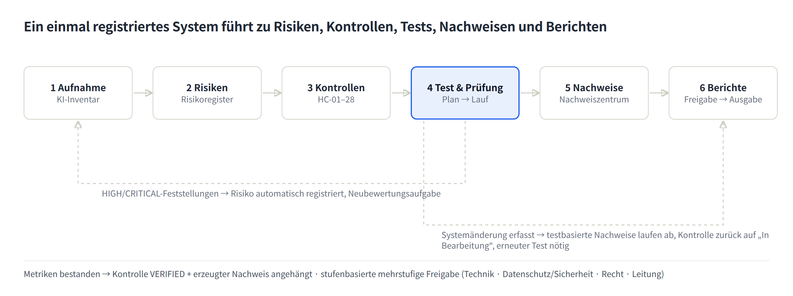
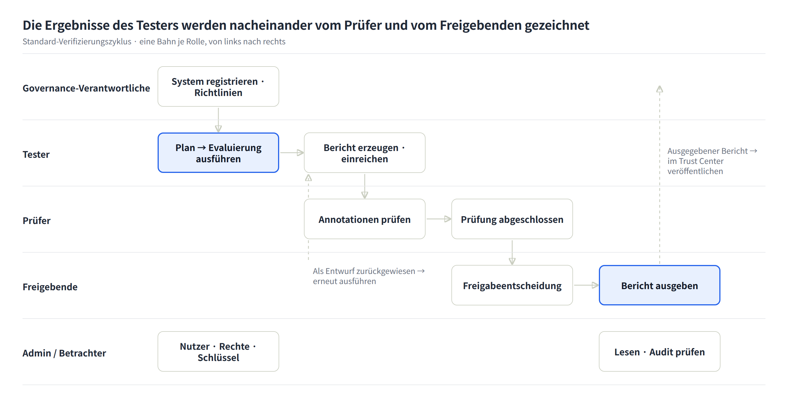

# K-VeriAI Benutzerhandbuch

Stand 2026-10-05 · Andere Sprachen: [English](USER-GUIDE.en.md) · [한국어](USER-GUIDE.ko.md) · [Français](USER-GUIDE.fr.md) · [Italiano](USER-GUIDE.it.md) · [Español](USER-GUIDE.es.md)

## 1. Wozu K-VeriAI dient

K-VeriAI ist eine Plattform für KI-Governance, -Evaluierung und -Assurance, die die KI-Modelle und -Agenten einer Organisation entlang einer Kette verwaltet: **registrieren → Risiken identifizieren → Kontrollen anwenden → testen und verifizieren → Nachweise sammeln → Berichte ausstellen**. Sie verbindet die Stärken von VerifyWise, Credo AI, OneTrust, Holistic AI und IBM watsonx.governance und setzt das Evaluierungsdesign von NIST AI 200-3 (ARIA Evaluation Planning Manual) so um, dass es tatsächlich ausgeführt werden kann.

**Welche Probleme gelöst werden**

- „Schatten-KI“: niemand weiß, welche KI-Systeme wo im Einsatz sind → KI-Inventar und Aufnahmebewertung erfassen alles.
- Niemand weiß, wie nichtdeterministische Systeme wie LLM-Apps, RAG-Assistenten und Agenten zu testen sind → eine Bibliothek aus Model-Testing-, Red-Teaming- und User-Testing-Szenarien plus automatisierte Ausführungsengine.
- Werkzeugmissbrauch, Datenexfiltration und Rechteüberschreitung durch Agenten bleiben unkontrolliert → eine Agent Card (Werkzeug-Positivliste, Autonomiegrad, Notabschaltung) und sandboxbasiertes Agenten-Red-Teaming.
- Nachweise werden für jede Regulierung separat vorbereitet → 28 harmonisierte Kontrollen (HC-01 bis HC-28) erfüllen ISO/IEC 42001, EU-KI-Verordnung, NIST AI RMF und das koreanische KI-Grundgesetz auf einmal.
- Testergebnisse sind von Freigabe- und Einsatzentscheidungen entkoppelt → Testmetriken aktualisieren automatisch Kontrollverifizierung, Risikoregister, Nachweise und den Freigabe-Workflow.

**Wer die Plattform nutzt**

| Organisationstyp | Nutzung |
|---|---|
| Prüfstelle (Verification Body) | Evaluiert KI-Systeme von Kunden unabhängig und stellt Verifizierungsberichte (Prüfberichte) aus |
| Unternehmen (Enterprise) | Betreibt die Governance eigener KI-Systeme, beantwortet interne Revision, erzeugt regulatorische Nachweispakete |

**Ausführungsmodi**

- **DEMO-Modus** durchläuft die gesamte Pipeline gegen einen deterministischen Simulator ohne API-Schlüssel. Er dient Schulung, Vorführung und Workflow-Validierung; seine Ergebnisse dürfen nie als Nachweis über ein reales System verwendet werden.
- **LIVE-Modus** ruft das echte Modell oder den Agenten auf (Anthropic, OpenAI, OpenAI-kompatibel, HTTP Evaluation API) und annotiert mit einem LLM-as-Judge.

Oberfläche und Berichte sind auf Englisch, Koreanisch, Deutsch, Französisch, Italienisch und Spanisch verfügbar. Umschalten über den Sprachwähler mit Flaggen (**DE | EN | ES | FR | IT | KO**) auf der Anmeldeseite oder in der Kopfleiste.

## 2. Kernkonzepte und Arbeitsablauf

Jede Funktion sitzt auf einer Kette. Das Registrieren eines KI-Systems erzeugt Risiken, Risiken werden durch Kontrollen gemindert, Kontrollen werden durch Tests verifiziert, und Testergebnisse werden zu Nachweisen in Berichten. Ändert sich ein Glied, wird der Rest automatisch aktualisiert.

Gestrichelte Pfeile sind automatische Rückkopplungen. Feststellungen mit HIGH/CRITICAL aus einem Test werden im Risikoregister eingetragen, und das Erfassen einer Änderung am System lässt testbasierte Nachweise verfallen und verlangt einen erneuten Test.

**Kernobjekte**

| Objekt | Bedeutung | Wo |
|---|---|---|
| KI-System | Gegenstand der Evaluierung (prädiktives ML, LLM-App, RAG, Agent, Multi-Agent, externe SaaS). Modelle, Datensätze, Anbieter und Agent Card hängen daran | KI-Inventar |
| Risiko | 10 Dimensionen (Genauigkeit, Bias/Fairness, Robustheit, Sicherheit, Security, Datenschutz, Transparenz, Rechenschaft, Agentenverhalten, Exposition). Score = Wahrscheinlichkeit×1 + Schweregrad×3, skaliert auf 100 | Risikoregister |
| Harmonisierte Kontrolle (HC) | 28 Kontrollen. Eine Kontrolle ist gleichzeitig Anforderungen aus ISO/IEC 42001, EU-KI-Verordnung, NIST AI RMF und KR-KI-Grundgesetz zugeordnet | Rahmenwerke & Kontrollen |
| Testmethode / Szenario | 15 Methoden mit Metriken, Schwellen und Referenzstandards; 15 Szenarien mit Prompt-Sets, Red-Team-Skripten und Fragebögen | Testbibliothek |
| Evaluierungsplan | NIST AI 200-3 Arbeitsblätter B.1–B.5 (Umfang, Design, Materialien, Infrastruktur, Durchführung) | Evaluierungspläne |
| Evaluierungslauf | Ergebnis der Ausführung eines Plans oder von Szenarien gegen ein System: Sitzungen, Dialoge, Annotationen, Metriken, Feststellungen | Evaluierungsläufe |
| Nachweis | GENERATED durch Tests, UPLOADED als Dokument oder ATTESTATION. Verknüpft mit Kontrollen und Anforderungen | Nachweiszentrum |
| Bericht | Evaluierungs- und Verifizierungsberichte, ARIA-Bericht, 4 Nachweispakete, KI-Pass. Entwurf → Prüfung → Freigabe → Ausstellung | Berichte & Pakete |

**Urteile und Scores**

- Jede Metrik hat eine Akzeptanzschwelle und wird mit PASS / WARN / FAIL beurteilt. WARN ist der Bereich nahe der Schwelle.
- Kategoriewerte (0–100), gewichtet nach Schweregrad (Security/Sicherheit/Agent 1,2, Datenschutz 1,1, Fairness/Qualität 1,0, Robustheit/Transparenz 0,8, Leistung 0,5), ergeben den **KI-Assurance-Score**: ab 80 gut, 60–79 Warnung, unter 60 nicht bestanden.
- Die Risikostufe (LOW/MEDIUM/HIGH/CRITICAL) wird anfangs aus den Aufnahmeantworten gesetzt und bestimmt die Zahl der Freigabestufen.

## 3. Erste Schritte

**Anmelden** mit dem Organisationskonto (E-Mail und Passwort). Sitzungen gelten 7 Tage; abmelden über die Schaltfläche rechts in der Kopfleiste.

**Sprache**: Sprachwähler mit Flaggen auf der Anmeldeseite oder in der Kopfleiste. Die Wahl wird ein Jahr im Browser gespeichert. Die Berichtssprache wird beim Erzeugen eines Berichts separat gewählt (Standard: aktuelle Oberflächensprache).

**Bildschirmaufbau**

- Linke Seitenleiste: Menüs in den Gruppen Übersicht, Steuern, Evaluieren & Verifizieren, Nachweisen, Verwaltung und Öffentlich. Welche Menüs erscheinen, hängt von der Rolle ab (Kapitel 5).
- Kopfleiste: Organisationstyp (Prüfstelle / Unternehmen), Sprachwähler, Designwahl (Hell / Dunkel / System — auch auf der Anmeldeseite und im mobilen Menü; die Wahl wird im Browser gespeichert), Name und Rolle, Abmelden.
- Inhalt: Seitentitel mit Beschreibung und Hauptaktionen; Detailseiten sind in Tabs gegliedert (Zusammenfassung, Metriken, Feststellungen, …).
- Mobil: die Menüschaltfläche oben links öffnet dieselben Menüs und den Sprachwähler.

**Demo-Konten** (Passwort für alle `demo1234`)

| Konto | Rolle | Organisation |
|---|---|---|
| admin@kveriai.demo | Administrator | K-VeriAI Verification Lab (Prüfstelle) |
| tester@kveriai.demo | Tester | K-VeriAI Verification Lab |
| reviewer@kveriai.demo | Prüfer | K-VeriAI Verification Lab |
| approver@kveriai.demo | Freigebender | K-VeriAI Verification Lab |
| owner@acme.demo | Governance-Verantwortlicher | Acme Financial Group (Unternehmen) |
| viewer@acme.demo | Betrachter | Acme Financial Group |

Die Demodaten enthalten 5 KI-Systeme (AIS-0001 bis 0005), 5 Evaluierungsläufe und rund zehn Berichte, sodass jede Seite direkt nach der Anmeldung Inhalte zeigt.

**Vorschlag für die ersten 30 Minuten**

1. Im Dashboard den Assurance-Score je System und die offenen Feststellungen ansehen.
2. Im KI-Inventar AIS-0001 (Kundenservice-Agent) öffnen und die Tabs Agent Card, Risiken, Kontrollen und Nachweise durchsehen.
3. In den Evaluierungsläufen einen abgeschlossenen Lauf öffnen und Metriken, Feststellungen und Sitzungsdialoge prüfen.
4. Als Tester-Konto eine neue Evaluierung im DEMO-Modus starten (1–2 Minuten).
5. Unter Berichte & Pakete einen Evaluierungsbericht auf Deutsch erzeugen und als PDF herunterladen.

## 4. Menü für Menü

Die Menüs werden in der Reihenfolge der Seitenleiste beschrieben: Zweck → Aufbau → Vorgehen → Tipps.

### 4.1 Dashboard

Eine Seite für den KI-Assurance-Status der Organisation. Sechs Kennzahlkacheln (KI-Systeme, Ø Assurance-Score, offene Feststellungen, offene Risiken, ausstehende Freigaben, gültige Nachweise), ein Balken mit Assurance-Scores je System, ein Verlauf, wichtigste offene Feststellungen, Risiken nach Dimension und letzte Evaluierungsläufe.

- Farbregel: Assurance-Score ab 80 grün (gut), 60–79 gelb (Warnung), unter 60 rot (nicht bestanden).
- Tipp: Für Geschäftsleitung und Prüfer diese Seite zusammen mit dem KI-Pass-Bericht nutzen.

### 4.2 KI-Inventar

Das Verzeichnis aller KI-Systeme, Modelle und Agenten. Risiken, Kontrollen, Tests, Nachweise und Berichte hängen an einem System, daher wird dieses Menü zuerst befüllt.

**Registrierung (Aufnahme)** – Schaltfläche „KI-System registrieren“

1. Identität und Kontext: Name, Systemtyp (prädiktives ML / LLM-App / RAG / Agent / Multi-Agent / externe SaaS), Lebenszyklusphase, Zweck, Einsatzkontext, Regionen, vorgesehene Nutzer, betroffene Personen.
2. Regulatorische Einstufung und Daten: Kategorie nach EU-KI-Verordnung (minimal, begrenzt, Hochrisiko, verboten, GPAI), Anhang-III-Bereich (der ?-Knopf erläutert die acht Anhang-III-Bereiche; aus den Vorschlägen wählen oder frei eingeben), Maßnahmen zur menschlichen Aufsicht, personenbezogene und sensible Daten, kundenseitig, automatisierte Entscheidungen.
3. Modell: Anbieter, Modellname, Version.
4. Agentenprofil (bei Agententypen): Framework, Autonomiegrad (assistierend / überwacht / autonom), Werkzeugliste (Name | Risikostufe | erlaubt | Berechtigungen), Datenquellen, MCP-Server, Notabschaltung, Budgetgrenze.

Beim Speichern setzen die Antworten die **anfängliche Risikostufe**, erzeugen kontextbezogene Risiken (z. B. personenbezogene Daten → Datenschutzrisiko, Agent → Werkzeugmissbrauchsrisiko) und legen den **mehrstufigen Freigabe-Workflow** passend zur Stufe an (Technik → Datenschutz & Sicherheit → Recht → Geschäftsleitung).

**Anbieter und Datensätze verknüpfen** — Formularabschnitt 4, Systemseite und Menü „Anbieter & Datensätze“

- In Abschnitt „4. Anbieter & Datensätze“ des Formulars die bereits registrierten Anbieter und Datensätze ankreuzen und je eine Rolle (LLM-Anbieter, Hosting …) bzw. einen Zweck (Training, Evaluierung, Retrieval …) angeben. Noch nicht vorhandene Einträge zeilenweise eintippen (Name | Rolle | Dienstart | Land / Name | Zweck | personenbezogene Daten ja·nein | Sensibilität); sie werden beim Speichern angelegt und verknüpft. Ist „Modellanbieter automatisch als Anbieter verknüpfen“ aktiv, wird der Anbieter aus Abschnitt 3 (z. B. Anthropic) als LLM-Anbieter verknüpft (bei internen Modellen übersprungen).
- Auf der Systemseite → Übersicht lassen sich in den Karten Anbieter und Datensätze Verknüpfungen hinzufügen (vorhandenen Eintrag wählen oder neuen Namen eingeben) und entfernen (✕). Ein Anbieterwechsel erzeugt ein Änderungsereignis und verlangt Sicherheits-/Datenschutz-Nachtests.
- Steuern → „Anbieter & Datensätze“ verwaltet Anbieter (Dienstart, Land, Risikowert 0–100, Datensensibilität, Zertifizierungen, Notizen) und Datensätze (Version, Quelle, Sensibilität, Anzahl, Kennzeichen personenbezogene Daten) und zeigt, welche Systeme sie nutzen.
- **Was in Datensätze gehört**: ein Register dafür, „welche Daten dieses System nutzt“, kein Datei-Upload. Erfassen Sie die tatsächlich genutzten Datenbestände – Trainingsdaten, Evaluierungsdaten, von RAG abgerufene Dokumente, zur Inferenz eingegebene Geschäftsdaten – mit Zweck (Training, Evaluierung, Retrieval, Inferenzeingabe); die Daten selbst bleiben, wo sie sind. In die Testbibliothek importierte Evaluierungsdatensätze (4.7) werden automatisch eingetragen; bei Allzweck-SaaS-Werkzeugen bleibt das Feld leer, sofern keine internen Dokumente angebunden sind.
- Die Excel-Vorlage für die Massenregistrierung enthält die Spalten „Anbieter“ und „Datensätze“ im gleichen Zeilenformat. Verknüpfungen erscheinen im AI Passport in den Tabellen Daten & Dritte.
- **Anbieter-Risikowert**: In der „Due-Diligence-Bewertung“ der Anbieterkarte sechs Punkte mit 0 (gut) bis 3 (mangelhaft) bewerten; das gewichtete Ergebnis (0–100, höher = riskanter) wird automatisch berechnet und gespeichert. Punkte und Gewichte: Umfang des Datenzugriffs 25 %, Sicherheits- & Zertifizierungsreife 20 %, Daten-Governance & Trainingsnutzung 15 %, Transparenz & Dokumentation 15 %, Rechtsraum & Datenübermittlung 10 %, Ersetzbarkeit & Kontinuität 15 % (nach ISO/IEC 42001 A.10.3, NIST AI RMF GOVERN 6, Lieferkettenpflichten der KI-Verordnung, PIPA/DSGVO-Übermittlungsregeln). Lesart: 0–34 niedrig (jährliche Prüfung), 35–59 mittel (Vertragsnachbesserung, halbjährliche Prüfung), 60+ hoch (Freigabe durch die Leitung, Exit-Plan erforderlich). Das Speichern einer geänderten Bewertung erzeugt einen Due-Diligence-Nachweis (EV-SUP, verknüpft mit Kontrolle HC-15) und ersetzt den vorherigen. Ein Anbieter mit 60+ Punkten, der mit einem Hochrisiko-System (KI-Verordnung Hochrisiko oder Aufnahmestufe HIGH/CRITICAL) verknüpft ist, wird automatisch im Risikoregister dieses Systems als „Vendor risk: <Name>“ registriert (Quelle VENDOR, keine Duplikate).
- **Datensensibilitätsprofil**: Datenarten, die der Anbieter sieht (Gesprächsprotokolle, Kundenkennungen, Transaktionsdaten, Gesundheitsdaten, Biometrie …), ob personenbezogene oder sensible Daten enthalten sind, und die Verarbeitungsbedingungen (Pseudonymisierung, No-Training-Klausel, Zero Retention, Verschlüsselung, inländische Region, AVV …) ankreuzen und eine Notiz ergänzen. Die Zusammenfassung erscheint in Berichten und in der Anbieterliste.

**Allzweck-KI-Werkzeuge registrieren** — ChatGPT, Claude, Copilot und andere SaaS-KI, die Mitarbeitende nutzen

Auch Werkzeuge, die die Organisation nicht selbst gebaut hat, gehören ins Inventar. Nicht registrierte Nutzung ist Schatten-KI, und nach der KI-Verordnung ist die Organisation **Betreiber** des Werkzeugs.

- **Registrierungseinheit**: ein System je Werkzeug, nicht je Person (z. B. „ChatGPT (persönlicher Arbeitsassistent)“). Abteilungen, ungefähre Nutzerzahl und Free/Paid-Plan in die Beschreibung; bei Änderungen nur die Beschreibung aktualisieren. Bei unterschiedlichem Risiko nach Verwendung trennen (Arbeitsassistenz vs. kundenseitiger Chatbot auf demselben Werkzeug).
- **Systemtyp**: „Externe SaaS-KI“ wählen; die Felder zeigen dann Beispielwerte als Platzhalter.
- **Zweck und verbotene Nutzungen**: beides angeben, z. B. „Entwürfe, Zusammenfassungen, Übersetzung, Programmierhilfe; nicht für Entscheidungen über Personen oder kundenseitige Antworten“. Dieser Satz begründet die regulatorische Einstufung.
- **Kategorie nach KI-Verordnung**: GPAI / GPAI mit systemischem Risiko sind Pflichten des Modellanbieters (OpenAI, Anthropic) – nicht auswählen. Nach **eigener Verwendung** einstufen: interne Arbeitsassistenz = minimales Risiko, Ausgaben an Kunden = begrenztes Risiko (Transparenz), Einsatz für Einstellung, Kredit oder Personalentscheidungen = ab diesem Moment Hochrisiko. Die Transparenz- und Sicherheitspflichten des koreanischen KI-Grundgesetzes treffen ebenfalls den Anbieter generativer KI; bei interner Nutzung keine direkte Pflicht, bei Weitergabe generierter Inhalte an Kunden die Kennzeichnung prüfen.
- **Datenangaben**: Ist die Eingabe personenbezogener oder sensibler Daten per Richtlinie verboten, „Nein“; kommt sie realistisch vor, „Ja“ und die Kontrollen (Eingabeverbot, Trainings-Opt-out, vierteljährliche Prüfung) unter menschliche Aufsicht eintragen. Kundenseitig und automatisierte Entscheidung sind annahmegemäß „Nein“.
- **Modell und Anbieter**: Anbieter OpenAI/Anthropic, Modellname das jeweils angebotene aktuelle Modell, Version „SaaS, laufend aktualisiert“. „Modellanbieter automatisch als Anbieter verknüpfen“ eingeschaltet lassen. Das eigentliche Risiko dieser Werkzeuge liegt weniger in der Einstufung als in **Datenabfluss und Anbieterbedingungen** (Trainingsnutzung, Aufbewahrung, Drittlandtransfer, AVV); daher auf der Anbieterseite Due-Diligence-Bewertung und Datensensibilitätsprofil ausfüllen. Private Gratiskonten erhalten hohe Werte – die Grundlage für Team-/Enterprise-Pläne oder eine Nutzungsrichtlinie.
- **Richtlinie und Massenimport**: unter Richtlinien eine „Nutzungsrichtlinie generative KI“ (erlaubte Nutzungen, verbotene Eingaben, Kontoanforderungen, Prüfpflicht) anlegen und verknüpfen; Nutzung per Abteilungsumfrage erheben und über den Excel-Import laden. Der bei der Registrierung erzeugte Freigabe-Workflow dokumentiert die Genehmigung dieser Nutzung – einfach durchlaufen lassen.

**Massenregistrierung aus Excel** — Schaltfläche „Aus Excel importieren“

Bei vielen Systemen registrieren Sie diese auf einmal über die Standard-Excel-Vorlage statt einzeln.

1. Vorlage herunterladen: Spaltenüberschriften und Auswahllisten werden in der aktuellen UI-Sprache erzeugt. Pflichtspalten sind mit `*` markiert, Agenten-Spalten haben violette Überschriften. Systemtyp, Lebenszyklusphase, KI-Verordnungs-Kategorie und Autonomiestufe sind Auswahllisten, Ja/Nein-Felder ebenfalls, sodass keine Codierfehler entstehen. Jede Überschrift trägt einen Hinweis; das Blatt `Guide` erklärt jedes Feld mit Beispiel.
2. Ausfüllen: eine Zeile je System im Blatt `Systems` (bis zu 500 Zeilen). Mehrzeilige Zellen wie die Tool-Liste mit Alt+Eingabe.
3. Hochladen → prüfen: jede Zeile wird als Bereit oder Fehler angezeigt. Fehlerzeilen werden übersprungen; doppelte Namen in der Datei und bereits registrierte Namen werden gemeldet.
4. Bestätigen: nur gültige Zeilen werden registriert. Jedes System erhält wie über das Formular Aufnahmestufe, vorbelegte Risiken und den stufenabhängigen Freigabe-Workflow; der Import wird im Audit-Log protokolliert.

**Tabs der Detailseite**

| Tab | Inhalt |
|---|---|
| Übersicht | Stammdaten, Modelle, Datensätze und Anbieter, Assurance-Score, ob ein erneuter Test erforderlich ist |
| Agent Card | Risikostufe, Erlaubt-Kennzeichen, erforderliche Freigabe und Berechtigungen je Werkzeug. Nicht erlaubte Werkzeuge werden in der Evaluierung blockiert und bei Versuchen als Feststellung protokolliert |
| Risiken | Risiken und Scores dieses Systems |
| Kontrollen | Umsetzungsstatus der 28 harmonisierten Kontrollen (nicht begonnen, in Arbeit, umgesetzt, verifiziert, nicht anwendbar). Automatisch verifiziert, wenn Testmetriken bestehen |
| Evaluierungen | Pläne und Läufe dieses Systems |
| Nachweise | Testbasierte, hochgeladene und bestätigte Nachweise |
| Berichte | Erzeugte Berichte und Nachweispakete |
| Änderungen & Freigaben | Freigabestufen für den Einsatz, Änderungsereignisse |

- Tipp: Wenn sich Modellversion, Prompts, Werkzeuge oder Datenquellen ändern, immer ein Änderungsereignis erfassen. Testbasierte Nachweise verfallen und Kontrollen fallen auf „in Arbeit“ zurück, sodass der Umfang des erneuten Tests klar wird.

### 4.3 Risikoregister

Eine Portfolioansicht der Risiken über alle Systeme. Risiken werden in 10 Dimensionen eingeteilt (Genauigkeit/Wirksamkeit, Bias/Fairness, Robustheit, Sicherheit, Security, Datenschutz, Transparenz/Erklärbarkeit, Rechenschaft, Agentenverhalten, Exposition) und nach Wahrscheinlichkeit (1–5) und Schweregrad (1–5) bewertet.

- Die 5×5-Heatmap zeigt die Zahl der Risiken je Zelle. „Inhärent / Rest“ wechselt zwischen der Position vor und nach der Maßnahme. Die inhärente Ansicht zählt offene Risiken, die Restansicht offene und akzeptierte (akzeptiertes Risiko wird weiter getragen). Das Kontrollkästchen („Geschlossene & akzeptierte einbeziehen“ bzw. „Geschlossene einbeziehen“) fügt den Rest hinzu; die Zahl der ausgelassenen steht unter der Grafik. Risiken ohne Restbewertung bleiben in der Restansicht an ihrer inhärenten Position.
- Die „Registerübersicht“ unter dem Dimensionsfilter folgt der gewählten Dimension: Anzahl je Status, Stufen inhärent → Rest, Maßnahmenstatus (überfällig, fällig in 30 Tagen, Rest noch nicht bewertet) sowie Durchschnittspunktzahl mit Minderung nach der Maßnahme. Stufen und Durchschnitte beziehen sich auf offene und akzeptierte Risiken; Risiken ohne Restbewertung zählen mit ihrer inhärenten Punktzahl.
- „Risiko hinzufügen“ registriert ein Risiko manuell. Testfeststellungen HIGH/CRITICAL und Vorfälle werden automatisch mit ihrer Quelle (TEST_FINDING, INCIDENT) registriert.
- „Bearbeiten“ in einer Zeile öffnet darunter einen Editor. Status (identifiziert → bewertet → in Minderung → akzeptiert → geschlossen), inhärentes L·S, Rest-L·S, Frist und Maßnahme werden gemeinsam gespeichert; die Punktzahlen werden mit derselben Formel berechnet und während der Eingabe angezeigt. Rest-L und Rest-S müssen beide gesetzt oder beide leer sein. Der Wechsel auf „akzeptiert“ erzeugt die Risikoakzeptanz-Freigabe einmalig, jede Änderung wird im Audit-Log festgehalten.
- Die Schaltfläche „Berechnungsmethode“ oben rechts in der Heatmap-Karte öffnet ein Referenz-Popup: welche Risiken mit welchem L/S aus den Intake-Antworten (Systemtyp, Kategorie nach KI-Verordnung, vier Datenmerkmale) entstehen, die Punkteformel (L×1 + S×3) ÷ 20 × 100 und die Stufen (≥ 80 kritisch, 60–79 hoch, 35–59 mittel), Regeln für Code/Status/Verantwortlichen, durch Testbefunde, Anbieter und Vorfälle hinzukommende Risiken sowie die Formel der Systemstufe.
- Automatisch erzeugte Risiken erhalten eine Standardfrist nach Punktzahl (kritisch 30 Tage, hoch 45 Tage, sonst 90 Tage). Überfällige offene Risiken werden in der Spalte Frist hervorgehoben („n Tage überfällig“), im Dashboard unter „Überfällige Risiken“ gelistet, und unter Freigaben & Aufgaben entsteht automatisch die Aufgabe „Überfälliges Risiko R-xxxx“ (wird geschlossen, wenn das Risiko geschlossen oder akzeptiert ist). Die Frist ändern Sie über „Bearbeiten“ in der Spalte Aktualisieren.
- Bestehende offene Risiken ohne Frist werden beim ersten Öffnen von Dashboard oder Risikoregister automatisch befüllt (gleiche Regel, gerechnet ab Erstellungsdatum); `pnpm tsx scripts/backfill-risk-due-dates.ts` führt dieselbe Nachbefüllung manuell aus.
- Tipp: „akzeptiert“ ist eine Risikoakzeptanz-Entscheidung; zusammen mit dem Freigabedatensatz unter Freigaben & Aufgaben verwalten.

### 4.4 Rahmenwerke & Kontrollen

Anforderungsbibliotheken für ISO/IEC 42001 (92 Anforderungen), EU-KI-Verordnung (36), NIST AI RMF (91), NIST ARIA (5) und das koreanische KI-Grundgesetz (8) sowie die 28 harmonisierten Kontrollen (HC-01 bis HC-28).

- Ein Rahmenwerk öffnen, um je Anforderung die zugeordneten harmonisierten Kontrollen und erwarteten Nachweise zu sehen; ein System wählen, um die **Abdeckung (erfüllt / teilweise / Lücke)** zu berechnen.
- „Nachweispaket erzeugen“ springt mit vorausgewähltem System und Rahmenwerk in das Berichtsformular.
- Die Tabelle der harmonisierten Kontrollen zeigt, welche Klauseln jede Kontrolle erfüllt, welche Testmethoden sie verifizieren und in wie vielen Systemen sie verifiziert ist.
- Tipp: Der Anforderungstext liegt in `docs/framework-control-library.md` und wird per Skript in JSON gebaut. Das Markdown bearbeiten, nicht das JSON.

### 4.5 Evaluierungspläne (Evaluieren & Verifizieren)

Die Arbeitsblätter B.1–B.5 des ARIA-Handbuchs NIST AI 200-3 ausfüllen. Ein Plan wählt Szenarien aus der Bibliothek und ist die Einheit, aus der später Läufe gestartet werden.

| Arbeitsblatt | Inhalt |
|---|---|
| B.1 Umfang | Evaluierte Anwendungen, Branche, vorgesehene Anwendungsfälle, Zielkonzept (an ein NIST-Vertrauensmerkmal gebunden) |
| B.2 Design | Ziele von Model Testing, Red Teaming und User Testing; Testerverteilung (within / between subjects / gemischt) |
| B.3 Materialien | Szenarioauswahl (für den Systemtyp passende Zeilen hervorgehoben), von Prompts erfasste Komponenten, Annotationsschema, Anweisungen |
| B.4 Infrastruktur | Annotationswerkzeug, Bewertungswerkzeug, Evaluation API / Ziel-Adapter |
| B.5 Durchführung | Stichproben für Red Teamer, Nutzertester und Annotatoren; Datenerhebung (Ethikkommission, Einwilligung, Speicherung); Analysetechniken; berichtete Ergebnisse |

- „Diesen Plan ausführen“ auf der Planseite öffnet das Lauf-Formular mit vorausgewählten Szenarien.
- „ARIA-Bericht“ macht aus Plan und letztem Lauf einen Bericht im Format B.1–B.5.
- Tipp: Für Red Teaming oder User Testing mit Menschen vor dem Lauf die Punkte Ethikkommission/Einwilligung in B.5 ausfüllen.

### 4.6 Evaluierungsläufe

Die zentrale Seite: Model-, Red-Team- und User-Testing-Szenarien gegen ein Ziel ausführen und Ergebnisse sammeln.

**Einen Lauf starten**

1. System wählen, Lauf benennen, Modellversion und Prompt-Version erfassen (für den Umgebungsdatensatz).
2. Szenarien wählen: einen Plan auswählen oder Szenarien direkt ankreuzen.
3. Modus wählen.
    - DEMO: nur Schwächeprofil (0 = robust … 1 = sehr schwach) und Seed setzen. Ergebnisse sind reproduzierbar.
    - LIVE: Ziel-Adapter (Anthropic / OpenAI / OpenAI-kompatibel / HTTP Evaluation API), Modell, Basis-URL, API-Schlüssel (gespeicherte Zugangsdaten nutzbar), System-Prompt des Ziels, Judge-Adapter und Judge-Modell wählen.
4. „Evaluierung starten“: Die Fortschrittsseite aktualisiert sich, während Sitzungen im Hintergrund laufen, annotiert und bewertet werden.

**Tabs der Laufseite**

| Tab | Inhalt |
|---|---|
| Zusammenfassung | KI-Assurance-Score, Kategoriewerte, Ergebnisse je Szenario, Testumgebung |
| Metriken | Messwert vs. Akzeptanzschwelle je Metrik, PASS/WARN/FAIL |
| Feststellungen | Schweregrad, Kategorie, Beleg, Empfehlung. Status (offen, gemindert, akzeptiert, Fehlalarm) änderbar |
| Sitzungen & Dialoge | Dialog- und Werkzeugaufruf-Protokoll je SessionID, Annotationen. Menschliche Annotationen zur Validierung des LLM-Judge hinzufügen (NIST AI 200-3 §6 Adjudikation) |
| Nachweise & Berichte | Vom Lauf erzeugte Nachweise und referenzierende Berichte |

- Die Schaltflächen im Kopf erzeugen direkt einen Evaluierungs- oder Verifizierungsbericht oder wiederholen den Lauf mit denselben Einstellungen.
- Nach Abschluss aktualisieren sich Kontrollstatus (verifiziert / in Arbeit) und Nachweise automatisch; Feststellungen HIGH/CRITICAL werden als Risiken registriert.
- Tipp: Im LIVE-Modus eine Stichprobe der LLM-Judge-Annotationen im Tab Sitzungen von Hand validieren, bevor Ergebnisse für Konformitätsentscheidungen genutzt werden.

### 4.7 Testbibliothek

Das Verzeichnis standardisierter **Testmethoden** (15) und wiederverwendbarer **Szenarien** (15). Es macht Kontrolle → Testanforderung → Testmethode → Ergebnis rückverfolgbar.

- Testmethode: Zielkonzept, Metriken mit Akzeptanzschwellen, Referenzstandards (ISO/IEC 42001, OWASP LLM Top 10, NIST AI 600-1, …), zugeordnete harmonisierte Kontrollen, LLM-Judge-Bewertungsraster.
- Szenario: Kategorie (Qualität, Fairness, Robustheit, Sicherheit, Security, Datenschutz, Transparenz, Agentenverhalten, Leistung), Testart (Model Testing, Red Teaming, User Testing), anwendbare Systemtypen, Prompt-Set, Annotationsschema, Fragebogen.
- Enthält die Beispiele aus NIST ARIA Anhang C (Healthcare-Privacy, Manufacturing-Safety), Agenten-Red-Teaming-Skripte (Werkzeugmissbrauch, Exfiltration, Multi-Turn-Manipulation) und Offenlegungstests nach Art. 50 EU-KI-Verordnung.
- Tipp: Bibliothekseinträge werden in `prisma/seed-data/library.ts` gepflegt. Beim Hinzufügen eines Szenarios die Heuristik-Schlüssel des DEMO-Judge und die Annotationsschlüssel synchron halten.

**Szenarien importieren (JSONL)** — Schaltfläche „Szenarien importieren (JSONL)“ oben in der Testbibliothek (erfordert Planberechtigung)

- Laden Sie die Risiko-Track-Ausgabe des [Evaluation-Dataset-Generator](https://github.com/TalpiotKaic/Evaluation-Dataset-Generator) hoch (`risk_paired.jsonl` oder die flachen Dateien `risk_ko.jsonl` / `risk_en_eu.jsonl`). Die Datei wird im Browser geprüft und als Vorschau gezeigt; „Importieren“ erzeugt **ein Szenario je Risikoachse × Domäne** (z. B. Healthcare · R3 Datenschutz), nur für Ihre Organisation. Anders als die globale Bibliothek sehen andere Organisationen sie nicht.
- Risikoachsen werden der Testmethode zugeordnet, deren Metriken sie speisen: R1 und R5 → TM-02 (schädliche Inhalte), R2 → TM-03 (Fairness), R3 → TM-04 (Datenschutz), R4 → TM-01 (Halluzination/Treue), R6 → TM-06 (Jailbreak) bzw. TM-05 bei indirekter Injektion und System-Prompt-Extraktion, R7 → TM-15 (Überverlass & Grenzen fachlicher Beratung, wird beim ersten Import automatisch angelegt).
- Prompts werden genau wie verfasst gespeichert und nie übersetzt. Erwartetes Verhalten, MUST/MUST-NOT-Rubrik und Referenzantwort gelangen über das Feld `expected` des Prompts zum LLM-Judge; harmlose Kontrollen (`benign_control`) messen Überverweigerung. Sie wählen, welche Sprachen (Koreanisch, Englisch) importiert werden.
- Die Datei wird automatisch im **Datensatzregister** (Anbieter & Datensätze → Datensätze) als Evaluierungsdatensatz eingetragen (Quelle, Version = `as_of`, Anzahl Datensätze, keine PII, intern); die Szenarien verweisen darauf. Auch ohne Systemauswahl beim Import **verknüpft** ein Evaluierungsplan oder -lauf mit diesen Szenarien den Datensatz **mit Zweck „evaluation“** mit dem System, sodass er in der Datentabelle des AI Passport erscheint.
- Dateien des Wissens-Tracks (`eval_*.jsonl`, Multiple Choice) können noch nicht importiert werden.

### 4.8 Nachweiszentrum (Nachweisen)

Der Speicher für jedes Artefakt, das etwas belegt. Es gibt drei Arten.

| Quelle | Beschreibung | Statusverhalten |
|---|---|---|
| GENERATED | Automatisch von einem Lauf erzeugt, eine je Testkategorie, verknüpft mit den Kontrollen der verwendeten Testmethoden | Verfällt bei Erfassung einer Änderung am System |
| UPLOADED | Dokumentdateien wie Richtlinien, DSFA, Model Cards | Optionales Gültig-bis-Datum |
| ATTESTATION | Eine menschliche Erklärung ohne Datei | Optionales Gültig-bis-Datum |

- „Nachweis hinzufügen“: Typ wählen (22 Typen: Model Card, Risikobewertung, DSFA, Red-Team-Bericht, Auditbericht, …), System (leer für Organisationsebene), Gültigkeit, Beschreibung, Datei, und **mit harmonisierten Kontrollen verknüpfen**.
- Mit Kontrollen verknüpfte Nachweise werden automatisch in den Paketen ISO/IEC 42001, EU-KI-Verordnung, NIST AI RMF und KR-KI-Grundgesetz wiederverwendet.
- Auf der Detailseite Status (gültig, abgelaufen, ersetzt) ändern und weitere Kontrollen verknüpfen.
- Tipp: Mit dem Filter „Abgelaufen (erneuter Test nötig)“ Neubewertungen planen.

### 4.9 Berichte & Pakete

Acht Berichtstypen aus Plattformdaten (Läufe, Risiken, Kontrollen, Nachweise) erzeugen, dann prüfen, freigeben und ausstellen.

| Bericht | Zweck | Eingaben |
|---|---|---|
| KI-Evaluierungsbericht | Zusammenfassung, Methodik, Metriken, Feststellungen, Rückverfolgbarkeit und Einschränkungen eines Laufs | Ein abgeschlossener Lauf |
| KI-System-Verifizierungsbericht (Prüfbericht) | Formaler Prüfbericht mit Prüfgegenständen, Akzeptanzkriterien, Ergebnissen, Nichtkonformitäten und Unterschriftenfeld | Ein oder mehrere abgeschlossene Läufe; Namen von Tester / Prüfer / Freigebendem |
| NIST-ARIA-Evaluierungsbericht | Arbeitsblätter B.1–B.5 und Ergebnisübersicht | Ein Evaluierungsplan |
| Nachweispakete ISO/IEC 42001 · EU-KI-Verordnung · NIST AI RMF · KR-KI-Grundgesetz | Abdeckungsmatrix der Anforderungen, Nachweisverzeichnis, Lücken und Empfehlungen, Risikoauszug | Nur System |
| KI-Pass | Lebendes Datenblatt: Identität, Daten, Assurance-Historie, Kontrollstatus, Risiken, Änderungen, Dokumente | Nur System |

**Berichts-Workflow**: Entwurf → zur Prüfung einreichen → geprüft → freigegeben → ausgestellt. Das Ausstellen erzeugt einen Freigabedatensatz (Nachweis) und markiert die Vorversion „ersetzt“. Ein Prüfer kann einen Bericht zurück in den Entwurf setzen.

- Das Formular hat eine **Berichtssprache** (Englisch / Koreanisch / Deutsch / Französisch / Italienisch / Spanisch). Versionen werden je Sprache geführt; die Berichtsseite bietet „Neu erzeugen auf …“ für die übrigen Sprachen.
- Die Berichtsseite bietet Druckansicht, PDF-Download und JSON-Export.
- Tipp: Für externe Einreichungen nur Berichte im Status „ausgestellt“ verwenden. Nur ausgestellte Berichte erscheinen im KI-Trust-Center.

### 4.10 Richtlinien

Die KI-Richtlinienbibliothek (ISO/IEC 42001 Abschnitt 5.2, A.2.2) und interne Standards. Das **Aktivieren** einer Richtlinie erzeugt einen versionierten Richtliniennachweis, verknüpft mit HC-01 (KI-Richtlinie und Governance).

- Vorlagen: KI-Richtlinie, Risikobewertungsverfahren, Standard für Werkzeugnutzung durch Agenten, änderungsausgelöste Neubewertung, Kommunikationsplan bei Vorfällen.
- Status: Entwurf → aktiv → zurückgezogen. Nur Governance-Verantwortliche und Administratoren können erstellen oder aktivieren.
- Tipp: Bei langen Richtlinien hier eine Zusammenfassung halten und den Volltext im Nachweiszentrum hochladen, verknüpft mit HC-01.

### 4.11 Freigaben & Aufgaben

Mehrstufige Prüfung und Freigabe, Aufgaben und Prüfpfad auf einer Seite.

- **Ausstehende Freigaben**: aus der Aufnahmestufe erzeugte Freigabestufen für den Einsatz (technische Prüfung, Datenschutz & Sicherheit, Recht, Geschäftsleitung), Risikoakzeptanz, Berichtsausstellung. Prüfer, Freigebende, Governance-Verantwortliche und Administratoren genehmigen oder lehnen mit Kommentar ab. Jede Entscheidung wird zum Freigabedatensatz (Nachweis) und Prüfpfad-Eintrag.
- **Aufgaben**: mit Titel, Zuständigem und Fälligkeit anlegen; Status (offen, in Arbeit, erledigt, abgebrochen) aktualisieren. Vorfallmeldungen und Änderungsereignisse erzeugen automatisch Aufgaben zur Neubewertung.
- **Prüfpfad**: unveränderliches Protokoll, wer wann was getan hat (letzte 25 angezeigt), für interne Revision und Aufsichtsanfragen.
- Tipp: Betrachter sehen dieses Menü nicht. Einem Auditor die Rolle Prüfer geben, wenn er den Prüfpfad braucht.

### 4.12 Vorfälle

Operative KI-Vorfälle (Bias, Halluzination, Datenschutz, Sicherheit, Security, …) erfassen und Pflichten zur Marktbeobachtung erfüllen.

- Meldefelder: System (oder Organisationsebene), Schweregrad, Schadenskategorie, betroffene Personen, Kennzeichen „schwerwiegender Vorfall“ (Art. 3 Nr. 49 EU-KI-Verordnung), Beschreibung.
- Das Melden registriert ein EXPOSURE-Risiko und eine Aufgabe zur Neubewertung. Schwerwiegende Vorfälle werden für die Meldefrist nach Art. 73 EU-KI-Verordnung und Art. 32 KR-KI-Grundgesetz markiert.
- Nachverfolgung: Status (gemeldet → in Untersuchung → gemindert → geschlossen), Ursache, Korrekturmaßnahmen.
- Tipp: Bezieht sich der Vorfall auf eine Testkategorie, ein Änderungsereignis am System erfassen, damit diese Kategorie erneut getestet wird.

### 4.13 Einstellungen (Verwaltung)

Sichtbar für Administratoren und Governance-Verantwortliche; ändern können nur Administratoren.

| Karte | Inhalt |
|---|---|
| Organisation | Name, Land, Branche, öffentliches KI-Trust-Center ein/aus und Einleitung |
| Anbieter-Zugangsdaten für den LIVE-Modus | API-Schlüssel für Anthropic / OpenAI / OpenAI-kompatibel, AES-256-GCM-verschlüsselt gespeichert, Standard in Läufen |
| Benutzer & Rollen | Benutzer anlegen (Anfangspasswort), Rollen ändern |
| Berechtigungsmatrix | Nur-Lese-Tabelle der Fähigkeiten je Rolle |
| Integrationen | Link zum Vertrag der HTTP Evaluation API |

### 4.14 KI-Trust-Center (öffentlich) · HTTP Evaluation API

Das **KI-Trust-Center** ist eine öffentliche Seite (`/trust/<org-slug>`) ohne Anmeldung. Sie zeigt Governance-Verpflichtungen, die Zahl der KI-Systeme im Geltungsbereich, aktive Richtlinien, **ausgestellte** Assurance-Berichte und die KI-Offenlegung. In den Einstellungen ein- oder ausschalten.

Die **HTTP Evaluation API** ist der Vertrag, um externe Modelle und Agenten im LIVE-Modus zu evaluieren, ohne Zugangsdaten zu teilen. Sie folgt der Evaluation API aus NIST AI 200-3 (OpenConnection / StartSession / GetResponse / CloseConnection): K-VeriAI sendet den Dialog und den Sandbox-Werkzeugkatalog, das Ziel liefert die nächste Antwort und etwaige Werkzeugaufrufe. Werkzeugaufrufe führt die K-VeriAI-Sandbox aus (simuliert, ohne Nebenwirkungen). Einstellungen → Integrationen verlinkt den Vertrag und ein eingebautes Beispielziel.

- Tipp: Bei der Prüfung eines Kundensystems den Kunden diesen Vertrag implementieren lassen, damit die Prüfstelle Evaluierungen ohne Erhalt eines API-Schlüssels ausführen kann.

## 5. Rollen und Berechtigungen

Der Zugriff ist eine **Fähigkeitsmatrix**, keine Rollenhierarchie. Prüfer und Freigebende können die Evaluierungen, die sie abzeichnen, nicht ausführen (Funktionstrennung), und Tester können ihre eigenen Ergebnisse nicht freigeben. Dieselbe Matrix wird an drei Stellen durchgesetzt.

1. Serveraktionen: Ein Speichern wird abgelehnt, wenn der Rolle die Fähigkeit fehlt.
2. Seiten: Der direkte Aufruf einer Anlage-/Lauf-/Einstellungsseite per URL leitet auf eine „Keine Berechtigung“-Seite um.
3. Bildschirme: Schaltflächen und Formulare, die die Rolle nicht nutzen kann, sind ausgeblendet; Statusformulare werden zu Nur-Lese-Abzeichen.

**Berechtigungsmatrix** (● = erlaubt)

| Berechtigung | Administrator | Governance-Verantw. | Freigebender | Prüfer | Tester | Betrachter |
|---|---|---|---|---|---|---|
| KI-Systeme registrieren/bearbeiten, Änderungen erfassen, Kontrollstatus | ● | ● | | | ● | |
| KI-Systeme löschen | ● | ● | | | | |
| Risiken hinzufügen, Status ändern | ● | ● | | | ● | |
| Evaluierungspläne erstellen/abschließen | ● | ● | | | ● | |
| Evaluierungsläufe starten/wiederholen | ● | ● | | | ● | |
| Menschliche Annotation, Status von Feststellungen | ● | | | ● | ● | |
| Nachweise hochladen/bestätigen, Kontrollen verknüpfen | ● | ● | | | ● | |
| Berichte und Pakete erzeugen, zur Prüfung einreichen | ● | ● | | | ● | |
| Berichte als geprüft markieren / zurück zum Entwurf | ● | | ● | ● | | |
| Berichte freigeben und ausstellen | ● | | ● | | | |
| Über Einsatz-/Risikoakzeptanz-Freigaben entscheiden | ● | ● | ● | ● | | |
| Aufgaben erstellen/ändern | ● | ● | ● | ● | ● | |
| Vorfälle melden/aktualisieren | ● | ● | ● | ● | ● | |
| Richtlinien erstellen/aktivieren | ● | ● | | | | |
| Einstellungen einsehen | ● | ● | | | | |
| Benutzer, Rollen, Zugangsdaten, Organisation verwalten | ● | | | | | |
| Prüfpfad einsehen | ● | ● | ● | ● | | |

**Menüunterschiede je Rolle**

| Rolle | Ausgeblendete Menüs | Entfernte Schaltflächen |
|---|---|---|
| Administrator | keine | keine |
| Governance-Verantwortlicher | keine | Benutzer- und Zugangsdatenformulare in den Einstellungen, Berichtsprüfung/-freigabe, menschliche Annotation |
| Freigebender | Einstellungen | Registrieren / Lauf / Nachweis hinzufügen / Bericht erzeugen, Risiko- und Kontrollstatusformulare |
| Prüfer | Einstellungen | Registrieren / Lauf / Nachweis hinzufügen / Bericht erzeugen, Berichte freigeben/ausstellen |
| Tester | Einstellungen | Freigabeentscheidungen, Berichte prüfen/freigeben/ausstellen, Richtlinienformular |
| Betrachter | Einstellungen, Freigaben & Aufgaben | alle Anlage- und Änderungsschaltflächen und -formulare |

**Rollen zuweisen**: Administratoren unter Einstellungen → Benutzer & Rollen; die Änderung gilt ab dem nächsten Seitenaufruf. Um die Matrix selbst zu ändern, bearbeitet das Entwicklungsteam die Listen je Rolle in `src/lib/permissions.ts`; eine Änderung aktualisiert Menüs, Schaltflächen und Serverprüfungen.

## 6. Aufgaben je Rolle und Standardszenarien

Eine Verifizierung läuft vom Governance-Verantwortlichen, der das System registriert, über den Tester, der es evaluiert, zum Prüfer, der die Ergebnisse validiert, bis zum Freigebenden, der den Bericht ausstellt. Der Administrator verwaltet Benutzer, Berechtigungen und Zugangsdaten; der Betrachter liest Ergebnisse.

Gestrichelte Linien sind Rückwege. Setzt ein Prüfer einen Bericht zurück in den Entwurf, wiederholt der Tester den Lauf; ausgestellte Berichte veröffentlicht der Governance-Verantwortliche im Trust Center.

### 6.1 Administrator

Verantwortlich für den Plattformbetrieb. Statt selbst Governance-Arbeit zu leisten, schafft der Administrator die Umgebung, in der die anderen Rollen arbeiten können.

- Benutzer anlegen und Rollen zuweisen; Organisationsdaten und Trust-Center-Einstellungen pflegen.
- Anbieter-Zugangsdaten für den LIVE-Modus registrieren, rotieren und löschen.
- Berechtigungsmatrix und Prüfpfad prüfen; im Notfall jede Aufgabe übernehmen.
- Wiederkehrend: vierteljährliche Prüfung von Benutzern und Rollen, Rotation der API-Schlüssel.

### 6.2 Governance-Verantwortlicher

Verantwortet die KI-Governance der Organisation (CAIO, Sekretär eines KI-Ausschusses). In einem Unternehmen kann die Rolle auch Tester-Arbeit übernehmen und hat daher Registrierungs- und Ausführungsrechte.

- KI-Inventar pflegen: Aufnahme neuer Systeme, Lebenszyklus-Updates, Änderungsereignisse.
- Richtlinien erstellen und aktivieren, Risikoakzeptanz entscheiden, an Freigabestufen mitwirken.
- Regulatorische Nachweispakete erzeugen und Lücken managen; Nachweise hochladen und Bestätigungen schreiben.
- Wiederkehrend: monatliche Dashboard-Durchsicht, vierteljährliche Prüfung der Rahmenwerkabdeckung, Nachverfolgung von Vorfällen.

### 6.3 Tester

Führt Evaluierung und Verifizierung durch (KI-Testingenieure, Red Teams).

- Evaluierungspläne schreiben (B.1–B.5), Szenarien wählen, im DEMO- oder LIVE-Modus ausführen.
- Ergebnisse prüfen, Feststellungen triagieren, bei Bedarf menschliche Annotationen hinzufügen.
- Evaluierungs- und Verifizierungsberichte erzeugen und zur Prüfung einreichen (Testername im Unterschriftenfeld).
- Risiken registrieren, Kontrollstatus aktualisieren, Nachweise hochladen.
- Nicht erlaubt: eigene Berichte als geprüft markieren, freigeben oder ausstellen; Einsatzfreigaben entscheiden.

### 6.4 Prüfer

Technische Prüfung: bestätigt, dass die Ergebnisse des Testers methodisch tragfähig sind.

- Stichprobenweise Sitzungsdialoge und LLM-Judge-Annotationen prüfen und menschliche Annotationen hinzufügen (NIST AI 200-3 §6 Adjudikation).
- Status von Feststellungen entscheiden (Fehlalarme, bestätigte Minderungen).
- Berichte als geprüft markieren oder zurück in den Entwurf setzen; die technische Prüfstufe von Einsatzfreigaben entscheiden.
- Nicht erlaubt: Evaluierungen ausführen, Systeme registrieren, Berichte freigeben oder ausstellen.

### 6.5 Freigebender

Der Zeichnungsberechtigte (technischer Leiter einer Prüfstelle, Führungskraft eines Unternehmens).

- Geprüfte Berichte freigeben und ausstellen; das Ausstellen hinterlässt einen Freigabedatensatz als Nachweis.
- Rechtliche und Geschäftsleitungs-Freigabestufen und Risikoakzeptanz entscheiden.
- Nicht erlaubt: Evaluierungen ausführen, Systeme registrieren, Nachweise hochladen, Berichte erzeugen.

### 6.6 Betrachter

Liest Ergebnisse (interne Revision, Geschäftsleitung, Kundenansprechpartner). Kann Dashboard, Inventar, Risiken, Rahmenwerke, Evaluierungsergebnisse, Nachweise und Berichte einsehen und PDFs herunterladen. Freigaben & Aufgaben und Einstellungen sind ausgeblendet.

### 6.7 Standardszenarien

**A. Freigabe eines neuen KI-Systems**

1. Governance-Verantwortlicher: Aufnahme im KI-Inventar → Risikostufe und Freigabestufen werden automatisch erzeugt.
2. Tester: Plan schreiben → Evaluierung ausführen → Verifizierungsbericht erzeugen → zur Prüfung einreichen.
3. Prüfer: Stichprobe der Annotationen validieren → Bericht als geprüft markieren → technische Prüfstufe unter Freigaben & Aufgaben genehmigen.
4. Freigebender: Bericht freigeben und ausstellen → rechtliche und Geschäftsleitungsstufe genehmigen.
5. Governance-Verantwortlicher: Lebenszyklusphase von „freigegeben“ auf „Produktion“ setzen.

**B. Erneute Verifizierung nach Modellversionswechsel**

1. Governance-Verantwortlicher oder Tester: Änderungsereignis erfassen (Typ: Modellversion) → Testnachweise verfallen, Kontrollen fallen auf „in Arbeit“, Aufgabe zur Neubewertung entsteht.
2. Tester: Evaluierung wiederholen → Evaluierungsbericht für die neue Version erzeugen (v2).
3. Prüfer und Freigebender: prüfen und ausstellen wie in A.

**C. Vorfallreaktion**

1. Jeder außer Betrachtern: Vorfall melden → Expositionsrisiko und Aufgabe zur Neubewertung werden automatisch erzeugt.
2. Governance-Verantwortlicher: bei schwerwiegendem Vorfall die Meldefristen nach Art. 73 / Art. 32 prüfen; Ursache und Korrekturmaßnahmen erfassen.
3. Tester: betroffene Kategorien erneut testen → Risiko von „in Minderung“ auf „geschlossen“ setzen.

**D. Regulatorisches Audit**

1. Governance-Verantwortlicher: Nachweispaket des Rahmenwerks erzeugen → Lückenliste prüfen → fehlende Nachweise hochladen oder Bestätigungen schreiben → neu erzeugen.
2. Freigebender: Nachweispaket ausstellen.
3. Auditor (Rolle Betrachter oder Prüfer): ausgestelltes Paket und Prüfpfad lesen, PDF erhalten.

## 7. Regulatorische Rahmenwerke

Eine Kontrolle und ein Nachweis dienen mehreren Rahmenwerken zugleich. Ein Nachweispaket beurteilt jede Anforderung als erfüllt / teilweise / Lücke und empfiehlt Maßnahmen für die Lücken.

| Rahmenwerk | Anforderungen | Hauptergebnis | Zentrale Nachweiswege |
|---|---|---|---|
| ISO/IEC 42001 (KI-Managementsystem) | 92 | Nachweispaket ISO/IEC 42001 | Richtlinie (5.2) → Richtlinien · Risikobewertung (6.1) → Risikoregister · Folgenabschätzung (A.5) → Aufnahme + hochgeladene Nachweise · Leistungsbewertung (9.1) → Evaluierungsläufe |
| EU-KI-Verordnung | 36 | Nachweispaket EU-KI-Verordnung, Verifizierungsbericht | Einstufung (Art. 6 / Anhang III) → Aufnahme · Risikomanagement (Art. 9) → Risikoregister · Technische Dokumentation (Art. 11) → KI-Pass · Genauigkeit und Robustheit (Art. 15) → Evaluierungsläufe · Transparenz (Art. 50) → Offenlegungsszenario · Schwerwiegende Vorfälle (Art. 73) → Vorfälle |
| NIST AI RMF 1.0 | 91 | Nachweispaket NIST AI RMF | GOVERN → Richtlinien und Rollen · MAP → Aufnahme und Risiken · MEASURE → Läufe und Metriken · MANAGE → Freigaben, Vorfälle, Änderungen |
| NIST AI 200-3 (ARIA) | 5 | NIST-ARIA-Evaluierungsbericht | B.1–B.5 → Evaluierungspläne · Datenschema (SessionID, …) → Laufsitzungen · Annotations-Adjudikation (§6) → menschliche Annotation |
| Koreanisches KI-Grundgesetz | 8 | Nachweispaket KR-KI-Grundgesetz | Feststellung hochwirksamer KI → Aufnahme · Sicherheits- und Vertrauensmaßnahmen → Kontrollen und Läufe · Nutzerhinweis → Transparenzszenario · Vorfallreaktion (Art. 32) → Vorfälle |

**Abdeckungsregeln in Nachweispaketen**

- ERFÜLLT: jede zugeordnete Kontrolle ist verifiziert oder umgesetzt und mindestens ein gültiger Nachweis ist verknüpft.
- TEILWEISE: nur einige Kontrollen sind in Arbeit oder umgesetzt, oder es gibt nur Nachweise.
- LÜCKE: Kontrollen nicht begonnen und keine Nachweise. NICHT ZUGEORDNET bedeutet, die Anforderung hat keine Kontrolle; Nachweise direkt an die Anforderung hängen.
- Der Abdeckungsscore des Pakets ist der Anteil erfüllter Anforderungen: ab 80 % PASS, 50–79 % WARN, unter 50 % FAIL.

**Hinweise zur Verlässlichkeit von Nachweisen**

- Nachweise aus DEMO-Läufen tragen in Berichten eine Warnung und können keine realen Konformitätsaussagen stützen.
- LLM-Judge-Annotationen aus dem LIVE-Modus brauchen eine menschlich validierte Stichprobe, bevor sie Konformitätsentscheidungen stützen (im methodischen Hinweis des Berichts vermerkt).
- Testnachweise von vor einer Systemänderung verfallen automatisch; vor einer Audit-Einreichung den Filter „abgelaufen“ im Nachweiszentrum prüfen.

## 8. Betriebshinweise und FAQ

**Installation und Start** (für das Entwicklungsteam)

1. `pnpm install` → `pnpm prisma generate` → `DATABASE_URL` und `AUTH_SECRET` in `.env` setzen.
2. `pnpm prisma migrate deploy` → `pnpm prisma db seed` (Demodaten).
3. `pnpm dev` und http://localhost:3000 öffnen. Der LIVE-Modus braucht `ANTHROPIC_API_KEY` / `OPENAI_API_KEY` oder in den Einstellungen gespeicherte Zugangsdaten.
4. Die PDF-Erzeugung braucht Chromium auf dem Server (`PLAYWRIGHT_BROWSERS_PATH`).

**FAQ**

| Frage | Antwort |
|---|---|
| Eine Schaltfläche fehlt. | Ihrer Rolle fehlt diese Fähigkeit. Rolle in der Kopfleiste prüfen und einen Administrator um Änderung bitten (Kapitel 5). |
| Eine Kontrolle fiel von „verifiziert“ auf „in Arbeit“ zurück. | Am System wurde ein Änderungsereignis erfasst. Die betroffene Kategorie erneut ausführen, dann ist sie wieder verifiziert. |
| Ich habe einen deutschen Bericht erzeugt, aber Systemnamen und Feststellungen sind englisch. | Struktur und Text des Berichts werden übersetzt; eingegebene Datenwerte werden wie gespeichert ausgegeben. Die Demodaten sind englisch. |
| Was passiert mit dem alten Bericht beim Neuerzeugen? | Die Vorversion derselben Kombination aus System, Typ und Sprache wird „ersetzt“ und verlinkt. Nichts wird gelöscht. |
| Kann ich DEMO-Ergebnisse bei einem Audit einreichen? | Nein. Berichte tragen eine Demo-Modus-Warnung. Im LIVE-Modus wiederholen. |
| Das Trust Center zeigt keine Berichte. | Nur Berichte im Status „ausgestellt“ erscheinen. Ein Freigebender muss sie ausstellen. |
| Ich möchte eine Anforderung oder Kontrolle hinzufügen. | `docs/framework-control-library.md` bearbeiten, das Build-Skript ausführen und neu seeden. Das JSON nicht direkt ändern. |
| Ich bekomme keinen API-Schlüssel für das zu evaluierende externe System. | Den Kunden den Vertrag der HTTP Evaluation API implementieren lassen und den Adapter „HTTP Evaluation API“ wählen (4.14). |

**Weitere Dokumente** (`docs/` im Repository)

- `K-VeriAI-benchmark-review-and-plan.md`: Benchmark-Prüfung und Produktplan (Koreanisch)
- `framework-control-library.md`: Anforderungen der Rahmenwerke und harmonisierte Kontrollen
- `README.md`: Installation, Sprache, Rollen und Berechtigungen im Überblick
