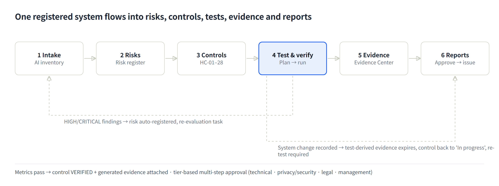
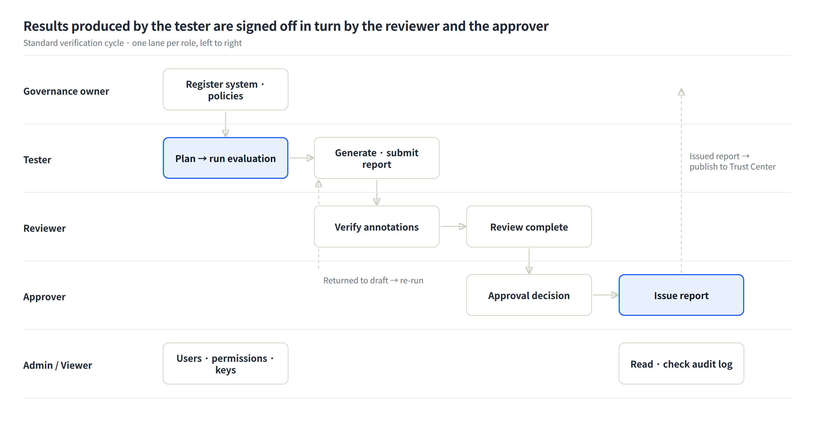

# K-VeriAI User Guide

As of 2026-10-05 · Other languages: [한국어](USER-GUIDE.ko.md) · [Deutsch](USER-GUIDE.de.md) · [Français](USER-GUIDE.fr.md) · [Italiano](USER-GUIDE.it.md) · [Español](USER-GUIDE.es.md)

## 1. What K-VeriAI is for

K-VeriAI is an AI governance, evaluation and assurance platform that manages an organisation's AI models and agents through one chain: **register → identify risks → apply controls → test and verify → collect evidence → issue reports**. It combines the strengths of VerifyWise, Credo AI, OneTrust, Holistic AI and IBM watsonx.governance, and implements the evaluation design of NIST AI 200-3 (the ARIA Evaluation Planning Manual) as something you can actually run.

**Problems it solves**

- "Shadow AI": nobody knows which AI systems are in use where → the AI Inventory and intake assessment register everything.
- Nobody knows how to test non-deterministic systems such as LLM apps, RAG assistants and agents → a library of model-testing, red-teaming and user-testing scenarios plus an automated execution engine.
- Agent tool misuse, data exfiltration and privilege overreach go uncontrolled → an Agent Card (tool allow-list, autonomy level, kill switch) and sandbox-based agent red teaming.
- Evidence is prepared separately for every regulation → 28 harmonized controls (HC-01 to HC-28) satisfy ISO/IEC 42001, the EU AI Act, NIST AI RMF and the Korea AI Basic Act at once.
- Test results are disconnected from approval and deployment decisions → test metrics automatically update control verification, risk registration, evidence and the approval workflow.

**Who uses it**

| Organisation type | How it is used |
|---|---|
| Verification Body | Independently evaluates customer AI systems and issues verification reports (test reports) |
| Enterprise | Runs governance of its own AI systems, answers internal audit, produces regulatory evidence packs |

**Execution modes**

- **DEMO mode** runs the whole pipeline against a deterministic simulator without any API key. It is for training, demonstration and workflow validation; its results must never be used as evidence about a real system.
- **LIVE mode** calls the real model or agent (Anthropic, OpenAI, OpenAI-compatible, HTTP Evaluation API) and annotates with an LLM-as-judge.

The UI and the reports are available in English, Korean, German, French, Italian and Spanish. Switch with the flag toggle (**DE | EN | ES | FR | IT | KO**) on the login page or in the top bar.

## 2. Core concepts and workflow

Every feature sits on one chain. Registering an AI system produces risks, risks are mitigated by controls, controls are verified by tests, and test results become evidence that goes into reports. When one link changes, the rest updates automatically.

Dashed arrows are automatic feedback. HIGH/CRITICAL findings from a test are registered in the risk register, and recording a change on a system expires test-derived evidence and demands a re-test.

**Core objects**

| Object | Meaning | Where |
|---|---|---|
| AI system | The subject of evaluation (predictive ML, LLM app, RAG, agent, multi-agent, external SaaS). Models, datasets, vendors and the Agent Card attach to it | AI Inventory |
| Risk | 10 dimensions (accuracy, bias/fairness, robustness, safety, security, privacy, transparency, accountability, agent behaviour, exposure). Score = likelihood×1 + severity×3, scaled to 100 | Risk Register |
| Harmonized control (HC) | 28 controls. One control maps simultaneously to ISO/IEC 42001, EU AI Act, NIST AI RMF and KR AI Basic Act requirements | Frameworks & Controls |
| Test method / scenario | 15 methods defining metrics, thresholds and reference standards; 15 scenarios with prompt sets, red-team scripts and questionnaires | Test Library |
| Evaluation plan | NIST AI 200-3 worksheets B.1–B.5 (scope, design, materials, infrastructure, implementation) | Evaluation Plans |
| Evaluation run | The result of running a plan or scenarios against a system: sessions, dialogues, annotations, metrics, findings | Evaluation Runs |
| Evidence | GENERATED by tests, UPLOADED documents, or ATTESTATIONS. Linked to controls and requirements | Evidence Center |
| Report | Evaluation and verification reports, ARIA report, 4 evidence packs, AI Passport. Draft → review → approve → issue | Reports & Packs |

**Verdicts and scores**

- Every metric has an acceptance threshold and is judged PASS / WARN / FAIL. WARN is the band close to the threshold.
- Category scores (0–100) weighted by severity (security/safety/agent 1.2, privacy 1.1, fairness/quality 1.0, robustness/transparency 0.8, performance 0.5) give the **AI Assurance Score**: 80+ good, 60–79 warning, below 60 failing.
- The risk tier (LOW/MEDIUM/HIGH/CRITICAL) is set initially from intake answers and determines how many approval stages are created.

## 3. Getting started

**Sign in** with your organisation account (email and password). Sessions last 7 days; sign out with the button at the right end of the top bar.

**Language**: use the flag toggle (**DE | EN | ES | FR | IT | KO**) on the login page or in the top bar. The choice is stored in the browser for a year. The report language is chosen separately when a report is generated (default: the current UI language).

**Screen layout**

- Left sidebar: menus grouped into Overview, Govern, Evaluate & Verify, Prove, Admin and Public. Which menus appear depends on your role (chapter 5).
- Top bar: organisation-type badge (Verification Body / Enterprise), language toggle, theme selector (Light / Dark / System — also on the login page and in the mobile menu; the choice is remembered by the browser), your name and role, sign-out.
- Body: page title with description and main action buttons; detail pages are split into tabs (summary, metrics, findings, …).
- Mobile: the menu button at the top left opens the same menus and the language toggle.

**Demo accounts** (password `demo1234` for all)

| Account | Role | Organisation |
|---|---|---|
| admin@kveriai.demo | Admin | K-VeriAI Verification Lab (Verification Body) |
| tester@kveriai.demo | Tester | K-VeriAI Verification Lab |
| reviewer@kveriai.demo | Reviewer | K-VeriAI Verification Lab |
| approver@kveriai.demo | Approver | K-VeriAI Verification Lab |
| owner@acme.demo | Governance Owner | Acme Financial Group (Enterprise) |
| viewer@acme.demo | Viewer | Acme Financial Group |

The demo data contains 5 AI systems (AIS-0001 to 0005), 5 evaluation runs and about ten reports, so every screen has content right after sign-in.

**A suggested first 30 minutes**

1. On the Dashboard, look at the assurance score per system and the open findings.
2. In the AI Inventory, open AIS-0001 (customer service agent) and browse the Agent Card, Risks, Controls and Evidence tabs.
3. In Evaluation Runs, open a completed run and inspect metrics, findings and session dialogues.
4. As the tester account, start a new evaluation in DEMO mode (takes 1–2 minutes).
5. In Reports & Packs, generate an evaluation report in Korean and download the PDF.

## 4. Menu by menu

Menus are described in sidebar order: purpose → layout → procedure → tips.

### 4.1 Dashboard

One screen for the organisation's AI assurance posture. Six stat tiles (AI systems, average assurance score, open findings, open risks, pending approvals, valid evidence), a bar of assurance scores per system, a score trend, top open findings, risks by dimension and recent evaluation runs.

- Colour rule: assurance score 80+ green (good), 60–79 amber (warning), below 60 red (failing).
- Tip: for executives and auditors, use this screen together with the AI Passport report.

### 4.2 AI Inventory

The register of every AI system, model and agent. Risks, controls, tests, evidence and reports all attach to a system, so fill this menu first.

**Registration (intake)** — the "Register AI system" button

1. Identity and context: name, system type (predictive ML / LLM app / RAG / agent / multi-agent / external SaaS), lifecycle stage, purpose, deployment context, geographies, intended users, affected persons.
2. Regulatory classification and data: EU AI Act category (minimal, limited, high-risk, prohibited, GPAI), Annex III area (the ? button lists the eight Annex III areas with descriptions; pick one from the suggestions or type freely), human oversight measures, personal and sensitive data, customer-facing, automated decisions.
3. Model: provider, model name, version.
4. Agent profile (for agent types): framework, autonomy level (assistive / supervised / autonomous), tool list (name | risk level | allowed | permissions), data sources, MCP servers, kill switch, budget cap.

On save, the answers set the **initial risk tier**, seed context-specific risks (for example personal data → privacy risk, agent → tool-misuse risk), and create the **multi-stage approval workflow** that matches the tier (technical → privacy & security → legal → executive).

**Linking vendors and datasets** — form section 4, the system page, and the "Vendors & Datasets" menu

- In section "4. Vendors & datasets" of the form, tick the vendors and datasets already registered for your organisation and give each a role (LLM provider, hosting…) or purpose (training, evaluation, retrieval…). Items that do not exist yet can be typed one per line (name | role | service type | country / name | purpose | PII yes·no | sensitivity) and are created and linked on save. With "Link the model provider as a vendor automatically" on, the provider from section 3 (e.g. Anthropic) is linked as an LLM-provider vendor (skipped for in-house models).
- On the system page → Overview, the Vendors and Datasets cards let you add links (pick an existing one or type a new name) and remove them (✕). A vendor change writes a change event and requires security/privacy re-tests.
- Govern → "Vendors & Datasets" manages vendors (service type, country, risk score 0–100, data sensitivity, certifications, notes) and datasets (version, source, sensitivity, record count, PII flag) and shows which systems use them.
- **What goes into Datasets**: it is a register of "which data this system uses", not a file upload. Register the data sets the system actually uses — training data, evaluation data, documents a RAG retrieves from, business data fed in at inference — with a purpose (training, evaluation, retrieval, inference input), and leave the data itself where it lives. Evaluation datasets imported into the Test Library (4.7) are registered automatically; for general-purpose SaaS tools leave it empty unless internal documents are connected.
- The Excel bulk template has "Vendors" and "Datasets" columns in the same line format. Links appear in the AI Passport's data & third-parties tables.
- **Vendor risk scoring**: in the vendor card's "Due-diligence assessment", score six items 0 (good) to 3 (poor); the weighted result (0–100, higher = riskier) is computed and stored automatically. Items and weights: data access scope 25%, security & certification maturity 20%, data governance & training use 15%, transparency & documentation 15%, legal jurisdiction & data transfer 10%, substitutability & continuity 15% (based on ISO/IEC 42001 A.10.3, NIST AI RMF GOVERN 6, EU AI Act supply-chain duties and PIPA/GDPR transfer rules). Reading: 0–34 low (annual review), 35–59 medium (contract remediation, semi-annual review), 60+ high (management approval, exit plan required). Saving a changed assessment files a vendor due-diligence evidence record (EV-SUP, linked to control HC-15) and supersedes the previous one. A vendor scoring 60+ that is linked to a high-risk system (EU AI Act high-risk or intake tier HIGH/CRITICAL) is registered automatically in that system's risk register as "Vendor risk: <name>" (source VENDOR, no duplicates).
- **Data sensitivity profile**: tick the data types the vendor sees (conversation transcripts, customer identifiers, transaction records, health records, biometric data…), whether personal or sensitive data is included, and the processing conditions (pseudonymisation, no-training clause, zero retention, encryption, domestic region, DPA signed…) plus a note. The summary line appears in reports and the vendor list.

**Registering general-purpose AI tools** — ChatGPT, Claude, Copilot and other SaaS AI used by staff

Tools the organisation did not build still belong in the inventory. Unregistered use is shadow AI, and under the EU AI Act the organisation is the **deployer** of the tool.

- **Unit of registration**: one system per tool, not per person (e.g. "ChatGPT (personal productivity assistant)"). Put the departments, approximate head-count and free/paid plan in the description and update it as usage changes. Split by use when the risk differs (personal assistance vs a customer-facing chatbot built on the same tool).
- **System type**: choose "External SaaS AI"; the fields then show worked examples as placeholders.
- **Purpose and prohibited uses**: write both, e.g. "drafting, summarising, translation, coding help; not used for decisions about people or for customer-facing responses". This sentence is the basis of the regulatory classification.
- **EU AI Act category**: GPAI / GPAI with systemic risk are the model provider's obligations (OpenAI, Anthropic), so do not select them. Classify by **your use**: internal work assistance is minimal risk, outputs that reach customers are limited risk (transparency), and use for hiring, credit or HR decisions is high-risk from that moment. The Korea AI Basic Act transparency and safety duties also fall on the generative-AI provider; for internal use there is no direct duty, but check output labelling if generated content goes to customers.
- **Data flags**: if personal or sensitive input is prohibited by policy, answer No; if it realistically happens, answer Yes and record the controls (input ban, training opt-out, quarterly review) under human oversight. Customer-facing and automated decision-making are No by assumption.
- **Model and vendor**: provider OpenAI/Anthropic, model name the latest offered, version "SaaS, continuously updated". Leave "link the model provider as a vendor" on. The real risk of these tools lies less in classification than in **data exposure and vendor terms** (training use, retention, cross-border transfer, DPA), so complete the due-diligence assessment and data-sensitivity profile on the vendor page. Personal free accounts will score high; that score is the evidence for moving to Team/Enterprise plans or issuing a usage policy.
- **Policy and bulk import**: register a "Generative AI usage policy" (allowed uses, prohibited inputs, account requirements, review duty) under Policies and link it; collect usage via a departmental survey and load it with the Excel import. The approval workflow created on registration records that use under these conditions was approved, so let it run.

**Bulk registration from Excel** — "Import from Excel" button

When there are many systems, register them in one go from the standard Excel template instead of one by one.

1. Download the template: column headers and dropdowns are generated in your current UI language. Required columns are marked `*`, agent-only columns have purple headers. System type, lifecycle stage, EU AI Act category and autonomy level are dropdowns and Yes/No fields are lists, so coding typos cannot happen. Every header carries a note and the `Guide` sheet explains each field with an example.
2. Fill in: one row per system in the `Systems` sheet (up to 500 rows). Multi-line cells such as the tool list use Alt+Enter.
3. Upload → validate: each row is shown as Ready or Error. Error rows are skipped; duplicate names inside the file and names already registered are flagged.
4. Confirm: only valid rows are registered. Each system gets its intake tier, seeded risks and tier-based approval workflow exactly as from the form, and the import is written to the audit log.

**Detail tabs**

| Tab | Content |
|---|---|
| Overview | Basic data, models, datasets and vendors, assurance score, whether a re-test is required |
| Agent card | Risk level, allowed flag, required approval and permissions per tool. Disallowed tools are blocked during evaluation and logged as findings if attempted |
| Risks | This system's risks and scores |
| Controls | Implementation status of the 28 harmonized controls (not started, in progress, implemented, verified, not applicable). Verified automatically when test metrics pass |
| Evaluations | Plans and runs for this system |
| Evidence | Test-derived, uploaded and attested evidence |
| Reports | Generated reports and evidence packs |
| Changes & approvals | Deployment approval stages, change events |

- Tip: whenever the model version, prompts, tools or data sources change, record a change event. Test-derived evidence expires and controls fall back to "in progress", so the re-test scope becomes explicit.

### 4.3 Risk Register

A portfolio view of risks across all systems. Risks are classified into 10 dimensions (accuracy/efficacy, bias/fairness, robustness, safety, security, privacy, transparency/explainability, accountability, agent behaviour, exposure) and scored by likelihood (1–5) and severity (1–5).

- The 5×5 heat map shows the number of risks per cell. "Inherent / Residual" switches between the position before and after mitigation. The inherent view counts open risks; the residual view counts open and accepted risks (accepted risk is still carried). The checkbox ("Include closed & accepted" in the inherent view, "Include closed" in the residual view) adds the rest, and the number left out is shown under the chart. Risks without a residual assessment stay at their inherent position in the residual view.
- "Register summary" below the dimension filter follows the selected dimension: counts by status, tier counts inherent → residual, action status (overdue, due within 30 days, residual not yet assessed), and average score with the reduction after mitigation. Tiers and averages cover open and accepted risks; risks without a residual assessment count at their inherent score.
- "Add risk" registers a risk manually. HIGH/CRITICAL test findings and incidents are registered automatically with their source (TEST_FINDING, INCIDENT) for traceability.
- "Edit" on a row opens an editor below it. Status (identified → assessed → mitigating → accepted → closed), inherent L·S, residual L·S, due date and mitigation are saved together; scores are computed with the same formula and previewed while you type. Residual L and S must both be set or both left empty. Changing to "accepted" creates the risk-acceptance approval once, and every change is written to the audit log.
- The "How scores are calculated" button at the top right of the heat-map card opens a reference popup: which risks are created with which L/S from the intake answers (system type, EU AI Act category, four data flags), the score formula (L×1 + S×3) ÷ 20 × 100 and bands (≥ 80 critical, 60–79 high, 35–59 medium), code/status/owner rules, risks added by test findings, vendors and incidents, and the system tier formula.
- Automatically created risks get a default due date by score (critical 30 days, high 45 days, others 90 days). Overdue open risks are highlighted in the Due column ("n days overdue"), listed under "Overdue risks" on the dashboard, and a follow-up task "Overdue risk R-xxxx" is created automatically in Approvals & Tasks (closed when the risk is closed or accepted). Change the date with "Edit" in the Update column.
- Existing open risks without a due date are filled in automatically (same rule, counted from the risk's creation date) the first time the dashboard or the risk register is opened; `pnpm tsx scripts/backfill-risk-due-dates.ts` runs the same backfill manually.
- Tip: "accepted" is a risk-acceptance decision; manage it together with the approval record in Approvals & Tasks.

### 4.4 Frameworks & Controls

Requirement libraries for ISO/IEC 42001 (92 requirements), EU AI Act (36), NIST AI RMF (91), NIST ARIA (5) and the Korea AI Basic Act (8), plus the 28 harmonized controls (HC-01 to HC-28).

- Open a framework to see the harmonized controls and expected evidence mapped to each requirement; select a system to compute **coverage (covered / partial / gap)**.
- "Generate evidence pack" jumps to the report form with the system and framework pre-selected.
- The harmonized-control table shows which framework clauses each control satisfies, which test methods verify it, and in how many systems it is verified.
- Hover over (or tap) a control name (HC-xx) to see the requirements it satisfies, grouped by framework with clause number and title. This works in the harmonized-control table here and in a system's Controls tab; click a framework name to open that framework.
- Tip: requirement text lives in `docs/framework-control-library.md` and is built into JSON by a script. Edit the markdown, not the JSON.

### 4.5 Evaluation Plans (Evaluate & Verify)

Fill in the NIST AI 200-3 ARIA evaluation-planning worksheets B.1–B.5. A plan selects scenarios from the library and is the unit that later runs are executed from.

| Worksheet | What you record |
|---|---|
| B.1 Scope | Applications evaluated, sector, intended use cases, target concept (tied to a NIST trustworthiness characteristic) |
| B.2 Design | Goals of model testing, red teaming and user testing; tester distribution (within / between subjects / mixed) |
| B.3 Materials | Scenario selection (rows applicable to the system type are highlighted), components captured by prompts, annotation schema, instructions |
| B.4 Infrastructure | Annotation tool, scoring tool, Evaluation API / target adapter |
| B.5 Implementation | Red teamer, user tester and annotator samples; data collection (IRB, consent, storage); analysis techniques; reported results |

- "Run this plan" on the plan page opens the run form with the plan's scenarios pre-selected.
- "ARIA report" turns the plan and its latest run into a B.1–B.5 formatted report.
- Tip: for red teaming or user testing with people, complete the IRB/consent items in B.5 before running.

### 4.6 Evaluation Runs

The core screen: execute model, red-team and user-testing scenarios against a target and accumulate results.

**Starting a run**

1. Choose the system, name the run, record model version and prompt version (for the environment record).
2. Select scenarios: pick a plan or tick scenarios directly.
3. Choose the mode.
    - DEMO: set only the weakness profile (0 = robust … 1 = very weak) and a seed. Results are reproducible.
    - LIVE: choose the target adapter (Anthropic / OpenAI / OpenAI-compatible / HTTP Evaluation API), model, base URL, API key (saved credentials can be used), target system prompt, judge adapter and judge model.
4. "Start evaluation": the progress page refreshes itself while sessions run, are annotated and scored in the background.

**Run detail tabs**

| Tab | Content |
|---|---|
| Summary | AI Assurance Score, category scores, results by scenario, test environment |
| Metrics | Measured value vs acceptance threshold per metric, PASS/WARN/FAIL |
| Findings | Severity, category, evidence excerpt, recommendation. Status (open, mitigated, accepted, false positive) can be changed |
| Sessions & dialogues | Dialogue and tool-call log per SessionID, annotations. Add human annotations to validate the LLM judge (NIST AI 200-3 §6 adjudication) |
| Evidence & reports | Evidence this run generated and reports that reference it |

- The header buttons generate an evaluation or verification report directly, or re-run with the same settings.
- When a run completes, control status (verified / in progress) and evidence update automatically and HIGH/CRITICAL findings are registered as risks.
- Tip: in LIVE mode, validate a sample of LLM-judge annotations by hand in the Sessions tab before using results for conformity decisions.

### 4.7 Test Library

The repository of standardised **test methods** (15) and reusable **scenarios** (15). It is the asset that makes control → test requirement → test method → result traceable.

- Test method: target concept, metrics with acceptance thresholds, reference standards (ISO/IEC 42001, OWASP LLM Top 10, NIST AI 600-1, …), mapped harmonized controls, LLM-judge rubric.
- Scenario: category (quality, fairness, robustness, safety, security, privacy, transparency, agent behaviour, performance), testing type (model testing, red teaming, user testing), applicable system types, prompt set, annotation schema, questionnaire.
- Includes the NIST ARIA Appendix C examples (Healthcare-Privacy, Manufacturing-Safety), agent red-teaming scripts (tool misuse, exfiltration, multi-turn manipulation) and EU AI Act Art. 50 disclosure tests.
- Tip: library items are maintained in `prisma/seed-data/library.ts`. When adding a scenario, keep the DEMO judge heuristic keys and annotation keys in sync so DEMO mode keeps working.

**Importing scenarios (JSONL)** — "Import scenarios (JSONL)" button at the top of the Test Library (requires plan permission)

- Upload the risk-track output of the [Evaluation-Dataset-Generator](https://github.com/TalpiotKaic/Evaluation-Dataset-Generator) (`risk_paired.jsonl`, or the flattened `risk_ko.jsonl` / `risk_en_eu.jsonl`). The file is validated and previewed in the browser; "Import" creates **one scenario per risk axis × domain** (e.g. Healthcare · R3 Privacy) for your organisation only. Unlike the global library, other organisations do not see them.
- Risk axes map to the test method whose metrics they feed: R1 and R5 → TM-02 (harmful content), R2 → TM-03 (fairness), R3 → TM-04 (privacy), R4 → TM-01 (hallucination / faithfulness), R6 → TM-06 (jailbreak) or TM-05 for indirect-injection and system-prompt-extraction techniques, R7 → TM-15 (overreliance & professional-advice limits, created automatically on first import).
- Prompts are stored exactly as authored and never translated. The expected behaviour, MUST / MUST NOT rubric and reference answer travel in the prompt's `expected` field to the LLM judge; benign controls (`benign_control`) measure over-refusal. You choose which languages (Korean, English) to import.
- The file is registered automatically in the **dataset register** (Vendors & Datasets → Datasets) as an evaluation dataset (source, version = `as_of`, record count, no PII, internal) and the scenarios reference it. Even without picking systems at import time, creating an evaluation plan or run that includes these scenarios **links the dataset to that system with purpose "evaluation"**, so it appears in the AI Passport data table.
- Knowledge-track files (`eval_*.jsonl`, multiple choice) cannot be imported yet.

### 4.8 Evidence Center (Prove)

The store of every artefact that proves something. There are three kinds.

| Source | Description | Status behaviour |
|---|---|---|
| GENERATED | Created automatically by a run, one per test category, linked to the controls of the test methods used | Expires when a change is recorded on the system |
| UPLOADED | Document files such as policies, DPIAs, model cards | Optional valid-until date |
| ATTESTATION | A human statement recorded without a file | Optional valid-until date |

- **Organisation-wide evidence**: evidence registered without a system, and documents approved in Policies & documents, count for every system. Evidence past its validity date expires automatically and drops out of coverage; evidence expiring within 30 days is shown on the dashboard. Write and approve governance documents (policies, procedures, roles) in Policies & documents, not here.
- "Add evidence": choose the type (22 types: model card, risk assessment, DPIA, red-team report, audit report, …), system (leave blank for organisation-level), validity, description, file, and **link to harmonized controls**.
- Evidence linked to controls is reused automatically in the ISO/IEC 42001, EU AI Act, NIST AI RMF and KR AI Basic Act packs.
- On the detail page, change status (valid, expired, superseded) and link further controls.
- Tip: use the "Expired (re-test needed)" filter to plan re-evaluations.

### 4.9 Reports & Packs

Generate eight report types from platform records (runs, risks, controls, evidence), then review, approve and issue them.

| Report | Purpose | Inputs |
|---|---|---|
| AI Evaluation Report | Summary, methodology, metrics, findings, traceability and limitations of one run | One completed run |
| AI System Verification Report (test report) | Formal test report with items, acceptance criteria, results, nonconformities and a signature block | One or more completed runs; tester / reviewer / approver names |
| NIST ARIA Evaluation Report | B.1–B.5 worksheets and results summary | An evaluation plan |
| ISO/IEC 42001 · EU AI Act · NIST AI RMF · KR AI Basic Act evidence packs | Requirement coverage matrix, evidence index, gaps and recommendations, risk extract | System only |
| AI Passport | Living factsheet: identity, data, assurance history, control status, risks, changes, documents | System only |

**Report workflow**: draft → submit for review → reviewed → approved → issued. Issuing creates an approval record (evidence) and marks the previous version "superseded". A reviewer can return a report to draft.

- The form has a **report language** selector (English / Korean / German / French / Italian / Spanish). Versions are tracked per language, and the report page offers "Regenerate in Korean / English".
- The report page offers print view, PDF download and JSON export.
- Tip: for external submission use only reports in "issued" status. Only issued reports appear in the AI Trust Center.

### 4.10 Policies & documents

Write, review and keep current the organisation-level governance documents in one place: policies, procedures, standards, roles and responsibilities, objectives and plans, resource and management-review plans, and records and document-control rules. Approved documents are published automatically as **organisation-wide evidence** that counts towards framework coverage for every AI system, and they expire automatically when their review date passes. System-specific documents (DPIA, model card…) and activity records such as test results or training records go in the Evidence Center.

| Step | What happens | Who |
|---|---|---|
| 1. Draft | In "New document", set the type, version and review cycle (3/6/12/24 months); write the body in Markdown (# headings, - lists, \| tables \|) and/or attach the signed file (MD, TXT, PDF, DOCX, HWP…, max 10 MB). Suggested controls are pre-selected by type (e.g. roles and responsibilities → HC-02). | Governance owner, admin |
| 2. Review request | Requires body text or a file. A "Document review requested" task appears in Approvals & Tasks. | Author |
| 3. Approved · in force | A reviewer other than the author approves it, or returns it with a comment. Approval puts it in force, sets the next review date (approval date + cycle) and creates organisation-wide evidence linked to the selected controls. | Reviewer, approver, governance owner, admin |
| 4. Periodic review · revision | From 30 days before the review date, the dashboard and a task remind the owner. If nothing changed, "Reviewed — no change" extends validity by one cycle; otherwise "New version" creates a revision that goes through review again. When it is approved the previous version becomes "Superseded" in the history. | Reviewer / author |

- **Expiry**: after the review date the document and its evidence expire and drop out of coverage; a "Document expired" task is created for the owner.
- **Segregation of duties**: the author (submitter) cannot approve their own document. An administrator may, but it is flagged "Self-reviewed".
- **Retire**: retiring a document supersedes its evidence and keeps it for the record. Drafts can be deleted.
- The tiles above the list (in force, awaiting review, review due within 30 days, expired, drafts) and the filters show the status; the dashboard card "Governance documents & evidence validity" shows the same.
- Tip: attach the signed original (PDF) and put the key content in the body so auditors can read it on screen.

### 4.11 Approvals & Tasks

Multi-stage review and approval, tasks and the audit trail on one screen.

- **Pending approvals**: deployment approval stages generated from the intake tier (technical review, privacy & security, legal, executive), risk acceptance, report issuance. Reviewers, Approvers, Governance Owners and Admins approve or reject with a comment. Every decision becomes an approval record (evidence) and an audit-trail entry.
- **Tasks**: create with title, assignee and due date; update status (open, in progress, done, cancelled). Incident reports and change events create re-evaluation tasks automatically.
- **Audit trail**: an immutable log of who did what and when (latest 25 shown), for internal audit and regulator requests.
- Tip: Viewers do not see this menu. Give an auditor the Reviewer role if they need the audit trail.

### 4.12 Incidents

Record operational AI incidents (bias, hallucination, privacy, safety, security, …) and meet post-market monitoring duties.

- Report fields: system (or organisation-level), severity, harm category, affected persons, serious-incident flag (EU AI Act Art. 3(49)), description.
- Reporting registers an EXPOSURE risk and a re-evaluation task. Serious incidents are flagged for the EU AI Act Art. 73 reporting clock and the Korea AI Basic Act Art. 32 response.
- Follow-up: status (reported → investigating → mitigated → closed), root cause, corrective actions.
- Tip: if the incident relates to a test category, record a change event on the system so that category becomes re-test scope.

### 4.13 Settings (Admin)

Visible to Admins and Governance Owners; only Admins can change anything.

| Card | Content |
|---|---|
| Organisation | Name, country, sector, public AI Trust Center on/off and introduction |
| LIVE-mode provider credentials | Anthropic / OpenAI / OpenAI-compatible API keys, AES-256-GCM encrypted at rest, used as defaults in runs |
| Users & roles | Add users (initial password), change roles |
| Permission matrix | Read-only table of capabilities per role |
| Integrations | Link to the HTTP Evaluation API contract |

### 4.14 AI Trust Center (Public) · HTTP Evaluation API

The **AI Trust Center** is a public page (`/trust/<org-slug>`) that needs no login. It shows governance commitments, the number of AI systems in scope, active policies, **issued** assurance reports and the AI disclosure. Turn it on or off in Settings.

The **HTTP Evaluation API** is the contract for evaluating external models and agents in LIVE mode without sharing credentials. It mirrors the NIST AI 200-3 Evaluation API (OpenConnection / StartSession / GetResponse / CloseConnection): K-VeriAI sends the dialogue and the sandbox tool catalogue, the target returns the next response and any tool calls. Tool calls are executed by the K-VeriAI sandbox (mocked, no side effects). Settings → Integrations links to the contract and a built-in sample target.

- Tip: when verifying a customer's system, have the customer implement this contract so the verification body can run evaluations without receiving an API key.

## 5. Roles and permissions

Access is a **capability matrix**, not a role hierarchy. Reviewers and Approvers cannot run the evaluations they sign off (segregation of duties), and Testers cannot approve their own results. The same matrix is enforced in three places.

1. Server actions: a save is refused when the role lacks the capability.
2. Pages: opening a create / run / settings page by URL redirects to a "no permission" page.
3. Screens: buttons and forms the role cannot use are hidden; status forms become read-only badges.

**Permission matrix** (● = allowed)

| Permission | Admin | Governance Owner | Approver | Reviewer | Tester | Viewer |
|---|---|---|---|---|---|---|
| Register / edit AI systems, record changes, set control status | ● | ● | | | ● | |
| Delete AI systems | ● | ● | | | | |
| Add risks, update risk status | ● | ● | | | ● | |
| Create / complete evaluation plans | ● | ● | | | ● | |
| Start / re-run evaluation runs | ● | ● | | | ● | |
| Human annotation, finding status | ● | | | ● | ● | |
| Upload / attest evidence, link controls | ● | ● | | | ● | |
| Generate reports and packs, submit for review | ● | ● | | | ● | |
| Mark reports reviewed / return to draft | ● | | ● | ● | | |
| Approve and issue reports | ● | | ● | | | |
| Decide deployment / risk-acceptance approvals | ● | ● | ● | ● | | |
| Create / update tasks | ● | ● | ● | ● | ● | |
| Report / update incidents | ● | ● | ● | ● | ● | |
| Write documents, request review, revise or retire | ● | ● | | | | |
| Review and approve documents (not one's own) | ● | ● | ● | ● | | |
| View settings | ● | ● | | | | |
| Manage users, roles, credentials, organisation | ● | | | | | |
| View audit trail | ● | ● | ● | ● | | |

**Menu differences by role**

| Role | Hidden menus | Buttons removed from screens |
|---|---|---|
| Admin | none | none |
| Governance Owner | none | user-add and credential forms in Settings, report review/approve buttons, human annotation |
| Approver | Settings | register / run / add-evidence / generate-report buttons, risk and control status forms |
| Reviewer | Settings | register / run / add-evidence / generate-report buttons, report approve/issue buttons |
| Tester | Settings | approval decision buttons, report review/approve/issue buttons, policy form |
| Viewer | Settings, Approvals & Tasks | every create and change button and form |

**Assigning roles**: Admins do this in Settings → Users & roles; the change applies from the next page load. To change the matrix itself, the development team edits the per-role lists in `src/lib/permissions.ts`; one edit updates menus, buttons and server checks.

## 6. Duties by role and standard scenarios

One verification flows from the Governance Owner who registers the system, to the Tester who evaluates it, to the Reviewer who validates the results, to the Approver who issues the report. The Admin manages users, permissions and credentials; the Viewer reads results.

Dashed lines are return paths. When a Reviewer returns a report to draft, the Tester re-runs; the Governance Owner publishes issued reports in the Trust Center.

### 6.1 Admin

Owns platform operations. Rather than doing governance work directly, the Admin creates the environment in which the other roles can work.

- Add users and assign roles; maintain organisation data and Trust Center settings.
- Register, rotate and delete LIVE-mode provider credentials.
- Review the permission matrix and audit trail; act as a fallback for any duty in an emergency.
- Recurring: quarterly user and role review, API key rotation.

### 6.2 Governance Owner

Owns the organisation's AI governance (a CAIO, the secretary of an AI committee). In an enterprise the owner may also do tester work, so the role carries register and run capabilities.

- Maintain the AI Inventory: intake of new systems, lifecycle updates, change events.
- Establish and activate policies, make risk-acceptance decisions, take part in deployment approval stages.
- Generate regulatory evidence packs and manage gaps; upload evidence and write attestations.
- Recurring: monthly dashboard review, quarterly framework coverage review, incident follow-up.

### 6.3 Tester

Performs evaluation and verification (AI test engineers, red teams).

- Write evaluation plans (B.1–B.5), select scenarios, run in DEMO or LIVE mode.
- Review results, triage findings, add human annotations where needed.
- Generate evaluation and verification reports and submit them for review (tester name in the signature block).
- Register risks, update control status, upload evidence.
- Cannot: mark own reports reviewed, approve or issue them, or decide deployment approvals.

### 6.4 Reviewer

Technical review: confirms that the tester's results are methodologically sound.

- Sample-review session dialogues and LLM-judge annotations and add human annotations (NIST AI 200-3 §6 adjudication).
- Decide finding status (false positives, confirmed mitigations).
- Mark reports reviewed or return them to draft; decide the technical-review stage of deployment approvals.
- Cannot: run evaluations, register systems, approve or issue reports.

### 6.5 Approver

The authorised signatory (a verification body's technical manager, an enterprise executive).

- Approve and issue reviewed reports; issuing leaves an approval record as evidence.
- Decide legal and executive approval stages and risk acceptance.
- Cannot: run evaluations, register systems, upload evidence, generate reports.

### 6.6 Viewer

Reads results (internal audit, executives, customer contacts). Can view the dashboard, inventory, risks, frameworks, evaluation results, evidence and reports, and download PDFs. Approvals & Tasks and Settings are hidden.

### 6.7 Standard scenarios

**A. Approving a new AI system**

1. Governance Owner: intake in the AI Inventory → risk tier and approval stages created automatically.
2. Tester: write a plan → run the evaluation → generate the verification report → submit for review.
3. Reviewer: validate a sample of annotations → mark the report reviewed → approve the technical-review stage in Approvals & Tasks.
4. Approver: approve and issue the report → approve the legal and executive stages.
5. Governance Owner: move the lifecycle stage from "approved" to "production".

**B. Re-verification after a model version change**

1. Governance Owner or Tester: record a change event (type: model version) → test evidence expires, controls fall to "in progress", a re-evaluation task is created.
2. Tester: re-run the evaluation → generate the evaluation report for the new version (v2).
3. Reviewer and Approver: review and issue as in A.

**C. Incident response**

1. Anyone except Viewers: report the incident → exposure risk and re-evaluation task created automatically.
2. Governance Owner: for a serious incident, check the Art. 73 / Art. 32 reporting clocks; record root cause and corrective actions.
3. Tester: re-test the related categories → move the risk from "mitigating" to "closed".

**D. Regulatory audit**

1. Governance Owner: generate the framework's evidence pack → review the gap list → upload missing evidence or write attestations → regenerate.
2. Approver: issue the evidence pack.
3. Auditor (Viewer or Reviewer role): read the issued pack and audit trail, receive the PDF.

## 7. Regulatory frameworks

One control and one piece of evidence serve several frameworks at once. An evidence pack judges every requirement covered / partial / gap and recommends actions for the shortfalls.

| Framework | Requirements | Main output | Key evidence paths |
|---|---|---|---|
| ISO/IEC 42001 (AI management system) | 92 | ISO/IEC 42001 evidence pack | Policy (5.2) → Policies · Risk assessment (6.1) → Risk Register · Impact assessment (A.5) → intake + uploaded evidence · Performance evaluation (9.1) → Evaluation Runs |
| EU AI Act | 36 | EU AI Act evidence pack, verification report | Classification (Art. 6 / Annex III) → intake · Risk management (Art. 9) → Risk Register · Technical documentation (Art. 11) → AI Passport · Accuracy and robustness (Art. 15) → Evaluation Runs · Transparency (Art. 50) → disclosure scenario · Serious incidents (Art. 73) → Incidents |
| NIST AI RMF 1.0 | 91 | NIST AI RMF evidence pack | GOVERN → policies and roles · MAP → intake and risks · MEASURE → runs and metrics · MANAGE → approvals, incidents, changes |
| NIST AI 200-3 (ARIA) | 5 | NIST ARIA evaluation report | B.1–B.5 → Evaluation Plans · data schema (SessionID, …) → run sessions · annotation adjudication (§6) → human annotation |
| Korea AI Basic Act | 8 | KR AI Basic Act evidence pack | High-impact AI determination → intake · safety and reliability measures → controls and runs · user notice → transparency scenario · incident response (Art. 32) → Incidents |

**Coverage rules in evidence packs**

- COVERED: every mapped control is verified or implemented and at least one valid evidence item is linked.
- PARTIAL: only some controls are in progress or implemented, or only evidence exists.
- GAP: controls not started and no evidence. UNMAPPED means the requirement has no control; link evidence directly to the requirement.
- The pack's coverage score is the covered ratio: 80%+ PASS, 50–79% WARN, below 50% FAIL.

**Notes on evidence reliability**

- Evidence from DEMO-mode runs carries a warning in reports and cannot support real conformity claims.
- LLM-judge annotations from LIVE mode need a human-validated sample before they support conformity decisions (stated in the report's methodological note).
- Test evidence from before a system change expires automatically; check the "expired" filter in the Evidence Center before an audit submission.

## 8. Operating tips and FAQ

**Install and run** (for the development team)

1. `pnpm install` → `pnpm prisma generate` → set `DATABASE_URL` and `AUTH_SECRET` in `.env`.
2. `pnpm prisma migrate deploy` → `pnpm prisma db seed` (demo data).
3. `pnpm dev` and open http://localhost:3000. LIVE mode needs `ANTHROPIC_API_KEY` / `OPENAI_API_KEY` or credentials saved in Settings.
4. PDF generation needs Chromium on the server (`PLAYWRIGHT_BROWSERS_PATH`).

**FAQ**

| Question | Answer |
|---|---|
| A button is missing. | Your role lacks that capability. Check your role in the top bar and ask an Admin to change it (chapter 5). |
| A control went from "verified" back to "in progress". | A change event was recorded on the system. Re-run the affected category and it is verified again. |
| I generated a Korean report but system names and findings are in English. | Report structure and narrative are translated; entered data values are printed as stored. The demo data is in English. |
| What happens to the old report when I regenerate? | The previous version of the same system, type and language becomes "superseded" and is linked. Nothing is deleted. |
| Can I submit DEMO results to an audit? | No. Reports carry a demo-mode warning. Re-run in LIVE mode. |
| The Trust Center shows no reports. | Only reports in "issued" status appear. An Approver has to issue them. |
| I want to add a requirement or control. | Edit `docs/framework-control-library.md`, run the build script and re-seed. Do not edit the JSON directly. |
| I cannot get an API key for the external system I need to evaluate. | Have the customer implement the HTTP Evaluation API contract and choose the "HTTP Evaluation API" adapter (4.14). |

**Related documents** (`docs/` in the repository)

- `K-VeriAI-benchmark-review-and-plan.md`: benchmark review and product plan (Korean)
- `framework-control-library.md`: framework requirements and harmonized controls
- `README.md`: installation, language, roles and permissions summary
