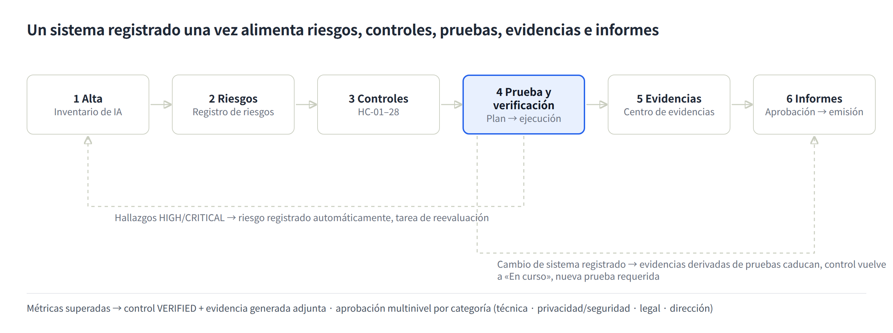
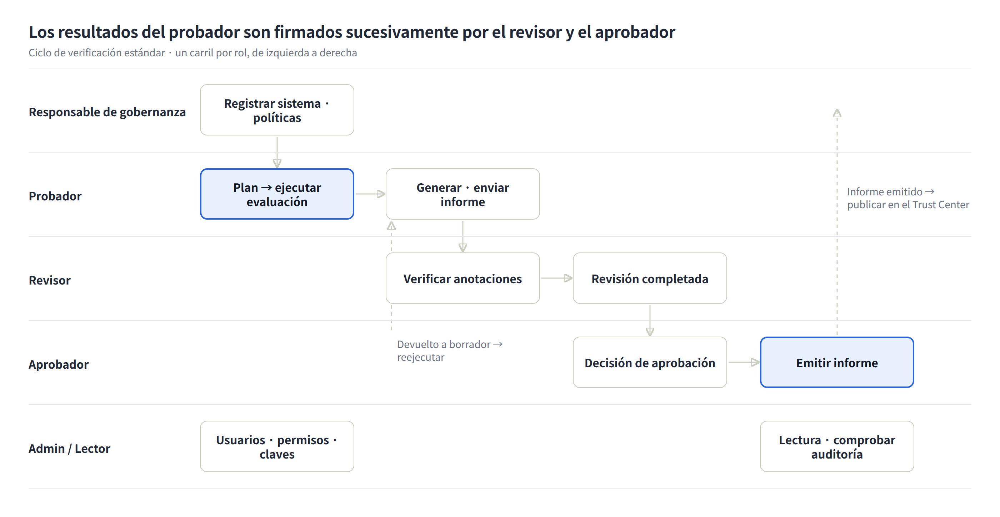

# Guía de usuario de K-VeriAI

A 2026-10-05 · Otros idiomas: [English](USER-GUIDE.en.md) · [한국어](USER-GUIDE.ko.md) · [Deutsch](USER-GUIDE.de.md) · [Français](USER-GUIDE.fr.md) · [Italiano](USER-GUIDE.it.md)

## 1. Para qué sirve K-VeriAI

K-VeriAI es una plataforma de gobernanza, evaluación y aseguramiento de la IA que gestiona los modelos y agentes de IA de una organización a lo largo de una sola cadena: **registrar → identificar riesgos → aplicar controles → probar y verificar → recopilar evidencias → emitir informes**. Combina las fortalezas de VerifyWise, Credo AI, OneTrust, Holistic AI e IBM watsonx.governance e implementa el diseño de evaluación de NIST AI 200-3 (ARIA Evaluation Planning Manual) de forma realmente ejecutable.

**Problemas que resuelve**

- «IA en la sombra»: nadie sabe qué sistemas de IA se usan ni dónde → el Inventario de IA y la evaluación de admisión lo registran todo.
- Nadie sabe cómo probar sistemas no deterministas como aplicaciones LLM, asistentes RAG y agentes → una biblioteca de escenarios de model testing, red teaming y user testing más un motor de ejecución automatizado.
- El uso indebido de herramientas, la exfiltración de datos y el exceso de privilegios de los agentes quedan sin control → una Agent Card (lista de herramientas permitidas, nivel de autonomía, parada de emergencia) y red teaming de agentes en entorno aislado.
- Las evidencias se preparan por separado para cada normativa → 28 controles armonizados (HC-01 a HC-28) satisfacen de una vez ISO/IEC 42001, la Ley de IA de la UE, el NIST AI RMF y la Ley marco coreana de IA.
- Los resultados de las pruebas están desconectados de las decisiones de aprobación y despliegue → las métricas de prueba actualizan automáticamente la verificación de controles, el registro de riesgos, las evidencias y el flujo de aprobación.

**Quién la usa**

| Tipo de organización | Uso |
|---|---|
| Organismo de verificación | Evalúa de forma independiente los sistemas de IA de clientes y emite informes de verificación (informes de ensayo) |
| Empresa | Gestiona la gobernanza de sus propios sistemas de IA, responde a la auditoría interna, produce paquetes de evidencias regulatorias |

**Modos de ejecución**

- **Modo DEMO**: recorre toda la cadena contra un simulador determinista sin claves API. Sirve para formación, demostración y validación del flujo; sus resultados nunca deben usarse como evidencia sobre un sistema real.
- **Modo LIVE**: llama al modelo o agente real (Anthropic, OpenAI, compatible con OpenAI, HTTP Evaluation API) y anota con un LLM-as-judge.

La interfaz y los informes están disponibles en inglés, coreano, alemán, francés, italiano y español. Cambie de idioma con el selector de banderas (**EN | KO | DE | FR | IT | ES**) en la página de inicio de sesión o en la barra superior.

## 2. Conceptos clave y flujo de trabajo

Toda función se apoya en una cadena. Registrar un sistema de IA produce riesgos, los riesgos se mitigan con controles, los controles se verifican con pruebas y los resultados de las pruebas se convierten en evidencias que van a los informes. Cuando un eslabón cambia, el resto se actualiza automáticamente.

Las flechas discontinuas son retroalimentaciones automáticas. Los hallazgos HIGH/CRITICAL de una prueba se inscriben en el registro de riesgos, y registrar un cambio en un sistema caduca las evidencias derivadas de pruebas y exige una nueva prueba.

**Objetos clave**

| Objeto | Significado | Dónde |
|---|---|---|
| Sistema de IA | El objeto evaluado (ML predictivo, aplicación LLM, RAG, agente, multiagente, SaaS externo). Modelos, conjuntos de datos, proveedores y Agent Card se vinculan a él | Inventario de IA |
| Riesgo | 10 dimensiones (exactitud, sesgo/equidad, robustez, seguridad física, seguridad informática, privacidad, transparencia, rendición de cuentas, comportamiento del agente, exposición). Puntuación = probabilidad×1 + gravedad×3, escalada a 100 | Registro de riesgos |
| Control armonizado (HC) | 28 controles. Un control corresponde simultáneamente a requisitos de ISO/IEC 42001, Ley de IA de la UE, NIST AI RMF y Ley marco KR | Marcos y controles |
| Método de prueba / escenario | 14 métodos con métricas, umbrales y normas de referencia; 15 escenarios con conjuntos de prompts, guiones de red teaming y cuestionarios | Biblioteca de pruebas |
| Plan de evaluación | Hojas NIST AI 200-3 B.1–B.5 (alcance, diseño, materiales, infraestructura, implementación) | Planes de evaluación |
| Ejecución de evaluación | Resultado de ejecutar un plan o escenarios contra un sistema: sesiones, diálogos, anotaciones, métricas, hallazgos | Ejecuciones de evaluación |
| Evidencia | GENERATED por pruebas, UPLOADED (documento) o ATTESTATION. Vinculada a controles y requisitos | Centro de evidencias |
| Informe | Informes de evaluación y verificación, informe ARIA, 4 paquetes de evidencias, Pasaporte de IA. Borrador → revisión → aprobación → emisión | Informes y paquetes |

**Veredictos y puntuaciones**

- Cada métrica tiene un umbral de aceptación y se juzga PASS / WARN / FAIL. WARN es la banda cercana al umbral.
- Las puntuaciones por categoría (0–100), ponderadas por gravedad (seguridad informática/seguridad física/agente 1,2, privacidad 1,1, equidad/calidad 1,0, robustez/transparencia 0,8, rendimiento 0,5), dan la **puntuación de aseguramiento de IA**: 80 o más bueno, 60–79 advertencia, menos de 60 insuficiente.
- El nivel de riesgo (LOW/MEDIUM/HIGH/CRITICAL) se fija inicialmente con las respuestas de admisión y determina el número de etapas de aprobación.

## 3. Primeros pasos

**Inicio de sesión** con la cuenta de su organización (correo y contraseña). Las sesiones duran 7 días; cierre sesión con el botón a la derecha de la barra superior.

**Idioma**: selector de banderas en la página de inicio de sesión o en la barra superior. La elección se guarda un año en el navegador. El idioma del informe se elige aparte al generarlo (por defecto, el idioma de la interfaz).

**Organización de la pantalla**

- Barra lateral izquierda: menús agrupados en Resumen, Gobernar, Evaluar y verificar, Demostrar, Administración y Público. Los menús visibles dependen de su rol (capítulo 5).
- Barra superior: tipo de organización (organismo de verificación / empresa), selector de idioma, tema (claro/oscuro), su nombre y rol, cierre de sesión.
- Cuerpo: título de página con descripción y acciones principales; las páginas de detalle se dividen en pestañas (resumen, métricas, hallazgos, …).
- Móvil: el botón de menú arriba a la izquierda abre los mismos menús y el selector de idioma.

**Cuentas de demostración** (contraseña `demo1234` para todas)

| Cuenta | Rol | Organización |
|---|---|---|
| admin@kveriai.demo | Administrador | K-VeriAI Verification Lab (organismo de verificación) |
| tester@kveriai.demo | Probador | K-VeriAI Verification Lab |
| reviewer@kveriai.demo | Revisor | K-VeriAI Verification Lab |
| approver@kveriai.demo | Aprobador | K-VeriAI Verification Lab |
| owner@acme.demo | Responsable de gobernanza | Acme Financial Group (empresa) |
| viewer@acme.demo | Lector | Acme Financial Group |

Los datos de demostración contienen 5 sistemas de IA (AIS-0001 a 0005), 5 ejecuciones de evaluación y una decena de informes, de modo que cada pantalla tiene contenido nada más iniciar sesión.

**Un primer recorrido de 30 minutos**

1. En el Panel, mire la puntuación de aseguramiento por sistema y los hallazgos abiertos.
2. En el Inventario de IA, abra AIS-0001 (agente de atención al cliente) y recorra las pestañas Agent Card, Riesgos, Controles y Evidencias.
3. En Ejecuciones de evaluación, abra una ejecución completada y revise métricas, hallazgos y diálogos de sesión.
4. Con la cuenta de probador, inicie una nueva evaluación en modo DEMO (1–2 minutos).
5. En Informes y paquetes, genere un informe de evaluación en español y descargue el PDF.

## 4. Menú por menú

Los menús se describen en el orden de la barra lateral: finalidad → organización → procedimiento → consejos.

### 4.1 Panel

Una pantalla para la situación de aseguramiento de IA de la organización. Seis mosaicos (sistemas de IA, puntuación media de aseguramiento, hallazgos abiertos, riesgos abiertos, aprobaciones pendientes, evidencias válidas), un gráfico de puntuaciones por sistema, una tendencia, los principales hallazgos abiertos, los riesgos por dimensión y las ejecuciones recientes.

- Regla de color: puntuación de aseguramiento de 80 o más verde (bueno), 60–79 ámbar (advertencia), menos de 60 rojo (insuficiente).
- Consejo: para dirección y auditores, use esta pantalla junto con el informe Pasaporte de IA.

### 4.2 Inventario de IA

El registro de todos los sistemas, modelos y agentes de IA. Riesgos, controles, pruebas, evidencias e informes se vinculan a un sistema: rellene este menú primero.

**Registro (admisión)** – botón «Registrar sistema de IA»

1. Identidad y contexto: nombre, tipo de sistema (ML predictivo / aplicación LLM / RAG / agente / multiagente / SaaS externo), fase del ciclo de vida, finalidad, contexto de despliegue, regiones, usuarios previstos, personas afectadas.
2. Clasificación regulatoria y datos: categoría según la Ley de IA de la UE (mínimo, limitado, alto riesgo, prohibido, GPAI), área del anexo III, medidas de supervisión humana, datos personales y sensibles, orientado al cliente, decisiones automatizadas.
3. Modelo: proveedor, nombre del modelo, versión.
4. Perfil del agente (para agentes): framework, nivel de autonomía (asistencial / supervisado / autónomo), lista de herramientas (nombre | nivel de riesgo | permitido | permisos), fuentes de datos, servidores MCP, parada de emergencia, límite de presupuesto.

Al guardar, las respuestas fijan el **nivel de riesgo inicial**, generan riesgos contextuales (por ejemplo, datos personales → riesgo de privacidad, agente → riesgo de uso indebido de herramientas) y crean el **flujo de aprobación en varias etapas** acorde al nivel (técnica → privacidad y seguridad → legal → dirección).

**Pestañas de la página de detalle**

| Pestaña | Contenido |
|---|---|
| Resumen | Datos básicos, modelos, conjuntos de datos y proveedores, puntuación de aseguramiento, si se requiere nueva prueba |
| Agent Card | Nivel de riesgo, indicador de permitido, aprobación requerida y permisos por herramienta. Las herramientas no permitidas se bloquean durante la evaluación y se registran como hallazgos si se intentan usar |
| Riesgos | Riesgos y puntuaciones de este sistema |
| Controles | Estado de implementación de los 28 controles armonizados (no iniciado, en curso, implementado, verificado, no aplicable). Verificado automáticamente cuando las métricas de prueba superan el umbral |
| Evaluaciones | Planes y ejecuciones de este sistema |
| Evidencias | Evidencias derivadas de pruebas, cargadas y atestadas |
| Informes | Informes y paquetes de evidencias generados |
| Cambios y aprobaciones | Etapas de aprobación del despliegue, eventos de cambio |

- Consejo: siempre que cambien la versión del modelo, los prompts, las herramientas o las fuentes de datos, registre un evento de cambio. Las evidencias derivadas de pruebas caducan y los controles vuelven a «en curso», lo que hace explícito el alcance de la nueva prueba.

### 4.3 Registro de riesgos

Una vista de cartera de los riesgos en todos los sistemas. Los riesgos se clasifican en 10 dimensiones (exactitud/eficacia, sesgo/equidad, robustez, seguridad física, seguridad informática, privacidad, transparencia/explicabilidad, rendición de cuentas, comportamiento del agente, exposición) y se puntúan por probabilidad (1–5) y gravedad (1–5).

- El mapa de calor 5×5 muestra el número de riesgos por celda y se filtra por dimensión.
- «Añadir riesgo» registra un riesgo manualmente. Los hallazgos de prueba HIGH/CRITICAL y los incidentes se registran automáticamente con su origen (TEST_FINDING, INCIDENT).
- Actualice el estado (identificado → evaluado → en mitigación → aceptado → cerrado) y la puntuación residual en la misma fila.
- Consejo: «aceptado» es una decisión de aceptación del riesgo; gestiónela junto con el registro de aprobación en Aprobaciones y tareas.

### 4.4 Marcos y controles

Bibliotecas de requisitos de ISO/IEC 42001 (92 requisitos), Ley de IA de la UE (36), NIST AI RMF (91), NIST ARIA (5) y Ley marco coreana de IA (8), más los 28 controles armonizados (HC-01 a HC-28).

- Abra un marco para ver, por requisito, los controles armonizados y las evidencias esperadas; seleccione un sistema para calcular la **cobertura (cubierto / parcial / brecha)**.
- «Generar paquete de evidencias» abre el formulario de informe con el sistema y el marco preseleccionados.
- La tabla de controles armonizados muestra qué cláusulas satisface cada control, qué métodos de prueba lo verifican y en cuántos sistemas está verificado.
- Consejo: el texto de los requisitos está en `docs/framework-control-library.md` y se convierte a JSON con un script. Edite el markdown, no el JSON.

### 4.5 Planes de evaluación (Evaluar y verificar)

Rellene las hojas B.1–B.5 del manual ARIA NIST AI 200-3. Un plan selecciona escenarios de la biblioteca y es la unidad desde la que se lanzan las ejecuciones.

| Hoja | Contenido |
|---|---|
| B.1 Alcance | Aplicaciones evaluadas, sector, casos de uso previstos, concepto objetivo (ligado a una característica de confiabilidad del NIST) |
| B.2 Diseño | Objetivos del model testing, red teaming y user testing; distribución de probadores (intra / entresujetos / mixto) |
| B.3 Materiales | Selección de escenarios (filas aplicables al tipo de sistema resaltadas), componentes capturados por los prompts, esquema de anotación, instrucciones |
| B.4 Infraestructura | Herramienta de anotación, herramienta de puntuación, Evaluation API / adaptador de destino |
| B.5 Implementación | Muestras de red teamers, probadores usuarios y anotadores; recogida de datos (comité ético, consentimiento, almacenamiento); técnicas de análisis; resultados comunicados |

- «Ejecutar este plan» en la página del plan abre el formulario de ejecución con los escenarios preseleccionados.
- «Informe ARIA» convierte el plan y su última ejecución en un informe con formato B.1–B.5.
- Consejo: para red teaming o user testing con personas, complete los apartados de comité ético/consentimiento de B.5 antes de ejecutar.

### 4.6 Ejecuciones de evaluación

La pantalla central: ejecutar escenarios de model testing, red teaming y user testing contra un destino y acumular resultados.

**Iniciar una ejecución**

1. Elija el sistema, nombre la ejecución, registre la versión del modelo y del prompt (para el registro del entorno).
2. Seleccione escenarios: un plan o escenarios marcados directamente.
3. Elija el modo.
    - DEMO: ajuste solo el perfil de debilidad (0 = robusto … 1 = muy débil) y una semilla. Los resultados son reproducibles.
    - LIVE: elija el adaptador de destino (Anthropic / OpenAI / compatible con OpenAI / HTTP Evaluation API), el modelo, la URL base, la clave API (pueden usarse credenciales guardadas), el prompt de sistema del destino, el adaptador y el modelo del juez.
4. «Iniciar evaluación»: la página de progreso se actualiza mientras las sesiones se ejecutan, anotan y puntúan en segundo plano.

**Pestañas de la página de ejecución**

| Pestaña | Contenido |
|---|---|
| Resumen | Puntuación de aseguramiento de IA, puntuaciones por categoría, resultados por escenario, entorno de prueba |
| Métricas | Valor medido frente a umbral de aceptación por métrica, PASS/WARN/FAIL |
| Hallazgos | Gravedad, categoría, extracto de evidencia, recomendación. Estado (abierto, mitigado, aceptado, falso positivo) modificable |
| Sesiones y diálogos | Registro de diálogos y llamadas a herramientas por SessionID, anotaciones. Añada anotaciones humanas para validar al juez LLM (adjudicación NIST AI 200-3 §6) |
| Evidencias e informes | Evidencias generadas por la ejecución e informes que la referencian |

- Los botones de cabecera generan directamente un informe de evaluación o de verificación, o reejecutan con los mismos ajustes.
- Al finalizar, el estado de los controles (verificado / en curso) y las evidencias se actualizan automáticamente, y los hallazgos HIGH/CRITICAL se registran como riesgos.
- Consejo: en modo LIVE, valide a mano una muestra de las anotaciones del juez LLM en la pestaña Sesiones antes de usar los resultados para decisiones de conformidad.

### 4.7 Biblioteca de pruebas

El repositorio de **métodos de prueba** estandarizados (14) y **escenarios** reutilizables (15). Es el activo que hace trazable la cadena control → requisito de prueba → método → resultado.

- Método de prueba: concepto objetivo, métricas con umbrales de aceptación, normas de referencia (ISO/IEC 42001, OWASP LLM Top 10, NIST AI 600-1, …), controles armonizados mapeados, rúbrica LLM-as-judge.
- Escenario: categoría (calidad, equidad, robustez, seguridad física, seguridad informática, privacidad, transparencia, comportamiento del agente, rendimiento), tipo de prueba (model testing, red teaming, user testing), tipos de sistema aplicables, conjunto de prompts, esquema de anotación, cuestionario.
- Incluye los ejemplos del apéndice C de NIST ARIA (Healthcare-Privacy, Manufacturing-Safety), guiones de red teaming de agentes (uso indebido de herramientas, exfiltración, manipulación multiturno) y pruebas de divulgación del art. 50 de la Ley de IA de la UE.
- Consejo: los elementos de la biblioteca se mantienen en `prisma/seed-data/library.ts`. Al añadir un escenario, mantenga sincronizadas las claves heurísticas del juez DEMO y las claves de anotación.

### 4.8 Centro de evidencias (Demostrar)

El almacén de todo artefacto que demuestra algo. Hay tres tipos.

| Origen | Descripción | Comportamiento del estado |
|---|---|---|
| GENERATED | Creada automáticamente por una ejecución, una por categoría de prueba, vinculada a los controles de los métodos usados | Caduca al registrar un cambio en el sistema |
| UPLOADED | Archivos como políticas, EIPD, model cards | Fecha de validez opcional |
| ATTESTATION | Declaración humana registrada sin archivo | Fecha de validez opcional |

- «Añadir evidencia»: elija el tipo (22 tipos: model card, evaluación de riesgos, EIPD, informe de red team, informe de auditoría, …), el sistema (en blanco para nivel de organización), la validez, la descripción, el archivo, y **vincúlela a controles armonizados**.
- Las evidencias vinculadas a controles se reutilizan automáticamente en los paquetes ISO/IEC 42001, Ley de IA de la UE, NIST AI RMF y Ley marco KR.
- En la página de detalle, cambie el estado (válida, caducada, sustituida) y vincule más controles.
- Consejo: use el filtro «Caducadas (se requiere nueva prueba)» para planificar reevaluaciones.

### 4.9 Informes y paquetes

Genere ocho tipos de informes a partir de los datos de la plataforma (ejecuciones, riesgos, controles, evidencias) y luego revíselos, apruébelos y emítalos.

| Informe | Finalidad | Entradas |
|---|---|---|
| Informe de evaluación de IA | Resumen, metodología, métricas, hallazgos, trazabilidad y limitaciones de una ejecución | Una ejecución completada |
| Informe de verificación del sistema de IA (informe de ensayo) | Informe de ensayo formal con elementos, criterios de aceptación, resultados, no conformidades y bloque de firma | Una o más ejecuciones completadas; nombres de probador / revisor / aprobador |
| Informe de evaluación NIST ARIA | Hojas B.1–B.5 y resumen de resultados | Un plan de evaluación |
| Paquetes de evidencias ISO/IEC 42001 · Ley de IA de la UE · NIST AI RMF · Ley marco KR | Matriz de cobertura de requisitos, índice de evidencias, brechas y recomendaciones, extracto de riesgos | Solo sistema |
| Pasaporte de IA | Ficha viva: identidad, datos, historial de aseguramiento, estado de controles, riesgos, cambios, documentos | Solo sistema |

**Flujo del informe**: borrador → enviar a revisión → revisado → aprobado → emitido. La emisión crea un registro de aprobación (evidencia) y marca la versión anterior como «sustituida». Un revisor puede devolver un informe a borrador.

- El formulario tiene un **idioma del informe** (inglés / coreano / alemán / francés / italiano / español). Las versiones se controlan por idioma y la página del informe ofrece «Regenerar en …» para los demás idiomas.
- La página del informe ofrece vista de impresión, descarga en PDF y exportación JSON.
- Consejo: para envíos externos use únicamente informes en estado «emitido». Solo los informes emitidos aparecen en el Centro de confianza de IA.

### 4.10 Políticas

La biblioteca de políticas de IA (ISO/IEC 42001 § 5.2, A.2.2) y las normas internas. **Activar** una política registra una evidencia de política versionada vinculada a HC-01 (política y gobernanza de la IA).

- Plantillas: Política de IA, Procedimiento de evaluación de riesgos, Norma de uso de herramientas por agentes, Reevaluación por cambios, Plan de comunicación de incidentes.
- Estado: borrador → activa → retirada. Solo los responsables de gobernanza y los administradores pueden crear o activar.
- Consejo: para políticas largas, mantenga aquí un resumen y cargue el texto completo en el Centro de evidencias vinculado a HC-01.

### 4.11 Aprobaciones y tareas

Revisión y aprobación en varias etapas, tareas y pista de auditoría en una sola pantalla.

- **Aprobaciones pendientes**: etapas de aprobación del despliegue generadas a partir del nivel de admisión (revisión técnica, privacidad y seguridad, legal, dirección), aceptación de riesgos, emisión de informes. Revisores, aprobadores, responsables de gobernanza y administradores aprueban o rechazan con un comentario. Cada decisión se convierte en un registro de aprobación (evidencia) y una entrada de la pista de auditoría.
- **Tareas**: cree con título, responsable y fecha de vencimiento; actualice el estado (abierta, en curso, hecha, cancelada). Las notificaciones de incidentes y los eventos de cambio crean automáticamente tareas de reevaluación.
- **Pista de auditoría**: registro inmutable de quién hizo qué y cuándo (últimas 25 entradas), para auditoría interna y solicitudes de reguladores.
- Consejo: los lectores no ven este menú. Asigne el rol Revisor a un auditor que necesite la pista de auditoría.

### 4.12 Incidentes

Registre incidentes operativos de IA (sesgo, alucinación, privacidad, seguridad física, seguridad informática, …) y cumpla las obligaciones de vigilancia poscomercialización.

- Campos de la notificación: sistema (o nivel de organización), gravedad, categoría de daño, personas afectadas, indicador de incidente grave (art. 3, punto 49, Ley de IA de la UE), descripción.
- La notificación registra un riesgo EXPOSURE y una tarea de reevaluación. Los incidentes graves se marcan para los plazos del art. 73 de la Ley de IA de la UE y el art. 32 de la Ley marco KR.
- Seguimiento: estado (notificado → en investigación → mitigado → cerrado), causa raíz, acciones correctivas.
- Consejo: si el incidente afecta a una categoría de prueba, registre un evento de cambio en el sistema para que esa categoría entre en el alcance de la nueva prueba.

### 4.13 Configuración (Administración)

Visible para administradores y responsables de gobernanza; solo los administradores pueden modificar.

| Tarjeta | Contenido |
|---|---|
| Organización | Nombre, país, sector, Centro de confianza de IA público activado/desactivado e introducción |
| Credenciales de proveedores del modo LIVE | Claves API de Anthropic / OpenAI / compatible con OpenAI, cifradas AES-256-GCM en reposo, usadas por defecto en las ejecuciones |
| Usuarios y roles | Añadir usuarios (contraseña inicial), cambiar roles |
| Matriz de permisos | Tabla de solo lectura con las capacidades por rol |
| Integraciones | Enlace al contrato de la HTTP Evaluation API |

### 4.14 Centro de confianza de IA (público) · HTTP Evaluation API

El **Centro de confianza de IA** es una página pública (`/trust/<slug-organización>`) sin inicio de sesión. Muestra compromisos de gobernanza, número de sistemas de IA en el alcance, políticas activas, informes de aseguramiento **emitidos** e información sobre IA. Se activa o desactiva en Configuración.

La **HTTP Evaluation API** es el contrato para evaluar modelos y agentes externos en modo LIVE sin compartir credenciales. Refleja la Evaluation API de NIST AI 200-3 (OpenConnection / StartSession / GetResponse / CloseConnection): K-VeriAI envía el diálogo y el catálogo de herramientas del entorno aislado, y el destino devuelve la siguiente respuesta y las llamadas a herramientas. Las llamadas las ejecuta el entorno aislado de K-VeriAI (simuladas, sin efectos secundarios). Configuración → Integraciones enlaza al contrato y a un destino de ejemplo integrado.

- Consejo: para verificar el sistema de un cliente, pídale que implemente este contrato para que el organismo de verificación pueda ejecutar las evaluaciones sin recibir una clave API.

## 5. Roles y permisos

El acceso es una **matriz de capacidades**, no una jerarquía de roles. Revisores y aprobadores no pueden ejecutar las evaluaciones que firman (segregación de funciones), y los probadores no pueden aprobar sus propios resultados. La misma matriz se aplica en tres niveles.

1. Acciones del servidor: se rechaza guardar si el rol carece de la capacidad.
2. Páginas: abrir por URL una página de creación / ejecución / configuración redirige a una página «sin permiso».
3. Pantallas: los botones y formularios que el rol no puede usar se ocultan; los formularios de estado se convierten en insignias de solo lectura.

**Matriz de permisos** (● = permitido)

| Permiso | Administrador | Resp. gobernanza | Aprobador | Revisor | Probador | Lector |
|---|---|---|---|---|---|---|
| Registrar / editar sistemas de IA, registrar cambios, estado de controles | ● | ● | | | ● | |
| Eliminar sistemas de IA | ● | ● | | | | |
| Añadir riesgos, actualizar su estado | ● | ● | | | ● | |
| Crear / completar planes de evaluación | ● | ● | | | ● | |
| Iniciar / reejecutar evaluaciones | ● | ● | | | ● | |
| Anotación humana, estado de hallazgos | ● | | | ● | ● | |
| Cargar / atestar evidencias, vincular controles | ● | ● | | | ● | |
| Generar informes y paquetes, enviar a revisión | ● | ● | | | ● | |
| Marcar informes como revisados / devolver a borrador | ● | | ● | ● | | |
| Aprobar y emitir informes | ● | | ● | | | |
| Decidir aprobaciones de despliegue / aceptación de riesgos | ● | ● | ● | ● | | |
| Crear / actualizar tareas | ● | ● | ● | ● | ● | |
| Notificar / actualizar incidentes | ● | ● | ● | ● | ● | |
| Crear / activar políticas | ● | ● | | | | |
| Ver la configuración | ● | ● | | | | |
| Gestionar usuarios, roles, credenciales, organización | ● | | | | | |
| Ver la pista de auditoría | ● | ● | ● | ● | | |

**Diferencias de menú por rol**

| Rol | Menús ocultos | Botones retirados de las pantallas |
|---|---|---|
| Administrador | ninguno | ninguno |
| Responsable de gobernanza | ninguno | formularios de alta de usuario y credenciales en Configuración, botones de revisión/aprobación de informes, anotación humana |
| Aprobador | Configuración | botones registrar / ejecutar / añadir evidencia / generar informe, formularios de estado de riesgos y controles |
| Revisor | Configuración | botones registrar / ejecutar / añadir evidencia / generar informe, botones aprobar/emitir |
| Probador | Configuración | botones de decisión de aprobaciones, botones revisar/aprobar/emitir, formulario de políticas |
| Lector | Configuración, Aprobaciones y tareas | todos los botones y formularios de creación y modificación |

**Asignación de roles**: los administradores lo hacen en Configuración → Usuarios y roles; el cambio se aplica en la siguiente carga de página. Para cambiar la propia matriz, el equipo de desarrollo edita las listas por rol en `src/lib/permissions.ts`; una sola edición actualiza menús, botones y comprobaciones del servidor.

## 6. Funciones por rol y escenarios estándar

Una verificación fluye desde el responsable de gobernanza que registra el sistema, al probador que lo evalúa, al revisor que valida los resultados y al aprobador que emite el informe. El administrador gestiona usuarios, permisos y credenciales; el lector lee los resultados.

Las líneas discontinuas son caminos de retorno. Cuando un revisor devuelve un informe a borrador, el probador reejecuta; el responsable de gobernanza publica los informes emitidos en el Centro de confianza.

### 6.1 Administrador

Responsable de la operación de la plataforma. En lugar de hacer el trabajo de gobernanza directamente, crea el entorno en el que los demás roles pueden trabajar.

- Añadir usuarios y asignar roles; mantener los datos de la organización y la configuración del Centro de confianza.
- Registrar, rotar y eliminar las credenciales de proveedores del modo LIVE.
- Revisar la matriz de permisos y la pista de auditoría; actuar como respaldo para cualquier función en una emergencia.
- Recurrente: revisión trimestral de usuarios y roles, rotación de claves API.

### 6.2 Responsable de gobernanza

Dirige la gobernanza de IA de la organización (CAIO, secretario de un comité de IA). En una empresa también puede hacer trabajo de probador, por lo que el rol tiene capacidades de registro y ejecución.

- Mantener el Inventario de IA: admisión de nuevos sistemas, actualizaciones del ciclo de vida, eventos de cambio.
- Establecer y activar políticas, decidir aceptaciones de riesgo, participar en las etapas de aprobación del despliegue.
- Generar paquetes de evidencias regulatorias y gestionar brechas; cargar evidencias y redactar atestaciones.
- Recurrente: revisión mensual del panel, revisión trimestral de la cobertura de los marcos, seguimiento de incidentes.

### 6.3 Probador

Realiza la evaluación y la verificación (ingenieros de pruebas de IA, red teams).

- Redactar planes de evaluación (B.1–B.5), seleccionar escenarios, ejecutar en modo DEMO o LIVE.
- Revisar resultados, clasificar hallazgos, añadir anotaciones humanas cuando sea necesario.
- Generar informes de evaluación y verificación y enviarlos a revisión (nombre del probador en el bloque de firma).
- Registrar riesgos, actualizar el estado de los controles, cargar evidencias.
- No puede: marcar sus propios informes como revisados, aprobarlos ni emitirlos, ni decidir aprobaciones de despliegue.

### 6.4 Revisor

Revisión técnica: confirma que los resultados del probador son metodológicamente sólidos.

- Revisar por muestreo los diálogos de sesión y las anotaciones del juez LLM y añadir anotaciones humanas (adjudicación NIST AI 200-3 §6).
- Decidir el estado de los hallazgos (falsos positivos, mitigaciones confirmadas).
- Marcar informes como revisados o devolverlos a borrador; decidir la etapa de revisión técnica de las aprobaciones de despliegue.
- No puede: ejecutar evaluaciones, registrar sistemas, aprobar ni emitir informes.

### 6.5 Aprobador

El firmante autorizado (responsable técnico de un organismo de verificación, directivo de una empresa).

- Aprobar y emitir los informes revisados; la emisión deja un registro de aprobación como evidencia.
- Decidir las etapas legal y de dirección de las aprobaciones y la aceptación de riesgos.
- No puede: ejecutar evaluaciones, registrar sistemas, cargar evidencias, generar informes.

### 6.6 Lector

Lee los resultados (auditoría interna, dirección, contactos de clientes). Puede ver el panel, el inventario, los riesgos, los marcos, los resultados de evaluación, las evidencias y los informes, y descargar PDF. Aprobaciones y tareas y Configuración están ocultos.

### 6.7 Escenarios estándar

**A. Aprobación de un nuevo sistema de IA**

1. Responsable de gobernanza: admisión en el Inventario de IA → nivel de riesgo y etapas de aprobación creados automáticamente.
2. Probador: redactar un plan → ejecutar la evaluación → generar el informe de verificación → enviar a revisión.
3. Revisor: validar una muestra de anotaciones → marcar el informe como revisado → aprobar la etapa de revisión técnica en Aprobaciones y tareas.
4. Aprobador: aprobar y emitir el informe → aprobar las etapas legal y de dirección.
5. Responsable de gobernanza: pasar la fase del ciclo de vida de «aprobado» a «producción».

**B. Nueva verificación tras un cambio de versión del modelo**

1. Responsable de gobernanza o probador: registrar un evento de cambio (tipo: versión del modelo) → las evidencias de prueba caducan, los controles vuelven a «en curso», se crea una tarea de reevaluación.
2. Probador: reejecutar la evaluación → generar el informe de evaluación de la nueva versión (v2).
3. Revisor y aprobador: revisión y emisión como en A.

**C. Respuesta a un incidente**

1. Cualquiera salvo los lectores: notificar el incidente → riesgo de exposición y tarea de reevaluación creados automáticamente.
2. Responsable de gobernanza: para un incidente grave, comprobar los plazos de notificación art. 73 / art. 32; registrar causa raíz y acciones correctivas.
3. Probador: volver a probar las categorías afectadas → pasar el riesgo de «en mitigación» a «cerrado».

**D. Auditoría regulatoria**

1. Responsable de gobernanza: generar el paquete de evidencias del marco → revisar la lista de brechas → cargar las evidencias que faltan o redactar atestaciones → regenerar.
2. Aprobador: emitir el paquete de evidencias.
3. Auditor (rol Lector o Revisor): leer el paquete emitido y la pista de auditoría, recibir el PDF.

## 7. Marcos regulatorios

Un control y una evidencia sirven a varios marcos a la vez. Un paquete de evidencias juzga cada requisito como cubierto / parcial / brecha y recomienda acciones para las carencias.

| Marco | Requisitos | Producto principal | Rutas clave de evidencia |
|---|---|---|---|
| ISO/IEC 42001 (sistema de gestión de IA) | 92 | Paquete de evidencias ISO/IEC 42001 | Política (5.2) → Políticas · Evaluación de riesgos (6.1) → Registro de riesgos · Evaluación de impacto (A.5) → admisión + evidencias cargadas · Evaluación del desempeño (9.1) → Ejecuciones de evaluación |
| Ley de IA de la UE | 36 | Paquete de evidencias Ley de IA de la UE, informe de verificación | Clasificación (art. 6 / anexo III) → admisión · Gestión de riesgos (art. 9) → Registro de riesgos · Documentación técnica (art. 11) → Pasaporte de IA · Exactitud y robustez (art. 15) → Ejecuciones de evaluación · Transparencia (art. 50) → escenario de divulgación · Incidentes graves (art. 73) → Incidentes |
| NIST AI RMF 1.0 | 91 | Paquete de evidencias NIST AI RMF | GOVERN → políticas y roles · MAP → admisión y riesgos · MEASURE → ejecuciones y métricas · MANAGE → aprobaciones, incidentes, cambios |
| NIST AI 200-3 (ARIA) | 5 | Informe de evaluación NIST ARIA | B.1–B.5 → Planes de evaluación · esquema de datos (SessionID, …) → sesiones de ejecución · adjudicación de anotaciones (§6) → anotación humana |
| Ley marco coreana de IA | 8 | Paquete de evidencias Ley marco KR | Determinación de IA de alto impacto → admisión · medidas de seguridad y fiabilidad → controles y ejecuciones · aviso a usuarios → escenario de transparencia · respuesta a incidentes (art. 32) → Incidentes |

**Reglas de cobertura en los paquetes de evidencias**

- CUBIERTO: todo control mapeado está verificado o implementado y hay al menos una evidencia válida vinculada.
- PARCIAL: solo algunos controles están en curso o implementados, o solo existen evidencias.
- BRECHA: controles no iniciados y sin evidencias. SIN MAPEAR significa que el requisito no tiene control; vincule las evidencias directamente al requisito.
- La puntuación de cobertura del paquete es la proporción de requisitos cubiertos: 80 % o más PASS, 50–79 % WARN, menos de 50 % FAIL.

**Notas sobre la fiabilidad de las evidencias**

- Las evidencias de ejecuciones en modo DEMO llevan una advertencia en los informes y no pueden respaldar afirmaciones reales de conformidad.
- Las anotaciones del juez LLM en modo LIVE necesitan una muestra validada por personas antes de respaldar decisiones de conformidad (indicado en la nota metodológica del informe).
- Las evidencias de prueba anteriores a un cambio del sistema caducan automáticamente; compruebe el filtro «caducadas» del Centro de evidencias antes de un envío a auditoría.

## 8. Consejos de operación y preguntas frecuentes

**Instalación y arranque** (para el equipo de desarrollo)

1. `pnpm install` → `pnpm prisma generate` → defina `DATABASE_URL` y `AUTH_SECRET` en `.env`.
2. `pnpm prisma migrate deploy` → `pnpm prisma db seed` (datos de demostración).
3. `pnpm dev` y abra http://localhost:3000. El modo LIVE necesita `ANTHROPIC_API_KEY` / `OPENAI_API_KEY` o credenciales guardadas en Configuración.
4. La generación de PDF necesita Chromium en el servidor (`PLAYWRIGHT_BROWSERS_PATH`).

**Preguntas frecuentes**

| Pregunta | Respuesta |
|---|---|
| Falta un botón. | Su rol carece de esa capacidad. Compruebe su rol en la barra superior y pida a un administrador que lo cambie (capítulo 5). |
| Un control pasó de «verificado» a «en curso». | Se registró un evento de cambio en el sistema. Reejecute la categoría afectada y volverá a estar verificado. |
| Generé un informe en español pero los nombres de sistemas y los hallazgos están en inglés. | La estructura y el texto del informe se traducen; los valores introducidos se imprimen tal como se almacenan. Los datos de demostración están en inglés. |
| ¿Qué pasa con el informe antiguo cuando regenero? | La versión anterior de la misma combinación de sistema, tipo e idioma pasa a «sustituida» y queda enlazada. Nada se elimina. |
| ¿Puedo presentar resultados DEMO a una auditoría? | No. Los informes llevan una advertencia de modo demo. Reejecute en modo LIVE. |
| El Centro de confianza no muestra informes. | Solo aparecen los informes en estado «emitido». Un aprobador debe emitirlos. |
| Quiero añadir un requisito o un control. | Edite `docs/framework-control-library.md`, ejecute el script de construcción y vuelva a ejecutar el seed. No edite el JSON directamente. |
| No puedo obtener una clave API para el sistema externo que debo evaluar. | Pida al cliente que implemente el contrato HTTP Evaluation API y elija el adaptador «HTTP Evaluation API» (4.14). |

**Documentos relacionados** (`docs/` en el repositorio)

- `K-VeriAI-benchmark-review-and-plan.md`: revisión comparativa y plan de producto (coreano)
- `framework-control-library.md`: requisitos de los marcos y controles armonizados
- `README.md`: instalación, idioma, resumen de roles y permisos
