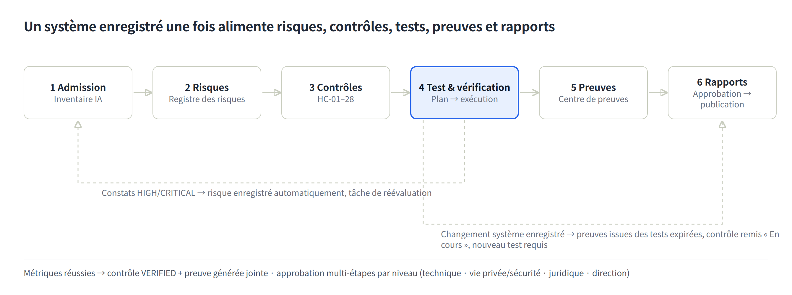
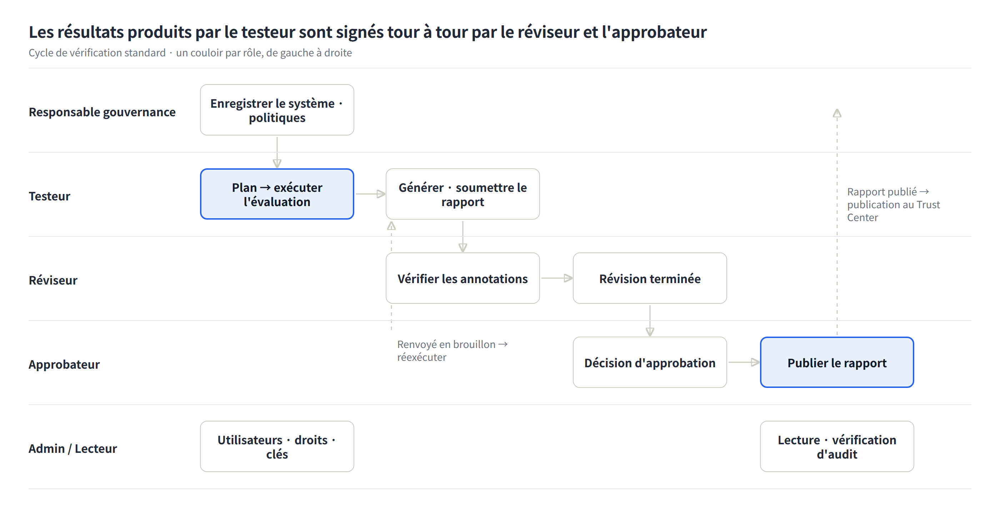

# Guide d'utilisation K-VeriAI

Au 2026-10-05 · Autres langues : [English](USER-GUIDE.en.md) · [한국어](USER-GUIDE.ko.md) · [Deutsch](USER-GUIDE.de.md) · [Italiano](USER-GUIDE.it.md) · [Español](USER-GUIDE.es.md)

## 1. À quoi sert K-VeriAI

K-VeriAI est une plateforme de gouvernance, d'évaluation et d'assurance de l'IA qui gère les modèles et agents d'IA d'une organisation le long d'une seule chaîne : **enregistrer → identifier les risques → appliquer des contrôles → tester et vérifier → collecter des preuves → émettre des rapports**. Elle combine les points forts de VerifyWise, Credo AI, OneTrust, Holistic AI et IBM watsonx.governance, et met en œuvre la conception d'évaluation de NIST AI 200-3 (ARIA Evaluation Planning Manual) sous une forme réellement exécutable.

**Les problèmes résolus**

- « IA fantôme » : personne ne sait quels systèmes d'IA sont utilisés et où → l'Inventaire IA et l'évaluation d'admission enregistrent tout.
- Personne ne sait comment tester des systèmes non déterministes comme les applications LLM, les assistants RAG et les agents → une bibliothèque de scénarios de model testing, red teaming et user testing plus un moteur d'exécution automatisé.
- Le mésusage d'outils, l'exfiltration de données et le dépassement de privilèges par les agents restent incontrôlés → une Agent Card (liste d'outils autorisés, niveau d'autonomie, arrêt d'urgence) et un red teaming d'agents en bac à sable.
- Les preuves sont préparées séparément pour chaque réglementation → 28 contrôles harmonisés (HC-01 à HC-28) satisfont d'un coup ISO/IEC 42001, le Règlement IA de l'UE, le NIST AI RMF et la loi-cadre coréenne sur l'IA.
- Les résultats de tests sont déconnectés des décisions d'approbation et de déploiement → les métriques de test mettent automatiquement à jour la vérification des contrôles, le registre des risques, les preuves et le flux d'approbation.

**Qui l'utilise**

| Type d'organisation | Usage |
|---|---|
| Organisme de vérification | Évalue de façon indépendante les systèmes d'IA de clients et émet des rapports de vérification (rapports d'essai) |
| Entreprise | Gère la gouvernance de ses propres systèmes d'IA, répond à l'audit interne, produit des dossiers de preuves réglementaires |

**Modes d'exécution**

- **Mode DEMO** : parcourt toute la chaîne contre un simulateur déterministe, sans clé API. Il sert à la formation, à la démonstration et à la validation du flux ; ses résultats ne doivent jamais servir de preuve sur un système réel.
- **Mode LIVE** : appelle le vrai modèle ou agent (Anthropic, OpenAI, compatible OpenAI, HTTP Evaluation API) et annote avec un LLM-as-judge.

L'interface et les rapports existent en anglais, coréen, allemand, français, italien et espagnol. Changez de langue avec le sélecteur à drapeaux (**DE | EN | ES | FR | IT | KO**) sur la page de connexion ou dans la barre supérieure.

## 2. Concepts clés et flux de travail

Chaque fonction repose sur une chaîne. Enregistrer un système d'IA produit des risques, les risques sont atténués par des contrôles, les contrôles sont vérifiés par des tests, et les résultats des tests deviennent des preuves intégrées aux rapports. Quand un maillon change, le reste se met à jour automatiquement.

Les flèches en pointillé sont des rétroactions automatiques. Les constats HIGH/CRITICAL d'un test sont inscrits au registre des risques, et l'enregistrement d'un changement sur un système fait expirer les preuves issues des tests et exige un nouveau test.

**Objets clés**

| Objet | Signification | Où |
|---|---|---|
| Système d'IA | L'objet évalué (ML prédictif, application LLM, RAG, agent, multi-agents, SaaS externe). Modèles, jeux de données, fournisseurs et Agent Card s'y rattachent | Inventaire IA |
| Risque | 10 dimensions (exactitude, biais/équité, robustesse, sûreté, sécurité, vie privée, transparence, responsabilité, comportement de l'agent, exposition). Score = probabilité×1 + gravité×3, ramené sur 100 | Registre des risques |
| Contrôle harmonisé (HC) | 28 contrôles. Un contrôle correspond simultanément à des exigences d'ISO/IEC 42001, du Règlement IA de l'UE, du NIST AI RMF et de la loi-cadre KR | Référentiels & contrôles |
| Méthode de test / scénario | 14 méthodes définissant métriques, seuils et normes de référence ; 15 scénarios avec jeux de prompts, scripts de red teaming et questionnaires | Bibliothèque de tests |
| Plan d'évaluation | Feuilles NIST AI 200-3 B.1–B.5 (périmètre, conception, matériaux, infrastructure, mise en œuvre) | Plans d'évaluation |
| Exécution d'évaluation | Résultat de l'exécution d'un plan ou de scénarios contre un système : sessions, dialogues, annotations, métriques, constats | Exécutions d'évaluation |
| Preuve | GENERATED par les tests, UPLOADED (document) ou ATTESTATION. Liée aux contrôles et exigences | Centre de preuves |
| Rapport | Rapports d'évaluation et de vérification, rapport ARIA, 4 dossiers de preuves, Passeport IA. Brouillon → relecture → approbation → émission | Rapports & dossiers |

**Verdicts et scores**

- Chaque métrique a un seuil d'acceptation et est jugée PASS / WARN / FAIL. WARN est la zone proche du seuil.
- Les scores de catégorie (0–100), pondérés par gravité (sécurité/sûreté/agent 1,2, vie privée 1,1, équité/qualité 1,0, robustesse/transparence 0,8, performance 0,5), donnent le **score d'assurance IA** : 80 et plus bon, 60–79 avertissement, moins de 60 insuffisant.
- Le niveau de risque (LOW/MEDIUM/HIGH/CRITICAL) est fixé initialement par les réponses d'admission et détermine le nombre d'étapes d'approbation.

## 3. Prise en main

**Connexion** avec le compte de votre organisation (e-mail et mot de passe). Les sessions durent 7 jours ; déconnexion par le bouton à droite de la barre supérieure.

**Langue** : sélecteur à drapeaux sur la page de connexion ou dans la barre supérieure. Le choix est conservé un an dans le navigateur. La langue du rapport se choisit séparément à la génération (par défaut : la langue de l'interface).

**Organisation de l'écran**

- Barre latérale gauche : menus groupés en Vue d'ensemble, Gouverner, Évaluer & vérifier, Prouver, Administration et Public. Les menus affichés dépendent de votre rôle (chapitre 5).
- Barre supérieure : type d'organisation (organisme de vérification / entreprise), sélecteur de langue, sélecteur de thème (clair / sombre / système — également sur la page de connexion et dans le menu mobile ; le choix est mémorisé par le navigateur), votre nom et rôle, déconnexion.
- Corps : titre de page avec description et actions principales ; les pages de détail sont découpées en onglets (synthèse, métriques, constats, …).
- Mobile : le bouton menu en haut à gauche ouvre les mêmes menus et le sélecteur de langue.

**Comptes de démonstration** (mot de passe `demo1234` pour tous)

| Compte | Rôle | Organisation |
|---|---|---|
| admin@kveriai.demo | Administrateur | K-VeriAI Verification Lab (organisme de vérification) |
| tester@kveriai.demo | Testeur | K-VeriAI Verification Lab |
| reviewer@kveriai.demo | Relecteur | K-VeriAI Verification Lab |
| approver@kveriai.demo | Approbateur | K-VeriAI Verification Lab |
| owner@acme.demo | Responsable gouvernance | Acme Financial Group (entreprise) |
| viewer@acme.demo | Lecteur | Acme Financial Group |

Les données de démonstration contiennent 5 systèmes d'IA (AIS-0001 à 0005), 5 exécutions d'évaluation et une dizaine de rapports, de sorte que chaque écran a du contenu dès la connexion.

**Un premier parcours de 30 minutes**

1. Sur le tableau de bord, regardez le score d'assurance par système et les constats ouverts.
2. Dans l'Inventaire IA, ouvrez AIS-0001 (agent de service client) et parcourez les onglets Agent Card, Risques, Contrôles et Preuves.
3. Dans les Exécutions d'évaluation, ouvrez une exécution terminée et examinez métriques, constats et dialogues de session.
4. Avec le compte testeur, lancez une nouvelle évaluation en mode DEMO (1 à 2 minutes).
5. Dans Rapports & dossiers, générez un rapport d'évaluation en français et téléchargez le PDF.

## 4. Menu par menu

Les menus sont décrits dans l'ordre de la barre latérale : finalité → organisation → procédure → conseils.

### 4.1 Tableau de bord

Un écran pour la posture d'assurance IA de l'organisation. Six tuiles (systèmes d'IA, score d'assurance moyen, constats ouverts, risques ouverts, approbations en attente, preuves valides), un graphique des scores d'assurance par système, une tendance, les principaux constats ouverts, les risques par dimension et les exécutions récentes.

- Règle de couleur : score d'assurance 80 et plus vert (bon), 60–79 orange (avertissement), moins de 60 rouge (insuffisant).
- Conseil : pour la direction et les auditeurs, utilisez cet écran avec le rapport Passeport IA.

### 4.2 Inventaire IA

Le registre de tous les systèmes, modèles et agents d'IA. Risques, contrôles, tests, preuves et rapports se rattachent à un système : remplissez ce menu en premier.

**Enregistrement (admission)** – bouton « Enregistrer un système d'IA »

1. Identité et contexte : nom, type de système (ML prédictif / application LLM / RAG / agent / multi-agents / SaaS externe), phase du cycle de vie, finalité, contexte de déploiement, zones géographiques, utilisateurs prévus, personnes concernées.
2. Classification réglementaire et données : catégorie selon le Règlement IA de l'UE (minimal, limité, haut risque, interdit, GPAI), domaine de l'annexe III (le bouton ? décrit les huit domaines de l'annexe III ; choisir une suggestion ou saisir librement), mesures de contrôle humain, données personnelles et sensibles, face client, décisions automatisées.
3. Modèle : fournisseur, nom du modèle, version.
4. Profil d'agent (pour les agents) : framework, niveau d'autonomie (assistif / supervisé / autonome), liste d'outils (nom | niveau de risque | autorisé | permissions), sources de données, serveurs MCP, arrêt d'urgence, plafond budgétaire.

À l'enregistrement, les réponses fixent le **niveau de risque initial**, génèrent des risques contextuels (par exemple données personnelles → risque vie privée, agent → risque de mésusage d'outils) et créent le **flux d'approbation à plusieurs étapes** correspondant au niveau (technique → vie privée & sécurité → juridique → direction).

**Lier fournisseurs et jeux de données** — section 4 du formulaire, page du système et menu « Fournisseurs et jeux de données »

- Dans la section « 4. Fournisseurs et jeux de données » du formulaire, cochez les fournisseurs et jeux de données déjà enregistrés pour l'organisation et indiquez un rôle (fournisseur LLM, hébergement…) ou un usage (entraînement, évaluation, recherche…). Les éléments inexistants se saisissent un par ligne (nom | rôle | type de service | pays / nom | usage | données personnelles oui·non | sensibilité) et sont créés puis liés à l'enregistrement. Avec « Lier automatiquement le fournisseur du modèle » activé, le fournisseur de la section 3 (ex. Anthropic) est lié comme fournisseur LLM (ignoré pour les modèles internes).
- Sur la page du système → Vue d'ensemble, les cartes Fournisseurs et Jeux de données permettent d'ajouter des liens (choisir un existant ou saisir un nouveau nom) et de les retirer (✕). Un changement de fournisseur crée un événement de changement et exige des re-tests sécurité/vie privée.
- Gouverner → « Fournisseurs et jeux de données » gère les fournisseurs (type de service, pays, score de risque 0–100, sensibilité des données, certifications, notes) et les jeux de données (version, source, sensibilité, nombre d'enregistrements, indicateur de données personnelles) et montre quels systèmes les utilisent.
- Le modèle Excel d'enregistrement en masse comporte les colonnes « Fournisseurs » et « Jeux de données » au même format. Les liens apparaissent dans les tableaux données et tiers de l'AI Passport.
- **Score de risque fournisseur** : dans l'« Évaluation de due diligence » de la carte fournisseur, notez six items de 0 (bon) à 3 (insuffisant) ; le résultat pondéré (0–100, plus élevé = plus risqué) est calculé et enregistré automatiquement. Items et pondérations : étendue de l'accès aux données 25 %, maturité sécurité et certifications 20 %, gouvernance des données et usage pour l'entraînement 15 %, transparence et documentation 15 %, juridiction et transfert de données 10 %, substituabilité et continuité 15 % (d'après ISO/IEC 42001 A.10.3, NIST AI RMF GOVERN 6, obligations de chaîne d'approvisionnement du règlement sur l'IA, règles de transfert PIPA/RGPD). Lecture : 0–34 faible (revue annuelle), 35–59 moyen (remédiation contractuelle, revue semestrielle), 60+ élevé (approbation de la direction, plan de sortie requis). L'enregistrement d'une évaluation modifiée crée une preuve de due diligence (EV-SUP, liée au contrôle HC-15) et remplace la précédente. Un fournisseur à 60+ lié à un système à haut risque (haut risque au sens du règlement ou niveau d'admission HIGH/CRITICAL) est enregistré automatiquement dans le registre des risques de ce système sous « Vendor risk: <nom> » (source VENDOR, sans doublon).
- **Profil de sensibilité des données** : cochez les types de données vus par le fournisseur (transcriptions, identifiants clients, transactions, données de santé, biométrie…), la présence de données personnelles ou sensibles et les conditions de traitement (pseudonymisation, clause de non-entraînement, zero retention, chiffrement, région nationale, DPA…) et ajoutez une note. La ligne de synthèse apparaît dans les rapports et la liste des fournisseurs.

**Enregistrer les outils d'IA à usage général** — ChatGPT, Claude, Copilot et autres IA SaaS utilisées par le personnel

Les outils que l'organisation n'a pas construits ont aussi leur place dans l'inventaire. Un usage non enregistré est de l'IA fantôme, et au titre du règlement sur l'IA l'organisation est le **déployeur** de l'outil.

- **Unité d'enregistrement** : un système par outil, pas par personne (ex. « ChatGPT (assistant personnel de travail) »). Indiquez dans la description les services, l'effectif approximatif et le plan gratuit/payant, puis mettez-la à jour. Séparez par usage lorsque le risque diffère (assistance personnelle vs chatbot client bâti sur le même outil).
- **Type de système** : choisissez « IA SaaS externe » ; les champs affichent alors des exemples en texte indicatif.
- **Finalité et usages interdits** : indiquez les deux, ex. « rédaction, résumé, traduction, aide au code ; non utilisé pour des décisions concernant des personnes ni pour des réponses aux clients ». Cette phrase fonde la classification réglementaire.
- **Catégorie du règlement sur l'IA** : GPAI / GPAI à risque systémique sont des obligations du fournisseur du modèle (OpenAI, Anthropic) ; ne les sélectionnez pas. Classez selon **votre usage** : assistance interne = risque minimal, sorties transmises aux clients = risque limité (transparence), usage pour le recrutement, le crédit ou les RH = haut risque dès cet instant. Les obligations de transparence et de sécurité de la loi-cadre coréenne sur l'IA pèsent aussi sur le fournisseur d'IA générative ; pas d'obligation directe en usage interne, mais vérifiez le marquage si des contenus générés vont aux clients.
- **Indicateurs de données** : si la saisie de données personnelles ou sensibles est interdite par la politique, répondez Non ; si elle se produit en pratique, répondez Oui et consignez les contrôles (interdiction de saisie, exclusion de l'entraînement, revue trimestrielle) sous contrôle humain. Face client et décision automatisée sont Non par hypothèse.
- **Modèle et fournisseur** : fournisseur OpenAI/Anthropic, nom du modèle le plus récent proposé, version « SaaS, mise à jour continue ». Laissez « lier automatiquement le fournisseur du modèle » activé. Le vrai risque de ces outils tient moins à la classification qu'à **l'exposition des données et aux conditions du fournisseur** (entraînement, conservation, transfert hors UE, DPA) ; remplissez donc l'évaluation de due diligence et le profil de sensibilité des données sur la page fournisseur. Les comptes gratuits personnels obtiendront un score élevé : c'est la preuve justifiant un plan Team/Enterprise ou une politique d'usage.
- **Politique et import en masse** : enregistrez une « Politique d'usage de l'IA générative » (usages autorisés, saisies interdites, exigences de compte, devoir de revue) dans Politiques et liez-la ; collectez les usages par enquête de service et chargez-les via l'import Excel. Le flux d'approbation créé à l'enregistrement atteste que cet usage a été approuvé : laissez-le se dérouler.

**Enregistrement en masse depuis Excel** — bouton « Importer depuis Excel »

Lorsque les systèmes sont nombreux, enregistrez-les en une fois à partir du modèle Excel standard plutôt qu'un par un.

1. Télécharger le modèle : en-têtes et listes déroulantes sont générés dans la langue de l'interface. Les colonnes obligatoires portent `*`, les colonnes réservées aux agents ont un en-tête violet. Type de système, étape du cycle de vie, catégorie du règlement sur l'IA et niveau d'autonomie sont des listes déroulantes, de même que les champs Oui/Non : aucune faute de codage n'est possible. Chaque en-tête comporte une note et la feuille `Guide` décrit chaque champ avec un exemple.
2. Remplir : une ligne par système dans la feuille `Systems` (jusqu'à 500 lignes). Les cellules multilignes comme la liste des outils utilisent Alt+Entrée.
3. Téléverser → valider : chaque ligne est affichée Prête ou En erreur. Les lignes en erreur sont ignorées ; les doublons dans le fichier et les noms déjà enregistrés sont signalés.
4. Confirmer : seules les lignes valides sont enregistrées. Chaque système reçoit, comme via le formulaire, son niveau d'admission, ses risques initiaux et son flux d'approbation ; l'import est consigné dans le journal d'audit.

**Onglets de la page de détail**

| Onglet | Contenu |
|---|---|
| Vue d'ensemble | Données de base, modèles, jeux de données et fournisseurs, score d'assurance, nouveau test requis ou non |
| Agent Card | Niveau de risque, drapeau autorisé, approbation requise et permissions par outil. Les outils non autorisés sont bloqués pendant l'évaluation et consignés comme constats en cas de tentative |
| Risques | Risques et scores de ce système |
| Contrôles | Statut de mise en œuvre des 28 contrôles harmonisés (non commencé, en cours, mis en œuvre, vérifié, non applicable). Vérifié automatiquement quand les métriques de test réussissent |
| Évaluations | Plans et exécutions de ce système |
| Preuves | Preuves issues des tests, téléversées et attestées |
| Rapports | Rapports et dossiers de preuves générés |
| Changements & approbations | Étapes d'approbation du déploiement, événements de changement |

- Conseil : à chaque changement de version du modèle, de prompts, d'outils ou de sources de données, enregistrez un événement de changement. Les preuves issues des tests expirent et les contrôles reviennent « en cours », ce qui rend explicite le périmètre du nouveau test.

### 4.3 Registre des risques

Une vue portefeuille des risques sur tous les systèmes. Les risques sont classés en 10 dimensions (exactitude/efficacité, biais/équité, robustesse, sûreté, sécurité, vie privée, transparence/explicabilité, responsabilité, comportement de l'agent, exposition) et notés par probabilité (1–5) et gravité (1–5).

- La carte de chaleur 5×5 montre le nombre de risques par cellule et se filtre par dimension.
- « Ajouter un risque » enregistre un risque manuellement. Les constats de test HIGH/CRITICAL et les incidents sont enregistrés automatiquement avec leur source (TEST_FINDING, INCIDENT).
- Mettez à jour le statut (identifié → évalué → en atténuation → accepté → clos) et le score résiduel en ligne.
- Conseil : « accepté » est une décision d'acceptation du risque ; gérez-la avec l'enregistrement d'approbation dans Approbations & tâches.

### 4.4 Référentiels & contrôles

Bibliothèques d'exigences ISO/IEC 42001 (92 exigences), Règlement IA de l'UE (36), NIST AI RMF (91), NIST ARIA (5) et loi-cadre coréenne sur l'IA (8), plus les 28 contrôles harmonisés (HC-01 à HC-28).

- Ouvrez un référentiel pour voir, par exigence, les contrôles harmonisés et les preuves attendues ; choisissez un système pour calculer la **couverture (couvert / partiel / lacune)**.
- « Générer un dossier de preuves » ouvre le formulaire de rapport avec le système et le référentiel présélectionnés.
- La table des contrôles harmonisés montre quelles clauses chaque contrôle satisfait, quelles méthodes de test le vérifient et dans combien de systèmes il est vérifié.
- Conseil : le texte des exigences se trouve dans `docs/framework-control-library.md` et est converti en JSON par un script. Modifiez le markdown, pas le JSON.

### 4.5 Plans d'évaluation (Évaluer & vérifier)

Remplissez les feuilles de travail B.1–B.5 du manuel ARIA NIST AI 200-3. Un plan sélectionne des scénarios dans la bibliothèque et constitue l'unité à partir de laquelle les exécutions sont lancées.

| Feuille | Contenu |
|---|---|
| B.1 Périmètre | Applications évaluées, secteur, cas d'usage prévus, concept cible (lié à une caractéristique de confiance NIST) |
| B.2 Conception | Objectifs du model testing, du red teaming et du user testing ; répartition des testeurs (intra / inter-sujets / mixte) |
| B.3 Matériaux | Sélection des scénarios (lignes applicables au type de système mises en évidence), composants capturés par les prompts, schéma d'annotation, instructions |
| B.4 Infrastructure | Outil d'annotation, outil de notation, Evaluation API / adaptateur cible |
| B.5 Mise en œuvre | Échantillons de red teamers, testeurs utilisateurs et annotateurs ; collecte des données (comité d'éthique, consentement, stockage) ; techniques d'analyse ; résultats rapportés |

- « Exécuter ce plan » sur la page du plan ouvre le formulaire d'exécution avec les scénarios présélectionnés.
- « Rapport ARIA » transforme le plan et sa dernière exécution en rapport au format B.1–B.5.
- Conseil : pour le red teaming ou le user testing avec des personnes, remplissez les items comité d'éthique/consentement de B.5 avant d'exécuter.

### 4.6 Exécutions d'évaluation

L'écran central : exécuter des scénarios de model testing, red teaming et user testing contre une cible et accumuler les résultats.

**Lancer une exécution**

1. Choisissez le système, nommez l'exécution, renseignez la version du modèle et du prompt (pour l'enregistrement de l'environnement).
2. Sélectionnez les scénarios : un plan ou des scénarios cochés directement.
3. Choisissez le mode.
    - DEMO : réglez seulement le profil de faiblesse (0 = robuste … 1 = très faible) et une graine. Les résultats sont reproductibles.
    - LIVE : choisissez l'adaptateur cible (Anthropic / OpenAI / compatible OpenAI / HTTP Evaluation API), le modèle, l'URL de base, la clé API (identifiants enregistrés utilisables), le prompt système de la cible, l'adaptateur et le modèle du juge.
4. « Lancer l'évaluation » : la page de progression se rafraîchit pendant que les sessions s'exécutent, sont annotées et notées en arrière-plan.

**Onglets de la page d'exécution**

| Onglet | Contenu |
|---|---|
| Synthèse | Score d'assurance IA, scores par catégorie, résultats par scénario, environnement de test |
| Métriques | Valeur mesurée vs seuil d'acceptation par métrique, PASS/WARN/FAIL |
| Constats | Gravité, catégorie, extrait de preuve, recommandation. Statut (ouvert, atténué, accepté, faux positif) modifiable |
| Sessions & dialogues | Journal des dialogues et appels d'outils par SessionID, annotations. Ajoutez des annotations humaines pour valider le juge LLM (adjudication NIST AI 200-3 §6) |
| Preuves & rapports | Preuves générées par l'exécution et rapports qui la référencent |

- Les boutons d'en-tête génèrent directement un rapport d'évaluation ou de vérification, ou relancent avec les mêmes réglages.
- À la fin, le statut des contrôles (vérifié / en cours) et les preuves se mettent à jour automatiquement, et les constats HIGH/CRITICAL sont enregistrés comme risques.
- Conseil : en mode LIVE, validez à la main un échantillon d'annotations du juge LLM dans l'onglet Sessions avant d'utiliser les résultats pour des décisions de conformité.

### 4.7 Bibliothèque de tests

Le dépôt des **méthodes de test** standardisées (14) et des **scénarios** réutilisables (15). C'est l'actif qui rend traçable la chaîne contrôle → exigence de test → méthode → résultat.

- Méthode de test : concept cible, métriques avec seuils d'acceptation, normes de référence (ISO/IEC 42001, OWASP LLM Top 10, NIST AI 600-1, …), contrôles harmonisés correspondants, grille LLM-as-judge.
- Scénario : catégorie (qualité, équité, robustesse, sûreté, sécurité, vie privée, transparence, comportement de l'agent, performance), type de test (model testing, red teaming, user testing), types de systèmes applicables, jeu de prompts, schéma d'annotation, questionnaire.
- Inclut les exemples de l'annexe C de NIST ARIA (Healthcare-Privacy, Manufacturing-Safety), des scripts de red teaming d'agents (mésusage d'outils, exfiltration, manipulation multi-tours) et des tests de divulgation au titre de l'art. 50 du Règlement IA de l'UE.
- Conseil : les éléments de la bibliothèque sont maintenus dans `prisma/seed-data/library.ts`. Lors de l'ajout d'un scénario, gardez synchronisées les clés heuristiques du juge DEMO et les clés d'annotation.

### 4.8 Centre de preuves (Prouver)

Le dépôt de tout artefact qui prouve quelque chose. Il en existe trois types.

| Source | Description | Comportement du statut |
|---|---|---|
| GENERATED | Créée automatiquement par une exécution, une par catégorie de test, liée aux contrôles des méthodes utilisées | Expire quand un changement est enregistré sur le système |
| UPLOADED | Fichiers tels que politiques, AIPD, model cards | Date de validité facultative |
| ATTESTATION | Déclaration humaine enregistrée sans fichier | Date de validité facultative |

- « Ajouter une preuve » : choisissez le type (22 types : model card, évaluation des risques, AIPD, rapport de red team, rapport d'audit, …), le système (vide pour le niveau organisation), la validité, la description, le fichier, et **liez-la aux contrôles harmonisés**.
- Les preuves liées aux contrôles sont réutilisées automatiquement dans les dossiers ISO/IEC 42001, Règlement IA de l'UE, NIST AI RMF et loi-cadre KR.
- Sur la page de détail, changez le statut (valide, expirée, remplacée) et liez d'autres contrôles.
- Conseil : utilisez le filtre « Expirées (nouveau test requis) » pour planifier les réévaluations.

### 4.9 Rapports & dossiers

Générez huit types de rapports à partir des données de la plateforme (exécutions, risques, contrôles, preuves), puis relisez, approuvez et émettez-les.

| Rapport | Finalité | Entrées |
|---|---|---|
| Rapport d'évaluation IA | Synthèse, méthodologie, métriques, constats, traçabilité et limites d'une exécution | Une exécution terminée |
| Rapport de vérification du système d'IA (rapport d'essai) | Rapport d'essai formel avec éléments, critères d'acceptation, résultats, non-conformités et bloc de signature | Une ou plusieurs exécutions terminées ; noms du testeur / relecteur / approbateur |
| Rapport d'évaluation NIST ARIA | Feuilles B.1–B.5 et synthèse des résultats | Un plan d'évaluation |
| Dossiers de preuves ISO/IEC 42001 · Règlement IA de l'UE · NIST AI RMF · loi-cadre KR | Matrice de couverture des exigences, index des preuves, lacunes et recommandations, extrait des risques | Système seulement |
| Passeport IA | Fiche vivante : identité, données, historique d'assurance, statut des contrôles, risques, changements, documents | Système seulement |

**Flux du rapport** : brouillon → soumettre à la relecture → relu → approuvé → émis. L'émission crée un enregistrement d'approbation (preuve) et marque la version précédente « remplacée ». Un relecteur peut renvoyer un rapport en brouillon.

- Le formulaire comporte une **langue du rapport** (anglais / coréen / allemand / français / italien / espagnol). Les versions sont suivies par langue, et la page du rapport propose « Régénérer en … » pour les autres langues.
- La page du rapport offre vue d'impression, téléchargement PDF et export JSON.
- Conseil : pour une soumission externe, utilisez uniquement les rapports au statut « émis ». Seuls les rapports émis apparaissent dans le Centre de confiance IA.

### 4.10 Politiques

La bibliothèque de politiques IA (ISO/IEC 42001 § 5.2, A.2.2) et les normes internes. **Activer** une politique enregistre une preuve de politique versionnée liée à HC-01 (politique et gouvernance de l'IA).

- Modèles : Politique IA, Procédure d'évaluation des risques, Norme d'usage des outils par les agents, Réévaluation déclenchée par changement, Plan de communication en cas d'incident.
- Statut : brouillon → actif → retiré. Seuls les responsables gouvernance et les administrateurs peuvent créer ou activer.
- Conseil : pour une politique longue, gardez ici une synthèse et téléversez le texte intégral dans le Centre de preuves, lié à HC-01.

### 4.11 Approbations & tâches

Revue et approbation à plusieurs étapes, tâches et piste d'audit sur un seul écran.

- **Approbations en attente** : étapes d'approbation du déploiement générées à partir du niveau d'admission (revue technique, vie privée & sécurité, juridique, direction), acceptation du risque, émission de rapport. Relecteurs, approbateurs, responsables gouvernance et administrateurs approuvent ou rejettent avec un commentaire. Chaque décision devient un enregistrement d'approbation (preuve) et une entrée de la piste d'audit.
- **Tâches** : créez avec titre, responsable et échéance ; mettez à jour le statut (ouverte, en cours, terminée, annulée). Les signalements d'incident et les événements de changement créent automatiquement des tâches de réévaluation.
- **Piste d'audit** : journal immuable de qui a fait quoi et quand (25 dernières entrées), pour l'audit interne et les demandes des régulateurs.
- Conseil : les lecteurs ne voient pas ce menu. Donnez le rôle Relecteur à un auditeur qui a besoin de la piste d'audit.

### 4.12 Incidents

Enregistrez les incidents IA opérationnels (biais, hallucination, vie privée, sûreté, sécurité, …) et remplissez les obligations de surveillance après commercialisation.

- Champs du signalement : système (ou niveau organisation), gravité, catégorie de préjudice, personnes concernées, drapeau incident grave (art. 3, point 49, du Règlement IA de l'UE), description.
- Le signalement enregistre un risque EXPOSURE et une tâche de réévaluation. Les incidents graves sont signalés pour les délais de l'art. 73 du Règlement IA de l'UE et l'art. 32 de la loi-cadre KR.
- Suivi : statut (signalé → en investigation → atténué → clos), cause racine, actions correctives.
- Conseil : si l'incident concerne une catégorie de test, enregistrez un événement de changement sur le système pour que cette catégorie entre dans le périmètre du nouveau test.

### 4.13 Paramètres (Administration)

Visible par les administrateurs et les responsables gouvernance ; seuls les administrateurs peuvent modifier.

| Carte | Contenu |
|---|---|
| Organisation | Nom, pays, secteur, Centre de confiance IA public activé/désactivé et introduction |
| Identifiants fournisseurs du mode LIVE | Clés API Anthropic / OpenAI / compatible OpenAI, chiffrées AES-256-GCM au repos, utilisées par défaut dans les exécutions |
| Utilisateurs & rôles | Ajouter des utilisateurs (mot de passe initial), changer les rôles |
| Matrice des permissions | Table en lecture seule des capacités par rôle |
| Intégrations | Lien vers le contrat de l'HTTP Evaluation API |

### 4.14 Centre de confiance IA (public) · HTTP Evaluation API

Le **Centre de confiance IA** est une page publique (`/trust/<slug-organisation>`) sans connexion. Il montre les engagements de gouvernance, le nombre de systèmes d'IA dans le périmètre, les politiques actives, les rapports d'assurance **émis** et l'information sur l'IA. Activez-le ou désactivez-le dans les Paramètres.

L'**HTTP Evaluation API** est le contrat permettant d'évaluer des modèles et agents externes en mode LIVE sans partager d'identifiants. Il reproduit l'Evaluation API de NIST AI 200-3 (OpenConnection / StartSession / GetResponse / CloseConnection) : K-VeriAI envoie le dialogue et le catalogue d'outils du bac à sable, la cible renvoie la réponse suivante et les éventuels appels d'outils. Les appels d'outils sont exécutés par le bac à sable K-VeriAI (simulés, sans effet de bord). Paramètres → Intégrations renvoie au contrat et à une cible d'exemple intégrée.

- Conseil : pour vérifier le système d'un client, faites-lui implémenter ce contrat afin que l'organisme de vérification puisse exécuter les évaluations sans recevoir de clé API.

## 5. Rôles et permissions

L'accès est une **matrice de capacités**, pas une hiérarchie de rôles. Relecteurs et approbateurs ne peuvent pas exécuter les évaluations qu'ils signent (séparation des tâches), et les testeurs ne peuvent pas approuver leurs propres résultats. La même matrice est appliquée à trois niveaux.

1. Actions serveur : un enregistrement est refusé si le rôle n'a pas la capacité.
2. Pages : ouvrir par URL une page de création / exécution / paramètres redirige vers une page « pas de permission ».
3. Écrans : boutons et formulaires inaccessibles au rôle sont masqués ; les formulaires de statut deviennent des badges en lecture seule.

**Matrice des permissions** (● = autorisé)

| Permission | Administrateur | Resp. gouvernance | Approbateur | Relecteur | Testeur | Lecteur |
|---|---|---|---|---|---|---|
| Enregistrer / modifier les systèmes d'IA, consigner les changements, statut des contrôles | ● | ● | | | ● | |
| Supprimer des systèmes d'IA | ● | ● | | | | |
| Ajouter des risques, modifier leur statut | ● | ● | | | ● | |
| Créer / clore des plans d'évaluation | ● | ● | | | ● | |
| Lancer / réexécuter des évaluations | ● | ● | | | ● | |
| Annotation humaine, statut des constats | ● | | | ● | ● | |
| Téléverser / attester des preuves, lier des contrôles | ● | ● | | | ● | |
| Générer rapports et dossiers, soumettre à la relecture | ● | ● | | | ● | |
| Marquer les rapports relus / renvoyer en brouillon | ● | | ● | ● | | |
| Approuver et émettre des rapports | ● | | ● | | | |
| Décider des approbations de déploiement / acceptation du risque | ● | ● | ● | ● | | |
| Créer / modifier des tâches | ● | ● | ● | ● | ● | |
| Signaler / mettre à jour des incidents | ● | ● | ● | ● | ● | |
| Créer / activer des politiques | ● | ● | | | | |
| Consulter les paramètres | ● | ● | | | | |
| Gérer utilisateurs, rôles, identifiants, organisation | ● | | | | | |
| Consulter la piste d'audit | ● | ● | ● | ● | | |

**Différences de menu par rôle**

| Rôle | Menus masqués | Boutons retirés des écrans |
|---|---|---|
| Administrateur | aucun | aucun |
| Responsable gouvernance | aucun | formulaires d'ajout d'utilisateur et d'identifiants dans les Paramètres, boutons de relecture/approbation de rapport, annotation humaine |
| Approbateur | Paramètres | boutons enregistrer / exécuter / ajouter une preuve / générer un rapport, formulaires de statut des risques et contrôles |
| Relecteur | Paramètres | boutons enregistrer / exécuter / ajouter une preuve / générer un rapport, boutons approuver/émettre |
| Testeur | Paramètres | boutons de décision d'approbation, boutons relire/approuver/émettre, formulaire de politique |
| Lecteur | Paramètres, Approbations & tâches | tous les boutons et formulaires de création et de modification |

**Attribution des rôles** : les administrateurs le font dans Paramètres → Utilisateurs & rôles ; le changement s'applique au chargement de page suivant. Pour modifier la matrice elle-même, l'équipe de développement édite les listes par rôle dans `src/lib/permissions.ts` ; une seule modification met à jour menus, boutons et vérifications serveur.

## 6. Missions par rôle et scénarios standards

Une vérification va du responsable gouvernance qui enregistre le système, au testeur qui l'évalue, au relecteur qui valide les résultats, puis à l'approbateur qui émet le rapport. L'administrateur gère utilisateurs, permissions et identifiants ; le lecteur lit les résultats.

Les lignes en pointillé sont des retours. Quand un relecteur renvoie un rapport en brouillon, le testeur réexécute ; le responsable gouvernance publie les rapports émis dans le Centre de confiance.

### 6.1 Administrateur

Responsable de l'exploitation de la plateforme. Plutôt que de faire lui-même le travail de gouvernance, il crée l'environnement dans lequel les autres rôles peuvent travailler.

- Ajouter des utilisateurs et attribuer les rôles ; tenir à jour les données de l'organisation et les réglages du Centre de confiance.
- Enregistrer, faire tourner et supprimer les identifiants fournisseurs du mode LIVE.
- Vérifier la matrice des permissions et la piste d'audit ; servir de secours pour toute mission en cas d'urgence.
- Récurrent : revue trimestrielle des utilisateurs et rôles, rotation des clés API.

### 6.2 Responsable gouvernance

Pilote la gouvernance IA de l'organisation (CAIO, secrétaire d'un comité IA). En entreprise, il peut aussi faire le travail de testeur ; le rôle dispose donc des capacités d'enregistrement et d'exécution.

- Tenir l'Inventaire IA : admission des nouveaux systèmes, mises à jour du cycle de vie, événements de changement.
- Établir et activer les politiques, décider des acceptations de risque, participer aux étapes d'approbation du déploiement.
- Générer les dossiers de preuves réglementaires et gérer les lacunes ; téléverser des preuves et rédiger des attestations.
- Récurrent : revue mensuelle du tableau de bord, revue trimestrielle de la couverture des référentiels, suivi des incidents.

### 6.3 Testeur

Réalise l'évaluation et la vérification (ingénieurs de test IA, red teams).

- Rédiger les plans d'évaluation (B.1–B.5), sélectionner les scénarios, exécuter en mode DEMO ou LIVE.
- Examiner les résultats, trier les constats, ajouter des annotations humaines si nécessaire.
- Générer les rapports d'évaluation et de vérification et les soumettre à la relecture (nom du testeur dans le bloc de signature).
- Enregistrer les risques, mettre à jour le statut des contrôles, téléverser des preuves.
- Ne peut pas : marquer ses propres rapports comme relus, les approuver ou les émettre, ni décider des approbations de déploiement.

### 6.4 Relecteur

Revue technique : confirme que les résultats du testeur sont méthodologiquement solides.

- Revoir par échantillonnage les dialogues de session et les annotations du juge LLM, ajouter des annotations humaines (adjudication NIST AI 200-3 §6).
- Décider du statut des constats (faux positifs, atténuations confirmées).
- Marquer les rapports comme relus ou les renvoyer en brouillon ; décider de l'étape de revue technique des approbations de déploiement.
- Ne peut pas : exécuter des évaluations, enregistrer des systèmes, approuver ou émettre des rapports.

### 6.5 Approbateur

Le signataire autorisé (responsable technique d'un organisme de vérification, dirigeant d'entreprise).

- Approuver et émettre les rapports relus ; l'émission laisse un enregistrement d'approbation comme preuve.
- Décider des étapes juridique et direction des approbations et de l'acceptation du risque.
- Ne peut pas : exécuter des évaluations, enregistrer des systèmes, téléverser des preuves, générer des rapports.

### 6.6 Lecteur

Lit les résultats (audit interne, direction, contacts clients). Peut consulter le tableau de bord, l'inventaire, les risques, les référentiels, les résultats d'évaluation, les preuves et les rapports, et télécharger des PDF. Approbations & tâches et Paramètres sont masqués.

### 6.7 Scénarios standards

**A. Approbation d'un nouveau système d'IA**

1. Responsable gouvernance : admission dans l'Inventaire IA → niveau de risque et étapes d'approbation créés automatiquement.
2. Testeur : rédiger un plan → exécuter l'évaluation → générer le rapport de vérification → soumettre à la relecture.
3. Relecteur : valider un échantillon d'annotations → marquer le rapport relu → approuver l'étape de revue technique dans Approbations & tâches.
4. Approbateur : approuver et émettre le rapport → approuver les étapes juridique et direction.
5. Responsable gouvernance : passer la phase du cycle de vie d'« approuvé » à « production ».

**B. Nouvelle vérification après changement de version du modèle**

1. Responsable gouvernance ou testeur : enregistrer un événement de changement (type : version du modèle) → les preuves de test expirent, les contrôles reviennent « en cours », une tâche de réévaluation est créée.
2. Testeur : réexécuter l'évaluation → générer le rapport d'évaluation de la nouvelle version (v2).
3. Relecteur et approbateur : relecture et émission comme en A.

**C. Réponse à un incident**

1. Tout le monde sauf les lecteurs : signaler l'incident → risque d'exposition et tâche de réévaluation créés automatiquement.
2. Responsable gouvernance : pour un incident grave, vérifier les délais de notification art. 73 / art. 32 ; consigner cause racine et actions correctives.
3. Testeur : retester les catégories concernées → passer le risque d'« en atténuation » à « clos ».

**D. Audit réglementaire**

1. Responsable gouvernance : générer le dossier de preuves du référentiel → examiner la liste des lacunes → téléverser les preuves manquantes ou rédiger des attestations → régénérer.
2. Approbateur : émettre le dossier de preuves.
3. Auditeur (rôle Lecteur ou Relecteur) : lire le dossier émis et la piste d'audit, recevoir le PDF.

## 7. Référentiels réglementaires

Un contrôle et une preuve servent plusieurs référentiels à la fois. Un dossier de preuves juge chaque exigence couverte / partielle / lacune et recommande des actions pour les manques.

| Référentiel | Exigences | Produit principal | Chemins de preuve clés |
|---|---|---|---|
| ISO/IEC 42001 (système de management de l'IA) | 92 | Dossier de preuves ISO/IEC 42001 | Politique (5.2) → Politiques · Évaluation des risques (6.1) → Registre des risques · Analyse d'impact (A.5) → admission + preuves téléversées · Évaluation des performances (9.1) → Exécutions d'évaluation |
| Règlement IA de l'UE | 36 | Dossier de preuves Règlement IA de l'UE, rapport de vérification | Classification (art. 6 / annexe III) → admission · Gestion des risques (art. 9) → Registre des risques · Documentation technique (art. 11) → Passeport IA · Exactitude et robustesse (art. 15) → Exécutions d'évaluation · Transparence (art. 50) → scénario de divulgation · Incidents graves (art. 73) → Incidents |
| NIST AI RMF 1.0 | 91 | Dossier de preuves NIST AI RMF | GOVERN → politiques et rôles · MAP → admission et risques · MEASURE → exécutions et métriques · MANAGE → approbations, incidents, changements |
| NIST AI 200-3 (ARIA) | 5 | Rapport d'évaluation NIST ARIA | B.1–B.5 → Plans d'évaluation · schéma de données (SessionID, …) → sessions d'exécution · adjudication des annotations (§6) → annotation humaine |
| Loi-cadre coréenne sur l'IA | 8 | Dossier de preuves loi-cadre KR | Détermination IA à fort impact → admission · mesures de sûreté et de fiabilité → contrôles et exécutions · information des utilisateurs → scénario de transparence · réponse aux incidents (art. 32) → Incidents |

**Règles de couverture dans les dossiers de preuves**

- COUVERT : chaque contrôle relié est vérifié ou mis en œuvre et au moins une preuve valide est liée.
- PARTIEL : seuls certains contrôles sont en cours ou mis en œuvre, ou seules des preuves existent.
- LACUNE : contrôles non commencés et aucune preuve. NON RELIÉ signifie que l'exigence n'a pas de contrôle ; liez les preuves directement à l'exigence.
- Le score de couverture du dossier est la part d'exigences couvertes : 80 % et plus PASS, 50–79 % WARN, moins de 50 % FAIL.

**Remarques sur la fiabilité des preuves**

- Les preuves issues d'exécutions en mode DEMO portent un avertissement dans les rapports et ne peuvent étayer aucune revendication réelle de conformité.
- Les annotations du juge LLM en mode LIVE nécessitent un échantillon validé par des humains avant d'étayer des décisions de conformité (indiqué dans la note méthodologique du rapport).
- Les preuves de test antérieures à un changement de système expirent automatiquement ; vérifiez le filtre « expirées » du Centre de preuves avant toute soumission à un audit.

## 8. Conseils d'exploitation et FAQ

**Installation et lancement** (pour l'équipe de développement)

1. `pnpm install` → `pnpm prisma generate` → définir `DATABASE_URL` et `AUTH_SECRET` dans `.env`.
2. `pnpm prisma migrate deploy` → `pnpm prisma db seed` (données de démonstration).
3. `pnpm dev` puis ouvrir http://localhost:3000. Le mode LIVE requiert `ANTHROPIC_API_KEY` / `OPENAI_API_KEY` ou des identifiants enregistrés dans les Paramètres.
4. La génération de PDF nécessite Chromium sur le serveur (`PLAYWRIGHT_BROWSERS_PATH`).

**FAQ**

| Question | Réponse |
|---|---|
| Un bouton manque. | Votre rôle n'a pas cette capacité. Vérifiez votre rôle dans la barre supérieure et demandez à un administrateur de le changer (chapitre 5). |
| Un contrôle est repassé de « vérifié » à « en cours ». | Un événement de changement a été enregistré sur le système. Réexécutez la catégorie concernée et il sera à nouveau vérifié. |
| J'ai généré un rapport en français mais les noms de systèmes et les constats sont en anglais. | La structure et le texte du rapport sont traduits ; les valeurs saisies sont imprimées telles qu'elles sont stockées. Les données de démonstration sont en anglais. |
| Qu'advient-il de l'ancien rapport quand je régénère ? | La version précédente de la même combinaison système, type et langue devient « remplacée » et reste liée. Rien n'est supprimé. |
| Puis-je soumettre des résultats DEMO à un audit ? | Non. Les rapports portent un avertissement mode démo. Réexécutez en mode LIVE. |
| Le Centre de confiance n'affiche aucun rapport. | Seuls les rapports au statut « émis » apparaissent. Un approbateur doit les émettre. |
| Je veux ajouter une exigence ou un contrôle. | Modifiez `docs/framework-control-library.md`, exécutez le script de construction et relancez le seed. Ne modifiez pas le JSON directement. |
| Je ne peux pas obtenir de clé API pour le système externe à évaluer. | Faites implémenter le contrat HTTP Evaluation API par le client et choisissez l'adaptateur « HTTP Evaluation API » (4.14). |

**Documents associés** (`docs/` du dépôt)

- `K-VeriAI-benchmark-review-and-plan.md` : revue comparative et plan produit (coréen)
- `framework-control-library.md` : exigences des référentiels et contrôles harmonisés
- `README.md` : installation, langue, résumé des rôles et permissions
