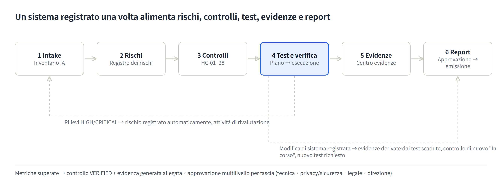
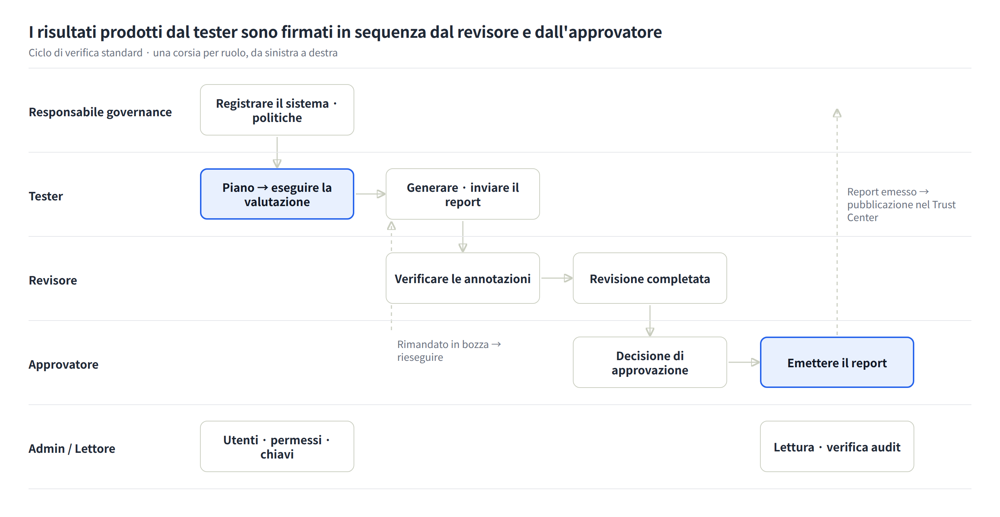

# Guida utente K-VeriAI

Aggiornata al 2026-10-05 · Altre lingue: [English](USER-GUIDE.en.md) · [한국어](USER-GUIDE.ko.md) · [Deutsch](USER-GUIDE.de.md) · [Français](USER-GUIDE.fr.md) · [Español](USER-GUIDE.es.md)

## 1. A cosa serve K-VeriAI

K-VeriAI è una piattaforma di governance, valutazione e assurance dell'IA che gestisce modelli e agenti di IA di un'organizzazione lungo un'unica catena: **registrare → identificare i rischi → applicare i controlli → testare e verificare → raccogliere evidenze → emettere report**. Combina i punti di forza di VerifyWise, Credo AI, OneTrust, Holistic AI e IBM watsonx.governance e implementa il disegno di valutazione di NIST AI 200-3 (ARIA Evaluation Planning Manual) in forma realmente eseguibile.

**Problemi risolti**

- «IA ombra»: nessuno sa quali sistemi di IA sono in uso e dove → l'Inventario IA e la valutazione di presa in carico registrano tutto.
- Nessuno sa come testare sistemi non deterministici come app LLM, assistenti RAG e agenti → una libreria di scenari di model testing, red teaming e user testing più un motore di esecuzione automatizzato.
- Uso improprio di strumenti, esfiltrazione di dati ed eccesso di privilegi degli agenti restano senza controllo → una Agent Card (lista di strumenti consentiti, livello di autonomia, arresto di emergenza) e red teaming degli agenti in sandbox.
- Le evidenze vengono preparate separatamente per ogni normativa → 28 controlli armonizzati (HC-01 … HC-28) soddisfano in una volta ISO/IEC 42001, AI Act UE, NIST AI RMF e legge quadro coreana sull'IA.
- I risultati dei test sono scollegati dalle decisioni di approvazione e rilascio → le metriche di test aggiornano automaticamente la verifica dei controlli, il registro dei rischi, le evidenze e il flusso di approvazione.

**Chi la usa**

| Tipo di organizzazione | Uso |
|---|---|
| Organismo di verifica | Valuta in modo indipendente i sistemi di IA dei clienti ed emette report di verifica (rapporti di prova) |
| Azienda | Gestisce la governance dei propri sistemi di IA, risponde all'audit interno, produce pacchetti di evidenze normative |

**Modalità di esecuzione**

- **Modalità DEMO**: percorre l'intera pipeline contro un simulatore deterministico senza chiavi API. Serve a formazione, dimostrazione e validazione del flusso; i suoi risultati non devono mai essere usati come evidenza su un sistema reale.
- **Modalità LIVE**: chiama il modello o l'agente reale (Anthropic, OpenAI, compatibile OpenAI, HTTP Evaluation API) e annota con un LLM-as-judge.

Interfaccia e report sono disponibili in inglese, coreano, tedesco, francese, italiano e spagnolo. Si cambia lingua con il selettore a bandiere (**DE | EN | ES | FR | IT | KO**) nella pagina di accesso o nella barra superiore.

## 2. Concetti chiave e flusso di lavoro

Ogni funzione poggia su una catena. Registrare un sistema di IA genera rischi, i rischi sono mitigati da controlli, i controlli sono verificati da test e i risultati dei test diventano evidenze inserite nei report. Quando un anello cambia, il resto si aggiorna automaticamente.

Le frecce tratteggiate sono retroazioni automatiche. I rilievi HIGH/CRITICAL di un test vengono registrati nel registro dei rischi e registrare una modifica su un sistema fa scadere le evidenze derivate dai test e richiede un nuovo test.

**Oggetti chiave**

| Oggetto | Significato | Dove |
|---|---|---|
| Sistema di IA | L'oggetto valutato (ML predittivo, app LLM, RAG, agente, multi-agente, SaaS esterna). Modelli, dataset, fornitori e Agent Card vi si collegano | Inventario IA |
| Rischio | 10 dimensioni (accuratezza, bias/equità, robustezza, safety, security, privacy, trasparenza, responsabilità, comportamento dell'agente, esposizione). Punteggio = probabilità×1 + gravità×3, riportato a 100 | Registro dei rischi |
| Controllo armonizzato (HC) | 28 controlli. Un controllo corrisponde contemporaneamente a requisiti di ISO/IEC 42001, AI Act UE, NIST AI RMF e legge quadro KR | Framework & controlli |
| Metodo di test / scenario | 14 metodi con metriche, soglie e norme di riferimento; 15 scenari con set di prompt, script di red teaming e questionari | Libreria dei test |
| Piano di valutazione | Schede NIST AI 200-3 B.1–B.5 (ambito, disegno, materiali, infrastruttura, attuazione) | Piani di valutazione |
| Esecuzione di valutazione | Risultato dell'esecuzione di un piano o di scenari contro un sistema: sessioni, dialoghi, annotazioni, metriche, rilievi | Esecuzioni di valutazione |
| Evidenza | GENERATED dai test, UPLOADED come documento o ATTESTATION. Collegata a controlli e requisiti | Centro evidenze |
| Report | Report di valutazione e verifica, report ARIA, 4 pacchetti di evidenze, Passaporto IA. Bozza → revisione → approvazione → emissione | Report & pacchetti |

**Esiti e punteggi**

- Ogni metrica ha una soglia di accettazione ed è giudicata PASS / WARN / FAIL. WARN è la fascia vicina alla soglia.
- I punteggi di categoria (0–100), pesati per gravità (security/safety/agente 1,2, privacy 1,1, equità/qualità 1,0, robustezza/trasparenza 0,8, prestazioni 0,5), danno il **punteggio di assurance IA**: da 80 buono, 60–79 attenzione, sotto 60 insufficiente.
- Il livello di rischio (LOW/MEDIUM/HIGH/CRITICAL) è fissato inizialmente dalle risposte di presa in carico e determina il numero di fasi di approvazione.

## 3. Primi passi

**Accesso** con l'account dell'organizzazione (e-mail e password). Le sessioni durano 7 giorni; si esce con il pulsante a destra nella barra superiore.

**Lingua**: selettore a bandiere nella pagina di accesso o nella barra superiore. La scelta è conservata un anno nel browser. La lingua del report si sceglie separatamente alla generazione (predefinita: la lingua dell'interfaccia).

**Struttura dello schermo**

- Barra laterale sinistra: menu raggruppati in Panoramica, Governare, Valutare & verificare, Dimostrare, Amministrazione e Pubblico. I menu visibili dipendono dal ruolo (capitolo 5).
- Barra superiore: tipo di organizzazione (organismo di verifica / azienda), selettore lingua, selettore del tema (chiaro / scuro / sistema — anche nella pagina di accesso e nel menu mobile; la scelta viene memorizzata dal browser), nome e ruolo, uscita.
- Corpo: titolo di pagina con descrizione e azioni principali; le pagine di dettaglio sono divise in schede (sintesi, metriche, rilievi, …).
- Mobile: il pulsante menu in alto a sinistra apre gli stessi menu e il selettore lingua.

**Account demo** (password `demo1234` per tutti)

| Account | Ruolo | Organizzazione |
|---|---|---|
| admin@kveriai.demo | Amministratore | K-VeriAI Verification Lab (organismo di verifica) |
| tester@kveriai.demo | Tester | K-VeriAI Verification Lab |
| reviewer@kveriai.demo | Revisore | K-VeriAI Verification Lab |
| approver@kveriai.demo | Approvatore | K-VeriAI Verification Lab |
| owner@acme.demo | Responsabile governance | Acme Financial Group (azienda) |
| viewer@acme.demo | Lettore | Acme Financial Group |

I dati demo contengono 5 sistemi di IA (AIS-0001 … 0005), 5 esecuzioni e una decina di report, quindi ogni schermata ha contenuti subito dopo l'accesso.

**Un primo percorso di 30 minuti**

1. Nella Dashboard guarda il punteggio di assurance per sistema e i rilievi aperti.
2. Nell'Inventario IA apri AIS-0001 (agente di assistenza clienti) e scorri le schede Agent Card, Rischi, Controlli ed Evidenze.
3. Nelle Esecuzioni di valutazione apri un'esecuzione completata ed esamina metriche, rilievi e dialoghi di sessione.
4. Con l'account tester avvia una nuova valutazione in modalità DEMO (1–2 minuti).
5. In Report & pacchetti genera un report di valutazione in italiano e scarica il PDF.

## 4. Menu per menu

I menu sono descritti nell'ordine della barra laterale: finalità → struttura → procedura → suggerimenti.

### 4.1 Dashboard

Una schermata per lo stato di assurance IA dell'organizzazione. Sei riquadri (sistemi di IA, punteggio di assurance medio, rilievi aperti, rischi aperti, approvazioni in attesa, evidenze valide), un grafico dei punteggi per sistema, un andamento, i principali rilievi aperti, i rischi per dimensione e le esecuzioni recenti.

- Regola dei colori: punteggio di assurance da 80 verde (buono), 60–79 ambra (attenzione), sotto 60 rosso (insufficiente).
- Suggerimento: per direzione e auditor usa questa schermata insieme al report Passaporto IA.

### 4.2 Inventario IA

Il registro di tutti i sistemi, modelli e agenti di IA. Rischi, controlli, test, evidenze e report si collegano a un sistema: compila prima questo menu.

**Registrazione (presa in carico)** – pulsante «Registra sistema di IA»

1. Identità e contesto: nome, tipo di sistema (ML predittivo / app LLM / RAG / agente / multi-agente / SaaS esterna), fase del ciclo di vita, finalità, contesto di impiego, aree geografiche, utenti previsti, persone interessate.
2. Classificazione normativa e dati: categoria AI Act UE (minimo, limitato, alto rischio, vietato, GPAI), area dell'allegato III (il pulsante ? descrive le otto aree dell'allegato III; scegliere un suggerimento o digitare liberamente), misure di sorveglianza umana, dati personali e sensibili, rivolto al cliente, decisioni automatizzate.
3. Modello: provider, nome del modello, versione.
4. Profilo agente (per gli agenti): framework, livello di autonomia (assistivo / supervisionato / autonomo), elenco strumenti (nome | livello di rischio | consentito | permessi), fonti dati, server MCP, arresto di emergenza, tetto di budget.

Al salvataggio le risposte fissano il **livello di rischio iniziale**, generano rischi contestuali (ad es. dati personali → rischio privacy, agente → rischio di uso improprio degli strumenti) e creano il **flusso di approvazione a più fasi** adeguato al livello (tecnica → privacy & sicurezza → legale → direzione).

**Collegare fornitori e dataset** — sezione 4 del modulo, pagina del sistema e menu «Fornitori e dataset»

- Nella sezione «4. Fornitori e dataset» del modulo, spunta i fornitori e i dataset già registrati per l'organizzazione e indica un ruolo (fornitore LLM, hosting…) o una finalità (addestramento, valutazione, retrieval…). Gli elementi non ancora esistenti si digitano uno per riga (nome | ruolo | tipo di servizio | paese / nome | finalità | dati personali sì·no | sensibilità) e vengono creati e collegati al salvataggio. Con «Collega automaticamente il fornitore del modello» attivo, il fornitore della sezione 3 (es. Anthropic) viene collegato come fornitore LLM (ignorato per i modelli interni).
- Nella pagina del sistema → Panoramica, le schede Fornitori e Dataset permettono di aggiungere collegamenti (scegliere un elemento esistente o digitare un nuovo nome) e rimuoverli (✕). Una modifica dei fornitori genera un evento di modifica e richiede nuovi test di sicurezza/privacy.
- Governare → «Fornitori e dataset» gestisce fornitori (tipo di servizio, paese, punteggio di rischio 0–100, sensibilità dei dati, certificazioni, note) e dataset (versione, fonte, sensibilità, numero di record, indicatore dati personali) e mostra quali sistemi li usano.
- Il modello Excel per la registrazione massiva ha le colonne «Fornitori» e «Dataset» nello stesso formato per riga. I collegamenti compaiono nelle tabelle dati e terze parti dell'AI Passport.
- **Punteggio di rischio del fornitore**: nella «Valutazione di due diligence» della scheda fornitore valuta sei voci da 0 (buono) a 3 (scarso); il risultato ponderato (0–100, più alto = più rischioso) è calcolato e salvato automaticamente. Voci e pesi: ambito di accesso ai dati 25%, maturità di sicurezza e certificazioni 20%, governance dei dati e uso per l'addestramento 15%, trasparenza e documentazione 15%, giurisdizione e trasferimento dei dati 10%, sostituibilità e continuità 15% (in base a ISO/IEC 42001 A.10.3, NIST AI RMF GOVERN 6, obblighi di filiera dell'AI Act, regole di trasferimento PIPA/GDPR). Lettura: 0–34 basso (revisione annuale), 35–59 medio (adeguamento contrattuale, revisione semestrale), 60+ alto (approvazione della direzione, piano di uscita obbligatorio). Il salvataggio di una valutazione modificata crea un'evidenza di due diligence (EV-SUP, collegata al controllo HC-15) e sostituisce la precedente. Un fornitore con 60+ collegato a un sistema ad alto rischio (alto rischio AI Act o fascia di intake HIGH/CRITICAL) viene registrato automaticamente nel registro dei rischi di quel sistema come «Vendor risk: <nome>» (fonte VENDOR, senza duplicati).
- **Profilo di sensibilità dei dati**: spunta i tipi di dati visibili al fornitore (trascrizioni, identificativi dei clienti, transazioni, dati sanitari, biometria…), la presenza di dati personali o sensibili e le condizioni di trattamento (pseudonimizzazione, clausola di non addestramento, zero retention, cifratura, regione nazionale, DPA…) e aggiungi una nota. La riga di sintesi compare nei report e nell'elenco dei fornitori.

**Registrare gli strumenti di IA generica** — ChatGPT, Claude, Copilot e altre IA SaaS usate dal personale

Anche gli strumenti non costruiti dall'organizzazione vanno nell'inventario. L'uso non registrato è shadow AI e, ai sensi dell'AI Act, l'organizzazione è il **deployer** dello strumento.

- **Unità di registrazione**: un sistema per strumento, non per persona (es. «ChatGPT (assistente personale di lavoro)»). Nella descrizione indica reparti, numero approssimativo di utenti e piano gratuito/a pagamento, aggiornandola quando cambia. Separa per uso quando il rischio differisce (assistenza personale vs chatbot per i clienti basato sullo stesso strumento).
- **Tipo di sistema**: scegli «IA SaaS esterna»; i campi mostrano esempi come segnaposto.
- **Finalità e usi vietati**: indica entrambi, es. «bozze, riassunti, traduzione, supporto alla programmazione; non usato per decisioni sulle persone né per risposte ai clienti». Questa frase è la base della classificazione normativa.
- **Categoria AI Act**: GPAI / GPAI con rischio sistemico sono obblighi del fornitore del modello (OpenAI, Anthropic): non selezionarle. Classifica in base al **tuo uso**: assistenza interna = rischio minimo, output che arrivano ai clienti = rischio limitato (trasparenza), uso per assunzioni, credito o decisioni HR = alto rischio da quel momento. Anche gli obblighi di trasparenza e sicurezza della legge quadro coreana sull'IA ricadono sul fornitore di IA generativa; per l'uso interno non c'è obbligo diretto, ma verifica l'etichettatura se i contenuti generati vanno ai clienti.
- **Indicatori sui dati**: se l'inserimento di dati personali o sensibili è vietato dalla policy, rispondi No; se avviene realisticamente, rispondi Sì e registra i controlli (divieto di inserimento, opt-out dall'addestramento, revisione trimestrale) nella sorveglianza umana. Rivolto ai clienti e decisione automatizzata sono No per ipotesi.
- **Modello e fornitore**: fornitore OpenAI/Anthropic, nome del modello più recente offerto, versione «SaaS, aggiornamento continuo». Lascia attivo «collega automaticamente il fornitore del modello». Il rischio reale di questi strumenti sta meno nella classificazione che nell'**esposizione dei dati e nelle condizioni del fornitore** (uso per addestramento, conservazione, trasferimento extra-UE, DPA): compila quindi la valutazione di due diligence e il profilo di sensibilità dei dati nella pagina fornitore. Gli account gratuiti personali avranno un punteggio alto: è l'evidenza per passare a piani Team/Enterprise o emanare una policy d'uso.
- **Policy e importazione massiva**: registra una «Policy sull'uso dell'IA generativa» (usi consentiti, input vietati, requisiti dell'account, obbligo di revisione) in Policy e collegala; raccogli l'uso con un sondaggio di reparto e caricalo con l'importazione Excel. Il flusso di approvazione creato alla registrazione attesta che l'uso a queste condizioni è stato approvato: lascialo procedere.

**Registrazione massiva da Excel** — pulsante «Importa da Excel»

Quando i sistemi sono molti, registrali in una volta dal modello Excel standard invece che uno alla volta.

1. Scaricare il modello: intestazioni ed elenchi a discesa sono generati nella lingua dell'interfaccia. Le colonne obbligatorie hanno `*`, quelle solo per agenti un'intestazione viola. Tipo di sistema, fase del ciclo di vita, categoria AI Act e livello di autonomia sono elenchi a discesa, così come i campi Sì/No: nessun errore di codifica. Ogni intestazione ha una nota e il foglio `Guide` descrive ogni campo con un esempio.
2. Compilare: una riga per sistema nel foglio `Systems` (fino a 500 righe). Le celle multiriga come l'elenco degli strumenti usano Alt+Invio.
3. Caricare → validare: ogni riga è mostrata come Pronta o Errore. Le righe con errori vengono saltate; i nomi duplicati nel file e quelli già registrati vengono segnalati.
4. Confermare: solo le righe valide vengono registrate. Ogni sistema riceve, come dal modulo, fascia di intake, rischi iniziali e flusso di approvazione; l'importazione è annotata nel registro di audit.

**Schede della pagina di dettaglio**

| Scheda | Contenuto |
|---|---|
| Panoramica | Dati di base, modelli, dataset e fornitori, punteggio di assurance, se è richiesto un nuovo test |
| Agent Card | Livello di rischio, flag consentito, approvazione richiesta e permessi per strumento. Gli strumenti non consentiti sono bloccati durante la valutazione e registrati come rilievi se tentati |
| Rischi | Rischi e punteggi di questo sistema |
| Controlli | Stato di implementazione dei 28 controlli armonizzati (non avviato, in corso, implementato, verificato, non applicabile). Verificato automaticamente quando le metriche di test superano la soglia |
| Valutazioni | Piani ed esecuzioni di questo sistema |
| Evidenze | Evidenze derivate dai test, caricate e attestate |
| Report | Report e pacchetti di evidenze generati |
| Modifiche & approvazioni | Fasi di approvazione del rilascio, eventi di modifica |

- Suggerimento: ogni volta che cambiano versione del modello, prompt, strumenti o fonti dati, registra un evento di modifica. Le evidenze derivate dai test scadono e i controlli tornano «in corso», rendendo esplicito l'ambito del nuovo test.

### 4.3 Registro dei rischi

Una vista di portafoglio dei rischi su tutti i sistemi. I rischi sono classificati in 10 dimensioni (accuratezza/efficacia, bias/equità, robustezza, safety, security, privacy, trasparenza/spiegabilità, responsabilità, comportamento dell'agente, esposizione) e valutati per probabilità (1–5) e gravità (1–5).

- La mappa di calore 5×5 mostra il numero di rischi per cella e si filtra per dimensione.
- «Aggiungi rischio» registra un rischio manualmente. I rilievi di test HIGH/CRITICAL e gli incidenti vengono registrati automaticamente con la loro origine (TEST_FINDING, INCIDENT).
- Aggiorna stato (identificato → valutato → in mitigazione → accettato → chiuso) e punteggio residuo direttamente nella riga.
- Suggerimento: «accettato» è una decisione di accettazione del rischio; gestiscila insieme al record di approvazione in Approvazioni & attività.

### 4.4 Framework & controlli

Librerie di requisiti ISO/IEC 42001 (92 requisiti), AI Act UE (36), NIST AI RMF (91), NIST ARIA (5) e legge quadro coreana sull'IA (8), più i 28 controlli armonizzati (HC-01 … HC-28).

- Apri un framework per vedere, per ogni requisito, i controlli armonizzati e le evidenze attese; seleziona un sistema per calcolare la **copertura (coperto / parziale / lacuna)**.
- «Genera pacchetto di evidenze» apre il modulo del report con sistema e framework preselezionati.
- La tabella dei controlli armonizzati mostra quali clausole soddisfa ogni controllo, quali metodi di test lo verificano e in quanti sistemi è verificato.
- Suggerimento: il testo dei requisiti è in `docs/framework-control-library.md` e viene convertito in JSON da uno script. Modifica il markdown, non il JSON.

### 4.5 Piani di valutazione (Valutare & verificare)

Compila le schede B.1–B.5 del manuale ARIA NIST AI 200-3. Un piano seleziona scenari dalla libreria ed è l'unità da cui partono le esecuzioni.

| Scheda | Contenuto |
|---|---|
| B.1 Ambito | Applicazioni valutate, settore, casi d'uso previsti, concetto target (legato a una caratteristica di affidabilità NIST) |
| B.2 Disegno | Obiettivi di model testing, red teaming e user testing; distribuzione dei tester (within / between subjects / misto) |
| B.3 Materiali | Selezione degli scenari (righe applicabili al tipo di sistema evidenziate), componenti catturati dai prompt, schema di annotazione, istruzioni |
| B.4 Infrastruttura | Strumento di annotazione, strumento di scoring, Evaluation API / adattatore target |
| B.5 Attuazione | Campioni di red teamer, tester utenti e annotatori; raccolta dati (comitato etico, consenso, conservazione); tecniche di analisi; risultati riportati |

- «Esegui questo piano» nella pagina del piano apre il modulo di esecuzione con gli scenari preselezionati.
- «Report ARIA» trasforma il piano e l'ultima esecuzione in un report in formato B.1–B.5.
- Suggerimento: per red teaming o user testing con persone, compila le voci comitato etico/consenso di B.5 prima di eseguire.

### 4.6 Esecuzioni di valutazione

La schermata centrale: eseguire scenari di model testing, red teaming e user testing contro un target e accumulare risultati.

**Avviare un'esecuzione**

1. Scegli il sistema, dai un nome all'esecuzione, registra versione del modello e del prompt (per il record dell'ambiente).
2. Seleziona gli scenari: un piano oppure scenari spuntati direttamente.
3. Scegli la modalità.
    - DEMO: imposta solo il profilo di debolezza (0 = robusto … 1 = molto debole) e un seed. I risultati sono riproducibili.
    - LIVE: scegli adattatore target (Anthropic / OpenAI / compatibile OpenAI / HTTP Evaluation API), modello, URL di base, chiave API (credenziali salvate utilizzabili), prompt di sistema del target, adattatore e modello del giudice.
4. «Avvia valutazione»: la pagina di avanzamento si aggiorna mentre le sessioni vengono eseguite, annotate e valutate in background.

**Schede della pagina di esecuzione**

| Scheda | Contenuto |
|---|---|
| Sintesi | Punteggio di assurance IA, punteggi per categoria, risultati per scenario, ambiente di test |
| Metriche | Valore misurato vs soglia di accettazione per metrica, PASS/WARN/FAIL |
| Rilievi | Gravità, categoria, estratto di evidenza, raccomandazione. Stato (aperto, mitigato, accettato, falso positivo) modificabile |
| Sessioni & dialoghi | Registro di dialoghi e chiamate a strumenti per SessionID, annotazioni. Aggiungi annotazioni umane per validare il giudice LLM (adjudication NIST AI 200-3 §6) |
| Evidenze & report | Evidenze generate dall'esecuzione e report che la referenziano |

- I pulsanti in alto generano direttamente un report di valutazione o di verifica, oppure rieseguono con le stesse impostazioni.
- Al completamento, lo stato dei controlli (verificato / in corso) e le evidenze si aggiornano automaticamente e i rilievi HIGH/CRITICAL sono registrati come rischi.
- Suggerimento: in modalità LIVE valida a mano un campione di annotazioni del giudice LLM nella scheda Sessioni prima di usare i risultati per decisioni di conformità.

### 4.7 Libreria dei test

Il repository dei **metodi di test** standardizzati (14) e degli **scenari** riutilizzabili (15). È l'asset che rende tracciabile la catena controllo → requisito di test → metodo → risultato.

- Metodo di test: concetto target, metriche con soglie di accettazione, norme di riferimento (ISO/IEC 42001, OWASP LLM Top 10, NIST AI 600-1, …), controlli armonizzati mappati, rubrica LLM-as-judge.
- Scenario: categoria (qualità, equità, robustezza, safety, security, privacy, trasparenza, comportamento dell'agente, prestazioni), tipo di test (model testing, red teaming, user testing), tipi di sistema applicabili, set di prompt, schema di annotazione, questionario.
- Include gli esempi dell'appendice C di NIST ARIA (Healthcare-Privacy, Manufacturing-Safety), script di red teaming agentico (uso improprio di strumenti, esfiltrazione, manipolazione multi-turno) e test di informativa ex art. 50 AI Act UE.
- Suggerimento: le voci della libreria sono mantenute in `prisma/seed-data/library.ts`. Aggiungendo uno scenario, mantieni sincronizzate le chiavi euristiche del giudice DEMO e le chiavi di annotazione.

### 4.8 Centro evidenze (Dimostrare)

L'archivio di ogni artefatto che dimostra qualcosa. Ne esistono tre tipi.

| Origine | Descrizione | Comportamento dello stato |
|---|---|---|
| GENERATED | Creata automaticamente da un'esecuzione, una per categoria di test, collegata ai controlli dei metodi usati | Scade quando si registra una modifica sul sistema |
| UPLOADED | File di documenti come politiche, DPIA, model card | Data di validità facoltativa |
| ATTESTATION | Dichiarazione umana registrata senza file | Data di validità facoltativa |

- «Aggiungi evidenza»: scegli il tipo (22 tipi: model card, valutazione dei rischi, DPIA, report di red team, report di audit, …), il sistema (vuoto per il livello organizzazione), la validità, la descrizione, il file, e **collega ai controlli armonizzati**.
- Le evidenze collegate ai controlli sono riutilizzate automaticamente nei pacchetti ISO/IEC 42001, AI Act UE, NIST AI RMF e legge quadro KR.
- Nella pagina di dettaglio cambia lo stato (valida, scaduta, sostituita) e collega altri controlli.
- Suggerimento: usa il filtro «Scadute (nuovo test necessario)» per pianificare le rivalutazioni.

### 4.9 Report & pacchetti

Genera otto tipi di report dai dati della piattaforma (esecuzioni, rischi, controlli, evidenze), poi revisiona, approva ed emetti.

| Report | Finalità | Input |
|---|---|---|
| Report di valutazione IA | Sintesi, metodologia, metriche, rilievi, tracciabilità e limitazioni di un'esecuzione | Un'esecuzione completata |
| Report di verifica del sistema di IA (rapporto di prova) | Rapporto di prova formale con elementi, criteri di accettazione, risultati, non conformità e blocco firma | Una o più esecuzioni completate; nomi di tester / revisore / approvatore |
| Report di valutazione NIST ARIA | Schede B.1–B.5 e sintesi dei risultati | Un piano di valutazione |
| Pacchetti di evidenze ISO/IEC 42001 · AI Act UE · NIST AI RMF · legge quadro KR | Matrice di copertura dei requisiti, indice delle evidenze, lacune e raccomandazioni, estratto dei rischi | Solo sistema |
| Passaporto IA | Scheda vivente: identità, dati, storico di assurance, stato dei controlli, rischi, modifiche, documenti | Solo sistema |

**Flusso del report**: bozza → invia in revisione → revisionato → approvato → emesso. L'emissione crea un record di approvazione (evidenza) e contrassegna la versione precedente come «sostituita». Un revisore può riportare un report in bozza.

- Il modulo ha una **lingua del report** (inglese / coreano / tedesco / francese / italiano / spagnolo). Le versioni sono tracciate per lingua e la pagina del report offre «Rigenera in …» per le altre lingue.
- La pagina del report offre vista di stampa, download PDF ed esportazione JSON.
- Suggerimento: per invii esterni usa solo report nello stato «emesso». Solo i report emessi compaiono nel Trust Center IA.

### 4.10 Politiche

La libreria delle politiche IA (ISO/IEC 42001 § 5.2, A.2.2) e gli standard interni. **Attivare** una politica registra un'evidenza di politica versionata collegata a HC-01 (politica e governance dell'IA).

- Modelli: Politica IA, Procedura di valutazione dei rischi, Standard per l'uso degli strumenti da parte degli agenti, Rivalutazione attivata da modifiche, Piano di comunicazione degli incidenti.
- Stato: bozza → attiva → ritirata. Solo responsabili governance e amministratori possono creare o attivare.
- Suggerimento: per politiche lunghe tieni qui una sintesi e carica il testo integrale nel Centro evidenze collegato a HC-01.

### 4.11 Approvazioni & attività

Revisione e approvazione a più fasi, attività e audit trail in un'unica schermata.

- **Approvazioni in attesa**: fasi di approvazione del rilascio generate dal livello di presa in carico (revisione tecnica, privacy & sicurezza, legale, direzione), accettazione del rischio, emissione di report. Revisori, approvatori, responsabili governance e amministratori approvano o rifiutano con un commento. Ogni decisione diventa un record di approvazione (evidenza) e una voce dell'audit trail.
- **Attività**: crea con titolo, assegnatario e scadenza; aggiorna lo stato (aperta, in corso, completata, annullata). Segnalazioni di incidenti ed eventi di modifica creano automaticamente attività di rivalutazione.
- **Audit trail**: registro immutabile di chi ha fatto cosa e quando (ultimi 25), per l'audit interno e le richieste dei regolatori.
- Suggerimento: i lettori non vedono questo menu. Assegna il ruolo Revisore a un auditor che ha bisogno dell'audit trail.

### 4.12 Incidenti

Registra gli incidenti operativi di IA (bias, allucinazione, privacy, safety, security, …) e adempi agli obblighi di monitoraggio post-commercializzazione.

- Campi della segnalazione: sistema (o livello organizzazione), gravità, categoria di danno, persone interessate, flag incidente grave (art. 3, punto 49, AI Act UE), descrizione.
- La segnalazione registra un rischio EXPOSURE e un'attività di rivalutazione. Gli incidenti gravi sono contrassegnati per i termini dell'art. 73 AI Act UE e dell'art. 32 della legge quadro KR.
- Seguito: stato (segnalato → in indagine → mitigato → chiuso), causa radice, azioni correttive.
- Suggerimento: se l'incidente riguarda una categoria di test, registra un evento di modifica sul sistema affinché quella categoria rientri nel nuovo test.

### 4.13 Impostazioni (Amministrazione)

Visibili ad amministratori e responsabili governance; solo gli amministratori possono modificare.

| Scheda | Contenuto |
|---|---|
| Organizzazione | Nome, paese, settore, Trust Center IA pubblico attivo/disattivo e introduzione |
| Credenziali dei provider per la modalità LIVE | Chiavi API Anthropic / OpenAI / compatibile OpenAI, cifrate AES-256-GCM a riposo, usate come predefinite nelle esecuzioni |
| Utenti & ruoli | Aggiungi utenti (password iniziale), cambia ruoli |
| Matrice dei permessi | Tabella in sola lettura delle capacità per ruolo |
| Integrazioni | Link al contratto HTTP Evaluation API |

### 4.14 Trust Center IA (pubblico) · HTTP Evaluation API

Il **Trust Center IA** è una pagina pubblica (`/trust/<slug-organizzazione>`) senza accesso. Mostra impegni di governance, numero di sistemi di IA nel perimetro, politiche attive, report di assurance **emessi** e informativa sull'IA. Si attiva o disattiva nelle Impostazioni.

L'**HTTP Evaluation API** è il contratto per valutare modelli e agenti esterni in modalità LIVE senza condividere credenziali. Riflette l'Evaluation API di NIST AI 200-3 (OpenConnection / StartSession / GetResponse / CloseConnection): K-VeriAI invia il dialogo e il catalogo degli strumenti sandbox, il target restituisce la risposta successiva e le eventuali chiamate a strumenti. Le chiamate sono eseguite dalla sandbox K-VeriAI (simulate, senza effetti collaterali). Impostazioni → Integrazioni rimanda al contratto e a un target di esempio integrato.

- Suggerimento: per verificare il sistema di un cliente, fagli implementare questo contratto così che l'organismo di verifica possa eseguire le valutazioni senza ricevere una chiave API.

## 5. Ruoli e permessi

L'accesso è una **matrice di capacità**, non una gerarchia di ruoli. Revisori e approvatori non possono eseguire le valutazioni che firmano (separazione dei compiti) e i tester non possono approvare i propri risultati. La stessa matrice è applicata a tre livelli.

1. Azioni server: il salvataggio è rifiutato se il ruolo non ha la capacità.
2. Pagine: aprire via URL una pagina di creazione / esecuzione / impostazioni reindirizza a una pagina «nessun permesso».
3. Schermate: pulsanti e moduli non utilizzabili dal ruolo sono nascosti; i moduli di stato diventano badge in sola lettura.

**Matrice dei permessi** (● = consentito)

| Permesso | Amministratore | Resp. governance | Approvatore | Revisore | Tester | Lettore |
|---|---|---|---|---|---|---|
| Registrare / modificare sistemi di IA, registrare modifiche, stato dei controlli | ● | ● | | | ● | |
| Eliminare sistemi di IA | ● | ● | | | | |
| Aggiungere rischi, aggiornarne lo stato | ● | ● | | | ● | |
| Creare / completare piani di valutazione | ● | ● | | | ● | |
| Avviare / rieseguire valutazioni | ● | ● | | | ● | |
| Annotazione umana, stato dei rilievi | ● | | | ● | ● | |
| Caricare / attestare evidenze, collegare controlli | ● | ● | | | ● | |
| Generare report e pacchetti, inviare in revisione | ● | ● | | | ● | |
| Segnare i report come revisionati / riportare in bozza | ● | | ● | ● | | |
| Approvare ed emettere report | ● | | ● | | | |
| Decidere approvazioni di rilascio / accettazione del rischio | ● | ● | ● | ● | | |
| Creare / modificare attività | ● | ● | ● | ● | ● | |
| Segnalare / aggiornare incidenti | ● | ● | ● | ● | ● | |
| Creare / attivare politiche | ● | ● | | | | |
| Visualizzare le impostazioni | ● | ● | | | | |
| Gestire utenti, ruoli, credenziali, organizzazione | ● | | | | | |
| Visualizzare l'audit trail | ● | ● | ● | ● | | |

**Differenze di menu per ruolo**

| Ruolo | Menu nascosti | Pulsanti rimossi |
|---|---|---|
| Amministratore | nessuno | nessuno |
| Responsabile governance | nessuno | moduli aggiungi utente e credenziali nelle Impostazioni, pulsanti revisione/approvazione report, annotazione umana |
| Approvatore | Impostazioni | pulsanti registra / esegui / aggiungi evidenza / genera report, moduli di stato di rischi e controlli |
| Revisore | Impostazioni | pulsanti registra / esegui / aggiungi evidenza / genera report, pulsanti approva/emetti |
| Tester | Impostazioni | pulsanti di decisione delle approvazioni, pulsanti revisiona/approva/emetti, modulo politiche |
| Lettore | Impostazioni, Approvazioni & attività | tutti i pulsanti e moduli di creazione e modifica |

**Assegnazione dei ruoli**: gli amministratori la fanno in Impostazioni → Utenti & ruoli; la modifica si applica dal caricamento di pagina successivo. Per cambiare la matrice stessa, il team di sviluppo modifica le liste per ruolo in `src/lib/permissions.ts`; una sola modifica aggiorna menu, pulsanti e controlli server.

## 6. Compiti per ruolo e scenari standard

Una verifica va dal responsabile governance che registra il sistema, al tester che lo valuta, al revisore che convalida i risultati, fino all'approvatore che emette il report. L'amministratore gestisce utenti, permessi e credenziali; il lettore legge i risultati.

Le linee tratteggiate sono percorsi di ritorno. Quando un revisore riporta un report in bozza, il tester riesegue; i report emessi vengono pubblicati dal responsabile governance nel Trust Center.

### 6.1 Amministratore

Responsabile dell'esercizio della piattaforma. Invece di svolgere direttamente il lavoro di governance, crea l'ambiente in cui gli altri ruoli possono lavorare.

- Aggiungere utenti e assegnare ruoli; mantenere dati dell'organizzazione e impostazioni del Trust Center.
- Registrare, ruotare ed eliminare le credenziali dei provider per la modalità LIVE.
- Verificare matrice dei permessi e audit trail; fungere da riserva per qualsiasi compito in emergenza.
- Ricorrente: revisione trimestrale di utenti e ruoli, rotazione delle chiavi API.

### 6.2 Responsabile governance

Guida la governance IA dell'organizzazione (CAIO, segretario di un comitato IA). In azienda può svolgere anche il lavoro di tester, quindi il ruolo ha capacità di registrazione ed esecuzione.

- Mantenere l'Inventario IA: presa in carico di nuovi sistemi, aggiornamenti del ciclo di vita, eventi di modifica.
- Definire e attivare politiche, decidere accettazioni del rischio, partecipare alle fasi di approvazione del rilascio.
- Generare pacchetti di evidenze normative e gestire le lacune; caricare evidenze e redigere attestazioni.
- Ricorrente: revisione mensile della dashboard, revisione trimestrale della copertura dei framework, seguito degli incidenti.

### 6.3 Tester

Svolge valutazione e verifica (ingegneri di test IA, red team).

- Redigere piani di valutazione (B.1–B.5), selezionare scenari, eseguire in modalità DEMO o LIVE.
- Esaminare i risultati, smistare i rilievi, aggiungere annotazioni umane se necessario.
- Generare report di valutazione e verifica e inviarli in revisione (nome del tester nel blocco firma).
- Registrare rischi, aggiornare lo stato dei controlli, caricare evidenze.
- Non può: segnare i propri report come revisionati, approvarli o emetterli, né decidere le approvazioni di rilascio.

### 6.4 Revisore

Revisione tecnica: conferma che i risultati del tester siano metodologicamente solidi.

- Rivedere a campione dialoghi di sessione e annotazioni del giudice LLM e aggiungere annotazioni umane (adjudication NIST AI 200-3 §6).
- Decidere lo stato dei rilievi (falsi positivi, mitigazioni confermate).
- Segnare i report come revisionati o riportarli in bozza; decidere la fase di revisione tecnica delle approvazioni di rilascio.
- Non può: eseguire valutazioni, registrare sistemi, approvare o emettere report.

### 6.5 Approvatore

Il firmatario autorizzato (responsabile tecnico di un organismo di verifica, dirigente aziendale).

- Approvare ed emettere i report revisionati; l'emissione lascia un record di approvazione come evidenza.
- Decidere le fasi legale e di direzione delle approvazioni e l'accettazione del rischio.
- Non può: eseguire valutazioni, registrare sistemi, caricare evidenze, generare report.

### 6.6 Lettore

Legge i risultati (audit interno, direzione, referenti dei clienti). Può consultare dashboard, inventario, rischi, framework, risultati di valutazione, evidenze e report e scaricare PDF. Approvazioni & attività e Impostazioni sono nascosti.

### 6.7 Scenari standard

**A. Approvazione di un nuovo sistema di IA**

1. Responsabile governance: presa in carico nell'Inventario IA → livello di rischio e fasi di approvazione creati automaticamente.
2. Tester: redigere un piano → eseguire la valutazione → generare il report di verifica → inviare in revisione.
3. Revisore: convalidare un campione di annotazioni → segnare il report come revisionato → approvare la fase di revisione tecnica in Approvazioni & attività.
4. Approvatore: approvare ed emettere il report → approvare le fasi legale e di direzione.
5. Responsabile governance: portare la fase del ciclo di vita da «approvato» a «produzione».

**B. Nuova verifica dopo un cambio di versione del modello**

1. Responsabile governance o tester: registrare un evento di modifica (tipo: versione del modello) → le evidenze di test scadono, i controlli tornano «in corso», viene creata un'attività di rivalutazione.
2. Tester: rieseguire la valutazione → generare il report di valutazione della nuova versione (v2).
3. Revisore e approvatore: revisione ed emissione come in A.

**C. Risposta a un incidente**

1. Chiunque tranne i lettori: segnalare l'incidente → rischio di esposizione e attività di rivalutazione creati automaticamente.
2. Responsabile governance: per un incidente grave, verificare i termini art. 73 / art. 32; registrare causa radice e azioni correttive.
3. Tester: ritestare le categorie interessate → portare il rischio da «in mitigazione» a «chiuso».

**D. Audit normativo**

1. Responsabile governance: generare il pacchetto di evidenze del framework → esaminare l'elenco delle lacune → caricare le evidenze mancanti o redigere attestazioni → rigenerare.
2. Approvatore: emettere il pacchetto di evidenze.
3. Auditor (ruolo Lettore o Revisore): leggere il pacchetto emesso e l'audit trail, ricevere il PDF.

## 7. Framework normativi

Un controllo e un'evidenza servono più framework contemporaneamente. Un pacchetto di evidenze giudica ogni requisito coperto / parziale / lacuna e raccomanda azioni per le carenze.

| Framework | Requisiti | Output principale | Percorsi chiave delle evidenze |
|---|---|---|---|
| ISO/IEC 42001 (sistema di gestione dell'IA) | 92 | Pacchetto di evidenze ISO/IEC 42001 | Politica (5.2) → Politiche · Valutazione dei rischi (6.1) → Registro dei rischi · Valutazione d'impatto (A.5) → presa in carico + evidenze caricate · Valutazione delle prestazioni (9.1) → Esecuzioni di valutazione |
| AI Act UE | 36 | Pacchetto di evidenze AI Act UE, report di verifica | Classificazione (art. 6 / allegato III) → presa in carico · Gestione dei rischi (art. 9) → Registro dei rischi · Documentazione tecnica (art. 11) → Passaporto IA · Accuratezza e robustezza (art. 15) → Esecuzioni di valutazione · Trasparenza (art. 50) → scenario di informativa · Incidenti gravi (art. 73) → Incidenti |
| NIST AI RMF 1.0 | 91 | Pacchetto di evidenze NIST AI RMF | GOVERN → politiche e ruoli · MAP → presa in carico e rischi · MEASURE → esecuzioni e metriche · MANAGE → approvazioni, incidenti, modifiche |
| NIST AI 200-3 (ARIA) | 5 | Report di valutazione NIST ARIA | B.1–B.5 → Piani di valutazione · schema dati (SessionID, …) → sessioni di esecuzione · adjudication delle annotazioni (§6) → annotazione umana |
| Legge quadro coreana sull'IA | 8 | Pacchetto di evidenze legge quadro KR | Determinazione di IA ad alto impatto → presa in carico · misure di sicurezza e affidabilità → controlli ed esecuzioni · informativa agli utenti → scenario di trasparenza · risposta agli incidenti (art. 32) → Incidenti |

**Regole di copertura nei pacchetti di evidenze**

- COPERTO: ogni controllo mappato è verificato o implementato e almeno un'evidenza valida è collegata.
- PARZIALE: solo alcuni controlli sono in corso o implementati, oppure esistono solo evidenze.
- LACUNA: controlli non avviati e nessuna evidenza. NON MAPPATO significa che il requisito non ha controlli; collega le evidenze direttamente al requisito.
- Il punteggio di copertura del pacchetto è la quota di requisiti coperti: da 80% PASS, 50–79% WARN, sotto 50% FAIL.

**Note sull'affidabilità delle evidenze**

- Le evidenze da esecuzioni DEMO portano un avviso nei report e non possono sostenere affermazioni di conformità reali.
- Le annotazioni del giudice LLM in modalità LIVE richiedono un campione validato da persone prima di sostenere decisioni di conformità (indicato nella nota metodologica del report).
- Le evidenze di test precedenti a una modifica del sistema scadono automaticamente; controlla il filtro «scadute» nel Centro evidenze prima di un invio per audit.

## 8. Suggerimenti operativi e FAQ

**Installazione e avvio** (per il team di sviluppo)

1. `pnpm install` → `pnpm prisma generate` → impostare `DATABASE_URL` e `AUTH_SECRET` in `.env`.
2. `pnpm prisma migrate deploy` → `pnpm prisma db seed` (dati demo).
3. `pnpm dev` e aprire http://localhost:3000. La modalità LIVE richiede `ANTHROPIC_API_KEY` / `OPENAI_API_KEY` o credenziali salvate nelle Impostazioni.
4. La generazione PDF richiede Chromium sul server (`PLAYWRIGHT_BROWSERS_PATH`).

**FAQ**

| Domanda | Risposta |
|---|---|
| Manca un pulsante. | Il tuo ruolo non ha quella capacità. Controlla il ruolo nella barra superiore e chiedi a un amministratore di cambiarlo (capitolo 5). |
| Un controllo è tornato da «verificato» a «in corso». | È stato registrato un evento di modifica sul sistema. Riesegui la categoria interessata e tornerà verificato. |
| Ho generato un report in italiano ma nomi dei sistemi e rilievi sono in inglese. | Struttura e testo del report sono tradotti; i valori inseriti sono stampati come memorizzati. I dati demo sono in inglese. |
| Cosa succede al vecchio report quando rigenero? | La versione precedente della stessa combinazione sistema, tipo e lingua diventa «sostituita» e resta collegata. Nulla viene eliminato. |
| Posso presentare risultati DEMO a un audit? | No. I report portano un avviso di modalità demo. Riesegui in modalità LIVE. |
| Il Trust Center non mostra report. | Compaiono solo i report nello stato «emesso». Un approvatore deve emetterli. |
| Voglio aggiungere un requisito o un controllo. | Modifica `docs/framework-control-library.md`, esegui lo script di build e riesegui il seed. Non modificare il JSON direttamente. |
| Non riesco a ottenere una chiave API per il sistema esterno da valutare. | Fai implementare al cliente il contratto HTTP Evaluation API e scegli l'adattatore «HTTP Evaluation API» (4.14). |

**Documenti correlati** (`docs/` nel repository)

- `K-VeriAI-benchmark-review-and-plan.md`: analisi comparativa e piano di prodotto (coreano)
- `framework-control-library.md`: requisiti dei framework e controlli armonizzati
- `README.md`: installazione, lingua, sintesi di ruoli e permessi
