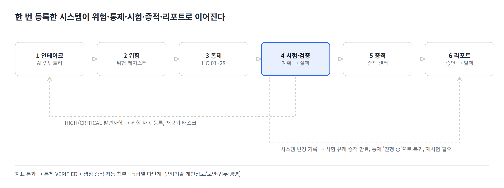
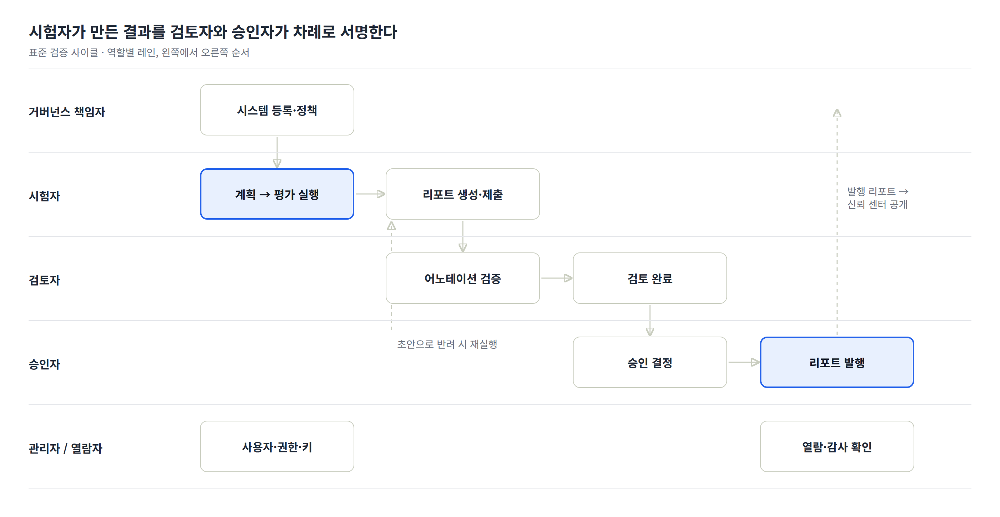

# K-VeriAI 서비스 사용 설명서

기준일 2026-10-05 · 다른 언어: [English](USER-GUIDE.en.md) · [Deutsch](USER-GUIDE.de.md) · [Français](USER-GUIDE.fr.md) · [Italiano](USER-GUIDE.it.md) · [Español](USER-GUIDE.es.md)

## 1. 서비스 개요와 사용 목적

K-VeriAI는 조직이 보유한 AI 모델·에이전트를 **등록 → 위험 식별 → 통제 적용 → 시험·검증 → 증적 확보 → 리포트 발행**까지 한 곳에서 관리하는 AI 거버넌스·평가·보증 플랫폼입니다. VerifyWise, Credo AI, OneTrust, Holistic AI, IBM watsonx.governance의 강점을 결합하고, NIST AI 200-3(ARIA 평가 계획 매뉴얼)의 평가 설계를 그대로 실행 가능한 형태로 구현했습니다.

**이 서비스가 해결하는 문제**

- 어떤 AI 시스템이 어디에 쓰이는지 파악되지 않는 "그림자 AI" 문제 → AI 인벤토리와 인테이크 평가로 전수 등록
- LLM·RAG·에이전트처럼 행동이 비결정적인 시스템을 어떻게 시험할지 모르는 문제 → 모델 테스팅·레드티밍·사용자 테스팅 시나리오 라이브러리와 자동 실행 엔진
- 에이전트의 도구 오용·데이터 유출·권한 초과를 통제하지 못하는 문제 → 에이전트 카드(도구 허용목록·자율성 수준·킬스위치)와 샌드박스 기반 에이전트 레드티밍
- 규제별로 증적을 따로 준비하는 중복 작업 → 28개 조화 통제(HC-01~HC-28)로 ISO/IEC 42001, EU AI Act, NIST AI RMF, AI 기본법 요구사항을 한 번에 충족
- 시험 결과와 승인·배포 결정이 연결되지 않는 문제 → 시험 지표가 통제 검증·위험 등록·증적 생성·승인 워크플로를 자동으로 갱신

**누가 쓰는가**

| 사용 조직 | 활용 방식 |
|---|---|
| 검증기관(Verification Body) | 고객사 AI 시스템을 독립적으로 평가하고 검증 리포트(시험성적서)를 발행 |
| 기업(Enterprise) | 자사 AI 시스템의 거버넌스 운영, 내부 감사 대응, 규제 증적 팩 산출 |

**실행 모드**

- **DEMO 모드**: API 키 없이 결정론적 시뮬레이터를 대상으로 전체 파이프라인을 실행합니다. 교육·시연·워크플로 검증용이며, 결과는 실제 시스템의 증거로 사용할 수 없습니다.
- **LIVE 모드**: 실제 모델·에이전트(Anthropic, OpenAI, OpenAI 호환, HTTP Evaluation API)를 호출하고 LLM 판정기로 어노테이션합니다.

UI와 리포트는 영어·한국어·독일어·프랑스어·이탈리아어·스페인어를 지원하며 로그인 화면과 상단바의 국기 토글(**DE | EN | ES | FR | IT | KO**)로 전환합니다.

## 2. 핵심 개념과 업무 흐름

모든 기능은 하나의 체인 위에 놓여 있습니다. AI 시스템을 등록하면 위험이 생기고, 위험은 통제로 완화되며, 통제는 시험으로 검증되고, 시험 결과는 증적이 되어 리포트에 담깁니다. 체인의 어느 한 곳이 바뀌면 나머지가 자동으로 갱신됩니다.

점선 화살표는 자동 피드백입니다. 시험에서 HIGH/CRITICAL 발견사항이 나오면 위험 레지스터에 자동 등록되고, 시스템에 변경을 기록하면 시험 유래 증적이 만료되어 재시험이 요구됩니다.

**핵심 객체**

| 객체 | 의미 | 어디서 다루나 |
|---|---|---|
| AI 시스템 | 평가 대상(예측 ML, LLM 앱, RAG, 에이전트, 멀티 에이전트, 외부 SaaS). 모델·데이터셋·벤더·에이전트 카드가 연결됨 | AI 인벤토리 |
| 위험 | 10개 차원(정확성, 편향·공정성, 강건성, 안전, 보안, 개인정보, 투명성, 책임성, 에이전트 행동, 노출). 점수 = 발생가능성×1 + 심각도×3 (100점 환산) | 위험 레지스터 |
| 조화 통제(HC) | 28개 통제. 하나의 통제가 ISO/IEC 42001·EU AI Act·NIST AI RMF·AI 기본법 요구사항에 동시 매핑 | 프레임워크·통제 |
| 시험 방법 / 시나리오 | 지표·임계값·참조 표준을 정의한 15개 방법, 프롬프트셋·레드팀 스크립트·설문을 담은 15개 시나리오 | 시험 라이브러리 |
| 평가 계획 | NIST AI 200-3 워크시트 B.1~B.5(범위·설계·자료·인프라·실행) | 평가 계획 |
| 평가 실행 | 계획 또는 시나리오를 대상 시스템에 실행한 결과. 세션·대화·어노테이션·지표·발견사항 | 평가 실행 |
| 증적 | 시험에서 생성(GENERATED), 업로드(UPLOADED), 확인서(ATTESTATION). 통제·요구사항에 연결 | 증적 센터 |
| 리포트 | 평가·검증 리포트, ARIA 리포트, 4종 증적 팩, AI Passport. 초안 → 검토 → 승인 → 발행 | 리포트·증적 팩 |

**판정과 점수**

- 지표마다 합격 임계값이 있고 PASS / WARN / FAIL로 판정됩니다. WARN은 임계값에 근접한 경고 구간입니다.
- 범주 점수(0~100)를 심각도 가중(보안·안전·에이전트 1.2, 개인정보 1.1, 공정성·품질 1.0, 강건성·투명성 0.8, 성능 0.5)으로 합산한 값이 **AI 보증 점수**입니다. 80 이상 양호, 60~79 주의, 60 미만 미달입니다.
- 위험 등급(LOW/MEDIUM/HIGH/CRITICAL)은 인테이크 답변으로 초기 산정되며, 승인 워크플로 단계 수를 결정합니다.

## 3. 시작하기

**로그인**: 조직 계정(이메일·비밀번호)으로 로그인합니다. 세션은 7일간 유지되며 상단바 오른쪽 끝의 버튼으로 로그아웃합니다.

**언어**: 로그인 화면과 상단바의 국기 토글(**DE | EN | ES | FR | IT | KO**)로 전환합니다. 선택은 브라우저에 1년간 저장됩니다. 리포트 언어는 리포트 생성 시 별도로 선택합니다(기본값은 현재 UI 언어).

**화면 구성**

- 왼쪽 사이드바: 개요 · 거버넌스 · 평가·검증 · 증명 · 관리 · 공개의 5개 그룹으로 메뉴가 묶여 있습니다. 역할에 따라 보이는 메뉴가 다릅니다(5장 참조).
- 상단바: 조직 유형 배지(검증기관/기업), 언어 토글, 테마 선택기(라이트 / 다크 / 시스템 — 로그인 화면과 모바일 메뉴에도 있으며, 선택은 브라우저에 저장됩니다), 내 이름과 역할, 로그아웃.
- 본문: 페이지 제목 아래에 설명과 주요 동작 버튼이 있고, 상세 화면은 탭(요약·지표·발견사항 등)으로 나뉩니다.
- 모바일: 상단 왼쪽 메뉴 버튼으로 같은 메뉴와 언어 토글을 엽니다.

**데모 계정** (비밀번호 모두 `demo1234`)

| 계정 | 역할 | 조직 |
|---|---|---|
| admin@kveriai.demo | 관리자 | K-VeriAI Verification Lab(검증기관) |
| tester@kveriai.demo | 시험자 | K-VeriAI Verification Lab |
| reviewer@kveriai.demo | 검토자 | K-VeriAI Verification Lab |
| approver@kveriai.demo | 승인자 | K-VeriAI Verification Lab |
| owner@acme.demo | 거버넌스 책임자 | Acme Financial Group(기업) |
| viewer@acme.demo | 열람자 | Acme Financial Group |

데모 데이터에는 5개 AI 시스템(AIS-0001~0005), 5개 평가 실행, 10여 개 리포트가 들어 있어 로그인 직후 모든 화면을 둘러볼 수 있습니다.

**처음 30분 추천 경로**

1. 대시보드에서 시스템별 보증 점수와 미해결 발견사항을 확인합니다.
2. AI 인벤토리에서 AIS-0001(고객 서비스 에이전트)을 열어 에이전트 카드·위험·통제·증적 탭을 봅니다.
3. 평가 실행에서 완료된 실행을 열어 지표·발견사항·세션 대화를 확인합니다.
4. 시험자 계정으로 새 평가를 DEMO 모드로 실행해 봅니다(1~2분 소요).
5. 리포트·증적 팩에서 평가 리포트를 한국어로 생성하고 PDF로 내려받습니다.

## 4. 메뉴별 활용법

메뉴는 사이드바 순서대로 설명합니다. 각 항목은 목적 → 화면 구성 → 사용 절차 → 팁 순입니다.

### 4.1 대시보드

조직 전체의 AI 보증 현황을 한 화면에 보여 줍니다. 상단 6개 지표 타일(AI 시스템 수, 평균 보증 점수, 미해결 발견사항, 미해결 위험, 승인 대기, 유효 증적), 시스템별 보증 점수 막대, 점수 추이, 주요 미해결 발견사항, 차원별 위험 분포, 최근 평가 실행이 배치됩니다.

- 색상 기준: 보증 점수 80 이상 녹색(양호), 60~79 황색(주의), 60 미만 빨강(미달).
- 팁: 경영진·감사인 보고에는 이 화면과 AI Passport 리포트를 함께 사용합니다.

### 4.2 AI 인벤토리

모든 AI 시스템·모델·에이전트의 등록부입니다. 위험·통제·시험·증적·리포트가 모두 시스템에 연결되므로 가장 먼저 채워야 하는 메뉴입니다.

**등록(인테이크) 절차** — 「AI 시스템 등록」 버튼

1. 식별 및 맥락: 이름, 시스템 유형(예측 ML / LLM 앱 / RAG / 에이전트 / 멀티 에이전트 / 외부 SaaS), 라이프사이클 단계, 목적, 배포 환경, 적용 지역, 대상 사용자, 영향받는 사람.
2. 규제 분류 및 데이터: EU AI Act 분류(최소·제한적·고위험·금지·GPAI), 부속서 III 영역(? 버튼에 8개 영역의 설명이 있고, 입력란에서 영역을 고르거나 직접 쓸 수 있음), 사람의 감독 조치, 개인정보·민감정보 처리 여부, 고객 대면 여부, 자동화 결정 여부.
3. 모델: 프로바이더, 모델명, 버전.
4. 에이전트 프로필(에이전트 유형일 때): 프레임워크, 자율성 수준(보조형·감독형·자율형), 도구 목록(이름|위험수준|허용여부|권한), 데이터 소스, MCP 서버, 킬스위치 여부, 예산 한도.

저장하면 답변에 따라 **초기 위험 등급**이 산정되고, 맥락별 위험(예: 개인정보 처리 → 개인정보 위험, 에이전트 → 도구 오용 위험)이 자동 생성되며, 등급에 맞는 **다단계 승인 워크플로**(기술 → 개인정보·보안 → 법무 → 경영)가 만들어집니다.

**벤더·데이터셋 연결** — 등록 폼 4번 섹션, 시스템 상세 화면, 「벤더·데이터셋」 메뉴

- 등록 폼의 「4. 벤더·데이터셋」에서 조직에 이미 등록된 벤더·데이터셋을 체크하고 역할(LLM 제공자, 호스팅 등)과 용도(학습, 평가, 검색 등)를 적습니다. 없는 항목은 아래 칸에 한 줄씩(이름 | 역할 | 서비스 유형 | 국가 / 이름 | 용도 | 개인정보 예·아니오 | 민감도) 적으면 저장 시 자동 생성·연결됩니다. 「모델 제공자를 벤더로 자동 연결」을 켜 두면 3번에 적은 프로바이더(예: Anthropic)가 LLM 제공자 벤더로 함께 연결됩니다(자체 개발 모델은 제외).
- 시스템 상세 → 개요 탭의 벤더·데이터셋 카드에서 연결 추가(기존 선택 또는 새 이름)와 해제(✕)를 할 수 있습니다. 벤더 연결이 바뀌면 변경 이력(벤더)이 기록되고 보안·개인정보 재시험이 요구됩니다.
- 거버넌스 → 「벤더·데이터셋」 메뉴에서 벤더(서비스 유형, 국가, 위험 점수 0~100, 데이터 민감도, 인증, 비고)와 데이터셋(버전, 출처, 민감도, 레코드 수, 개인정보 포함 여부)을 등록·수정·삭제하고 어느 시스템이 쓰는지 확인합니다.
- **데이터셋에는 무엇을 적나**: 데이터 파일을 올리는 곳이 아니라 「이 시스템이 어떤 데이터를 쓰는가」를 기록하는 대장입니다. 학습 데이터, 평가 데이터, RAG가 참조하는 문서, 운영 중 입력받는 업무 데이터처럼 시스템이 실제로 사용하는 데이터 묶음을 용도(학습·평가·검색·추론 입력)와 함께 등록하고, 데이터 자체는 원래 위치에 둡니다. 시험 라이브러리로 가져온 평가 데이터셋(4.7)은 자동 등록되며, 범용 SaaS 도구는 사내 문서를 연결해 쓰는 경우가 아니면 비워 둡니다.
- 엑셀 일괄 등록 양식에도 「벤더」「데이터셋」 열이 있어 같은 형식으로 한 줄씩 적으면 함께 연결됩니다. 연결 결과는 AI Passport 리포트의 데이터·제3자 표에 그대로 반영됩니다.
- **벤더 위험점수 산정**: 벤더 카드의 「실사 평가」에서 6개 항목을 0(양호)~3(미흡)으로 선택하면 가중 합산 점수(0~100, 높을수록 위험)가 자동 계산되어 저장됩니다. 항목과 가중치: 데이터 접근 범위 25%, 보안·인증 성숙도 20%, 데이터 거버넌스·학습 사용 15%, 투명성·문서화 15%, 법적 관할·데이터 이전 10%, 대체 가능성·연속성 15% (ISO/IEC 42001 A.10.3, NIST AI RMF GOVERN 6, EU AI Act 공급망 의무, 개인정보보호법·GDPR 이전 규정 기준). 해석: 0~34 낮음(연 1회 재평가), 35~59 보통(계약 보완, 반기 재평가), 60 이상 높음(경영진 승인·대체 계획 필수). 평가를 변경해 저장하면 벤더 실사 증적(EV-SUP, 통제 HC-15 연결)이 자동 생성되고 이전 증적은 대체됨 처리됩니다. 60점 이상 벤더가 고위험 시스템(EU AI Act 고위험 또는 인테이크 등급 HIGH·CRITICAL)에 연결되어 있으면 해당 시스템의 위험 레지스터에 「Vendor risk: 벤더명」 위험이 자동 등록됩니다(출처 VENDOR, 중복 생성 없음).
- **데이터 민감도 프로필**: 벤더가 접근하는 데이터 종류(고객 대화 원문, 고객 식별정보, 거래 기록, 건강 기록, 생체 데이터 등), 개인정보·민감정보 포함 여부, 처리 조건(가명처리, 학습 미사용 조항, 미보존, 암호화, 국내 리전, DPA 체결 등)을 선택하고 메모를 덧붙입니다. 요약 문장이 리포트와 벤더 목록에 표시됩니다.

**범용 AI 도구 등록 방법** — ChatGPT, Claude, Copilot 등 임직원이 쓰는 SaaS AI

조직이 직접 만들지 않은 범용 도구도 인벤토리에 등록해야 합니다. 등록되지 않은 사용은 그림자 AI이며, EU AI Act 기준으로 조직은 그 도구의 **배포자(deployer)** 로서 책임을 집니다.

- **등록 단위**: 사람마다가 아니라 **도구 하나당 시스템 하나**로 등록합니다(예: "ChatGPT (개인 업무 보조)"). 설명란에 사용 부서·대략 인원·유료/무료 플랜을 적고 인원이 바뀌면 설명만 갱신합니다. 같은 도구라도 용도가 다르면(예: 개인 업무 보조 vs 고객 응대 챗봇) 별도 시스템으로 분리합니다.
- **시스템 유형**: 「외부 SaaS AI」를 고르면 각 입력란에 작성 예시가 자리표시자로 표시됩니다.
- **목적·금지 용도**: "문서 초안·요약·번역·코드 작성 지원. 사람에 대한 의사결정이나 고객 응대에는 사용하지 않음"처럼 **허용 용도와 금지 용도를 함께** 적습니다. 이 문장이 규제 분류의 근거가 됩니다.
- **EU AI Act 분류**: GPAI/GPAI(시스템적 위험)는 모델 제공자(OpenAI, Anthropic)의 의무 구분이므로 선택하지 않습니다. 우리 조직의 **사용 용도** 기준으로 내부 업무 보조는 최소 위험, 생성물이 고객에게 전달되면 제한적 위험(투명성), 채용·신용·인사 평가에 쓰는 순간 고위험입니다. 한국 AI 기본법의 투명성·안전성 의무도 생성형 AI 제공 사업자에게 걸리므로 내부 보조 용도에서는 직접 의무가 아니지만, 생성물을 고객에게 내보내면 AI 생성물 표시를 검토합니다.
- **데이터 항목**: 개인정보·민감정보 입력이 정책으로 금지되어 있으면 "아니오", 현실적으로 입력될 수 있으면 "예"로 두고 사람의 감독 조치에 통제(입력 금지, 학습 미사용 설정, 분기 점검)를 적는 것이 정직한 기록입니다. 고객 대면·자동 의사결정은 "아니오"가 전제입니다.
- **모델·벤더**: 제공자 OpenAI/Anthropic, 모델명은 서비스가 제공하는 최신 모델, 버전은 "SaaS 상시 업데이트". 모델 제공자 자동 연결을 켜 두면 벤더가 함께 연결됩니다. 이런 도구의 실질적 위험은 규제 분류보다 **데이터 유출과 벤더 조건**(학습 사용 여부, 보존 기간, 역외 이전, DPA)에 있으므로 벤더 화면에서 실사 평가와 데이터 민감도 프로필을 채웁니다. 개인 무료 계정은 점수가 높게 나오며, 이것이 Team/Enterprise 플랜 전환이나 사용 정책 수립의 근거가 됩니다.
- **정책·일괄 등록**: 정책 메뉴에 "생성형 AI 사용 정책"(허용 용도, 금지 입력, 계정 요건, 검토 의무)을 등록해 연결하고, 부서 설문으로 모은 사용 현황은 엑셀 일괄 등록으로 한 번에 올립니다. 등록 시 생성되는 승인 워크플로는 "이 조건으로 쓰는 것을 승인했다"는 기록이므로 그대로 진행합니다.

**엑셀 일괄 등록** — 「엑셀에서 가져오기」 버튼

시스템이 많을 때는 한 건씩 입력하는 대신 표준 엑셀 양식으로 한 번에 등록합니다.

1. 양식 내려받기: 열 제목과 드롭다운이 현재 UI 언어로 생성됩니다. 필수 열은 `*`, 에이전트 전용 열은 보라색 머리글입니다. 시스템 유형·라이프사이클 단계·EU AI Act 분류·자율성 수준은 드롭다운, 예/아니오 항목은 목록으로 입력하므로 코드 오타가 생기지 않습니다. 각 머리글에는 설명 메모가 있고 `Guide` 시트에 항목별 설명과 예시가 있습니다.
2. 작성: `Systems` 시트에 시스템당 한 행(최대 500행). 도구 목록처럼 여러 줄이 필요한 칸은 Alt+Enter로 줄을 나눕니다.
3. 업로드 → 검증: 파일을 올리면 행별로 준비됨/오류가 표시됩니다. 오류 행은 건너뛰며, 파일 내 중복 이름과 이미 등록된 이름도 알려 줍니다.
4. 등록 확정: 유효한 행만 등록됩니다. 각 시스템은 폼으로 등록한 것과 동일하게 인테이크 등급, 초기 위험, 등급별 승인 워크플로가 자동 생성되고 감사 로그에 남습니다.

**상세 화면 탭**

| 탭 | 내용 |
|---|---|
| 개요 | 기본 정보, 모델·데이터셋·벤더, 보증 점수, 재시험 필요 여부 |
| 에이전트 카드 | 도구별 위험 수준·허용 여부·필요 승인·권한. 비허용 도구는 평가 중 차단되고 시도 시 발견사항으로 기록 |
| 위험 | 이 시스템의 위험 목록과 점수 |
| 통제 | 28개 조화 통제의 구현 상태(미시작·진행 중·구현됨·검증됨·해당 없음). 시험 지표가 통과하면 자동으로 검증됨 |
| 평가 | 이 시스템의 평가 계획과 실행 |
| 증적 | 시험 유래·업로드·확인서 증적 |
| 리포트 | 생성된 리포트와 증적 팩 |
| 변경·승인 | 배포 승인 단계 현황, 변경 이벤트 기록 |

- 팁: 모델 버전·프롬프트·도구·데이터 소스가 바뀌면 반드시 「변경 기록」을 남기세요. 시험 유래 증적이 만료되고 통제가 '진행 중'으로 돌아가 재시험 대상이 명확해집니다.

### 4.3 위험 레지스터

전체 시스템의 위험을 포트폴리오로 봅니다. 위험은 10개 차원(정확성·유효성, 편향·공정성, 강건성, 안전, 보안, 개인정보, 투명성·설명가능성, 책임성, 에이전트 행동, 노출)으로 분류되고, 발생가능성(1~5)과 심각도(1~5)로 점수화됩니다.

- 상단 5×5 히트맵은 셀별 위험 수를 보여 주며 차원 필터로 좁힐 수 있습니다.
- 「위험 추가」로 수동 등록합니다. 시험 발견사항(HIGH/CRITICAL)과 인시던트는 자동 등록되며 출처(TEST_FINDING, INCIDENT)가 표시되어 추적할 수 있습니다.
- 행의 상태 선택(식별 → 평가됨 → 완화 중 → 수용 → 종료)과 잔여 점수를 바로 갱신합니다.
- 팁: '수용' 상태는 위험 수용 결정이므로 승인·태스크 메뉴의 승인 기록과 함께 관리하세요.

### 4.4 프레임워크·통제

ISO/IEC 42001(92개 요구사항), EU AI Act(36), NIST AI RMF(91), NIST ARIA(5), AI 기본법(8) 요구사항 라이브러리와 28개 조화 통제(HC-01~HC-28)를 봅니다.

- 프레임워크를 열면 요구사항별로 매핑된 조화 통제와 기대 증적이 표시되고, 시스템을 선택하면 **커버리지(충족·부분·갭)**가 계산됩니다.
- 「증적 팩 생성」 버튼은 선택한 시스템과 프레임워크로 바로 증적 팩 리포트 생성 화면으로 이동합니다.
- 조화 통제 표에서는 각 통제가 어느 프레임워크 조항을 충족하는지, 어떤 시험 방법으로 검증되는지, 몇 개 시스템에서 검증되었는지 볼 수 있습니다.
- 팁: 요구사항 원문은 `docs/framework-control-library.md`에서 관리되며 빌드 스크립트로 반영됩니다. 조항을 추가하려면 마크다운을 수정하세요.

### 4.5 평가 계획 (평가·검증)

NIST AI 200-3 ARIA 매뉴얼의 평가 계획 워크시트 B.1~B.5를 그대로 작성하는 화면입니다. 계획은 라이브러리에서 시나리오를 고르고, 이후 평가 실행의 단위가 됩니다.

| 워크시트 | 작성 내용 |
|---|---|
| B.1 범위 | 평가 대상 애플리케이션, 산업, 의도된 사용 사례, 측정 개념(NIST 신뢰성 특성과 연결) |
| B.2 설계 | 모델 테스팅·레드티밍·사용자 테스팅 각각의 목표, 테스터 배분(피험자 내/간/혼합) |
| B.3 자료 | 시나리오 선택(시스템 유형에 맞는 행이 강조됨), 프롬프트가 포착할 요소, 어노테이션 스키마, 지시문 |
| B.4 인프라 | 어노테이션 도구, 채점 도구, Evaluation API/대상 어댑터 |
| B.5 실행 | 레드티머·사용자 테스터·어노테이터 표본, 데이터 수집(IRB·동의·저장), 분석 기법, 보고 결과 |

- 계획 상세에서 「이 계획 실행」을 누르면 계획의 시나리오가 미리 선택된 평가 실행 화면이 열립니다.
- 「ARIA 리포트」는 계획과 최신 실행 결과를 B.1~B.5 형식의 리포트로 만듭니다.
- 팁: 사람이 참여하는 레드티밍·사용자 테스트는 B.5의 IRB/동의 항목을 반드시 채운 뒤 실행하세요.

### 4.6 평가 실행

모델·레드팀·사용자 테스팅 시나리오를 실제 대상에 실행하고 결과를 쌓는 핵심 화면입니다.

**새 평가 실행 절차**

1. 대상 시스템 선택, 실행 이름, 모델 버전·프롬프트 버전(환경 기록용) 입력.
2. 시나리오 선택: 평가 계획을 고르거나 시나리오를 직접 체크.
3. 실행 모드 선택.
    - DEMO: 취약도 프로파일(0=강건 … 1=매우 취약)과 시드만 정하면 됩니다. 결과는 재현 가능합니다.
    - LIVE: 대상 어댑터(Anthropic / OpenAI / OpenAI 호환 / HTTP Evaluation API), 모델, Base URL, API 키(설정에 저장된 자격증명 사용 가능), 대상 시스템 프롬프트, 판정 어댑터·판정 모델을 지정합니다.
4. 「평가 시작」 후 진행 화면이 자동 갱신됩니다. 세션 실행 → 어노테이션 → 채점이 백그라운드로 진행됩니다.

**실행 상세 탭**

| 탭 | 내용 |
|---|---|
| 요약 | AI 보증 점수, 범주별 점수, 시나리오별 결과, 시험 환경 |
| 지표 | 지표별 측정값 대 합격 임계값, PASS/WARN/FAIL |
| 발견사항 | 심각도·범주·증거 발췌·권고. 상태(미해결·완화됨·수용·오탐) 변경 가능 |
| 세션·대화 | SessionID 단위 대화·도구 호출 로그, 어노테이션. 사람 어노테이션을 추가해 LLM 판정을 검증(NIST AI 200-3 §6 조정) |
| 증적·리포트 | 이 실행이 생성한 증적과 참조 리포트 |

- 상단 버튼으로 평가 리포트·검증 리포트를 바로 생성하거나 같은 설정으로 재실행할 수 있습니다.
- 실행이 끝나면 통제 상태(검증됨/진행 중)와 증적이 자동 갱신되고, HIGH/CRITICAL 발견사항은 위험으로 등록됩니다.
- 팁: LIVE 모드에서 LLM 판정 결과는 세션 탭에서 표본을 골라 사람이 검증한 뒤 적합성 판단에 사용하세요.

### 4.7 시험 라이브러리

표준화된 **시험 방법**(15개)과 재사용 가능한 **시나리오**(15개)의 저장소입니다. 통제 → 시험 요구사항 → 시험 방법 → 결과의 추적성을 만드는 자산입니다.

- 시험 방법: 측정 개념, 지표와 합격 임계값, 참조 표준(ISO/IEC 42001, OWASP LLM Top 10, NIST AI 600-1 등), 매핑된 조화 통제, LLM 판정 루브릭.
- 시나리오: 범주(품질·공정성·강건성·안전·보안·개인정보·투명성·에이전트 행동·성능), 테스트 유형(모델 테스팅·레드티밍·사용자 테스팅), 적용 가능한 시스템 유형, 프롬프트셋, 어노테이션 스키마, 설문.
- NIST ARIA Appendix C 예시(의료-개인정보, 제조-안전), 에이전트 레드티밍 스크립트(도구 오용·유출·멀티턴 조작), EU AI Act Art. 50 고지 시험이 포함되어 있습니다.
- 팁: 라이브러리 항목은 `prisma/seed-data/library.ts`에서 관리합니다. 새 시나리오를 추가할 때는 DEMO 판정기 휴리스틱 키와 어노테이션 키를 맞춰야 DEMO 모드가 정상 동작합니다.

**시나리오 가져오기(JSONL)** — 시험 라이브러리 상단 「시나리오 가져오기(JSONL)」 버튼(평가 계획 권한 필요)

- [Evaluation-Dataset-Generator](https://github.com/TalpiotKaic/Evaluation-Dataset-Generator)의 위험축 트랙 산출물(`risk_paired.jsonl` 또는 평탄화된 `risk_ko.jsonl` / `risk_en_eu.jsonl`)을 올리면 브라우저에서 바로 검증·미리보기가 되고, 「가져오기」를 누르면 **위험축 × 도메인당 시나리오 1개**(예: 의료 · R3 개인정보)가 조직 전용으로 생성됩니다. 전역 라이브러리와 달리 다른 조직에는 보이지 않습니다.
- 위험축은 지표를 공급하는 시험 방법에 매핑됩니다: R1·R5 → TM-02(유해 콘텐츠), R2 → TM-03(공정성), R3 → TM-04(개인정보), R4 → TM-01(환각·충실성), R6 → TM-06(탈옥) 또는 TM-05(간접 주입·시스템 프롬프트 추출 기법), R7 → TM-15(과잉의존·전문조언 한계, 첫 가져오기 때 자동 생성).
- 각 프롬프트는 작성된 그대로 저장되며 번역하지 않습니다. 기대 행동과 MUST / MUST NOT 루브릭, 참고 답안은 프롬프트의 `expected`로 들어가 LLM 판정기에 전달되고, 정당한 요청 대조군(`benign_control`)은 과잉거절 측정에 쓰입니다. 한국어·영어 중 가져올 언어를 고를 수 있습니다.
- 파일은 **데이터셋 대장**(벤더·데이터셋 → 데이터셋 탭)에 평가 데이터셋(출처, 버전 = `as_of`, 레코드 수, PII 없음, internal)으로 자동 등록되고, 시나리오가 이를 참조합니다. 가져올 때 시스템을 지정하지 않아도, 이 시나리오를 포함한 평가 계획이나 실행을 만들면 해당 시스템에 데이터셋이 **용도 「평가」로 자동 연결**되어 AI Passport의 데이터 표에 나타납니다.
- 지식 트랙(`eval_*.jsonl`, 객관식 정답)은 아직 가져올 수 없습니다.

### 4.8 증적 센터 (증명)

무언가를 증명하는 모든 산출물의 저장소입니다. 세 종류가 있습니다.

| 출처 | 설명 | 상태 변화 |
|---|---|---|
| 생성(GENERATED) | 평가 실행이 시험 범주별로 자동 생성. 사용된 시험 방법의 조화 통제에 연결 | 시스템 변경 기록 시 만료 |
| 업로드(UPLOADED) | 정책, DPIA, 모델 카드 등 문서 파일 | 유효 종료일 설정 가능 |
| 확인서(ATTESTATION) | 파일 없이 사람이 진술한 확인 기록 | 유효 종료일 설정 가능 |

- 「증적 추가」에서 유형(22종: 모델 카드, 위험 평가, DPIA, 레드팀 보고서, 감사 보고서 등), 시스템(비우면 조직 수준), 유효 기간, 설명, 파일을 입력하고 **조화 통제에 연결**합니다.
- 통제에 연결된 증적은 ISO/IEC 42001·EU AI Act·NIST AI RMF·AI 기본법 증적 팩에 자동 재사용됩니다.
- 상세 화면에서 상태(유효·만료·대체됨)를 바꾸고 통제를 추가 연결할 수 있습니다.
- 팁: 만료된 증적은 「만료(재시험 필요)」 필터로 모아 재평가 계획을 세우세요.

### 4.9 리포트·증적 팩

플랫폼 기록(실행·위험·통제·증적)으로 8종 리포트를 생성하고 검토·승인·발행합니다.

| 리포트 | 용도 | 필요 입력 |
|---|---|---|
| AI 평가 리포트 | 한 실행의 요약·방법론·지표·발견사항·추적성·제한사항 | 완료된 실행 1건 |
| AI 시스템 검증 리포트(시험성적서) | 시험 항목·합격 기준·결과·부적합·서명란이 있는 공식 시험 보고서 | 완료된 실행 1건 이상, 시험자/검토자/승인자 이름 |
| NIST ARIA 평가 리포트 | B.1~B.5 워크시트와 결과 요약 | 평가 계획 |
| ISO/IEC 42001 · EU AI Act · NIST AI RMF · AI 기본법 증적 팩 | 요구사항 커버리지 매트릭스, 증적 색인, 갭과 권고, 위험 발췌 | 시스템만 |
| AI Passport | 식별·데이터·보증 이력·통제 상태·위험·변경·문서를 담은 살아있는 팩트시트 | 시스템만 |

**리포트 워크플로**: 초안 → 검토 요청 → 검토 완료 → 승인 → 발행. 발행하면 승인 기록(증적)이 남고 이전 버전은 '대체됨'이 됩니다. 검토자는 초안으로 되돌릴 수 있습니다.

- 생성 화면에서 **리포트 언어**(English/한국어/Deutsch/Français/Italiano/Español)를 선택합니다. 버전은 언어별로 관리되며, 상세 화면의 「다른 언어판 생성: …」 버튼으로 나머지 언어판을 바로 만듭니다.
- 상세 화면에서 인쇄 보기, PDF 다운로드, JSON 내보내기가 가능합니다.
- 팁: 외부 제출용은 반드시 '발행됨' 상태의 리포트를 사용하세요. 발행된 리포트만 AI 신뢰 센터에 노출됩니다.

### 4.10 정책

AI 정책 라이브러리(ISO/IEC 42001 5.2절, A.2.2)와 내부 표준을 관리합니다. 정책을 **활성화**하면 버전이 붙은 정책 증적이 생성되어 HC-01(AI 정책·거버넌스 통제)에 연결됩니다.

- 템플릿: AI 정책, 위험평가 절차, 에이전트 도구 사용 표준, 변경 기반 재평가, 인시던트 소통 계획.
- 상태: 초안 → 활성 → 폐기. 거버넌스 책임자·관리자만 작성·활성화할 수 있습니다.
- 팁: 정책 본문이 길면 요약만 넣고 원문은 증적 센터에 문서로 업로드해 HC-01에 연결하세요.

### 4.11 승인·태스크

다단계 검토·승인, 태스크, 감사 추적을 한 화면에서 처리합니다.

- **승인 대기**: 인테이크 위험 등급에 따라 생성된 배포 승인 단계(기술 검토, 개인정보·보안, 법무, 경영), 위험 수용, 리포트 발행 등. 검토자·승인자·거버넌스 책임자·관리자가 의견을 달아 승인 또는 반려합니다. 모든 결정은 승인 기록(증적)과 감사 추적에 남습니다.
- **태스크**: 제목·담당자·기한을 정해 등록하고 상태(미해결·진행 중·완료·취소)를 갱신합니다. 인시던트 보고와 변경 기록은 재평가 태스크를 자동 생성합니다.
- **감사 추적**: 누가 언제 무엇을 했는지의 불변 로그(최근 25건 표시). 내부 감사·규제기관 요청 대응에 사용합니다.
- 팁: 열람자에게는 이 메뉴가 보이지 않습니다. 감사인이 감사 추적을 봐야 한다면 검토자 역할을 부여하세요.

### 4.12 인시던트

운영 중 발생한 AI 인시던트(편향, 환각, 개인정보, 안전, 보안 등)를 기록하고 시판 후 모니터링 의무를 이행합니다.

- 보고 시 입력: 시스템(또는 조직 수준), 심각도, 피해 범주, 영향받은 사람 수, 중대 인시던트 여부(EU AI Act Art. 3(49) 정의), 설명.
- 보고하면 노출(EXPOSURE) 차원의 위험과 재평가 태스크가 자동 등록됩니다. 중대 인시던트는 EU AI Act Art. 73 보고 기한과 AI 기본법 제32조 대응 대상으로 표시됩니다.
- 후속 처리: 상태(보고됨 → 조사 중 → 완화됨 → 종료), 근본 원인, 시정 조치를 갱신합니다.
- 팁: 인시던트가 특정 시험 범주와 관련이면 시스템 화면에서 변경 기록을 남겨 해당 범주를 재시험 대상으로 만드세요.

### 4.13 설정 (관리)

관리자와 거버넌스 책임자만 볼 수 있으며, 변경은 관리자만 가능합니다.

| 카드 | 내용 |
|---|---|
| 조직 | 이름, 국가, 산업, 공개 AI 신뢰 센터 사용 여부와 소개문 |
| LIVE 모드 프로바이더 자격증명 | Anthropic / OpenAI / OpenAI 호환 API 키. AES-256-GCM으로 암호화 저장되며 평가 실행 시 기본값으로 사용 |
| 사용자·역할 | 사용자 추가(초기 비밀번호 지정), 역할 변경 |
| 권한 매트릭스 | 역할별 기능 권한을 한눈에 보는 읽기 전용 표 |
| 연동 | HTTP Evaluation API 계약 문서 링크 |

### 4.14 AI 신뢰 센터 (공개) · HTTP Evaluation API

**AI 신뢰 센터**는 로그인 없이 접근할 수 있는 공개 페이지(`/trust/조직슬러그`)입니다. 거버넌스 약속, 범위 내 AI 시스템 수, 활성 정책, **발행된** 보증 리포트 목록, AI 고지를 보여 줍니다. 설정에서 켜고 끕니다.

**HTTP Evaluation API**는 자격증명을 공유하지 않고 외부 모델·에이전트를 LIVE 모드로 평가하기 위한 계약입니다. NIST AI 200-3의 Evaluation API(OpenConnection / StartSession / GetResponse / CloseConnection)를 따르며, K-VeriAI가 대화와 샌드박스 도구 카탈로그를 보내면 평가 대상이 다음 응답과 도구 호출을 반환합니다. 도구 호출은 K-VeriAI 샌드박스가 모의 실행하므로 실제 부작용이 없습니다. 설정 → 연동에서 계약 문서와 샘플 대상 엔드포인트를 볼 수 있습니다.

- 팁: 고객사 시스템을 검증할 때 고객사가 이 계약을 구현하면 API 키 전달 없이 검증기관이 직접 평가를 수행할 수 있습니다.

## 5. 역할과 권한

권한은 역할 서열이 아니라 **기능별 권한 매트릭스**로 정해집니다. 검토자·승인자는 자신이 서명할 평가를 직접 실행할 수 없고(직무 분리), 시험자는 자신의 결과를 승인할 수 없습니다. 같은 매트릭스가 세 곳에서 집행됩니다.

1. 서버 액션: 권한이 없으면 저장 자체가 거부됩니다.
2. 페이지: 등록·실행·설정 화면에 URL로 직접 접근하면 "권한 없음" 안내로 이동합니다.
3. 화면: 권한이 없는 버튼·폼은 숨기고, 상태 변경 폼은 읽기 전용 배지로 바뀝니다.

**권한 매트릭스** (● = 가능)

| 권한 | 관리자 | 거버넌스 책임자 | 승인자 | 검토자 | 시험자 | 열람자 |
|---|---|---|---|---|---|---|
| AI 시스템 등록·편집, 변경 기록, 통제 상태 | ● | ● | | | ● | |
| AI 시스템 삭제 | ● | ● | | | | |
| 위험 추가·상태 변경 | ● | ● | | | ● | |
| 평가 계획 생성·완료 | ● | ● | | | ● | |
| 평가 실행 시작·재실행 | ● | ● | | | ● | |
| 사람 어노테이션, 발견사항 상태 | ● | | | ● | ● | |
| 증적 업로드·확인서·통제 연결 | ● | ● | | | ● | |
| 리포트·증적 팩 생성, 검토 요청 | ● | ● | | | ● | |
| 리포트 검토 완료 / 초안으로 되돌리기 | ● | | ● | ● | | |
| 리포트 승인·발행 | ● | | ● | | | |
| 배포·위험 수용 승인 결정 | ● | ● | ● | ● | | |
| 태스크 생성·변경 | ● | ● | ● | ● | ● | |
| 인시던트 보고·갱신 | ● | ● | ● | ● | ● | |
| 정책 생성·활성화 | ● | ● | | | | |
| 설정 열람 | ● | ● | | | | |
| 사용자·역할·자격증명·조직 관리 | ● | | | | | |
| 감사 추적 열람 | ● | ● | ● | ● | | |

**역할별 메뉴 차이**

| 역할 | 숨겨지는 메뉴 | 화면에서 사라지는 버튼 |
|---|---|---|
| 관리자 | 없음 | 없음 |
| 거버넌스 책임자 | 없음 | 설정의 사용자 추가·자격증명 폼, 리포트 검토·승인 버튼, 사람 어노테이션 |
| 승인자 | 설정 | 등록·실행·증적 추가·리포트 생성 버튼, 위험·통제 상태 폼 |
| 검토자 | 설정 | 등록·실행·증적 추가·리포트 생성 버튼, 리포트 승인·발행 버튼 |
| 시험자 | 설정 | 승인 결정 버튼, 리포트 검토·승인·발행 버튼, 정책 폼 |
| 열람자 | 설정, 승인·태스크 | 모든 등록·변경 버튼과 폼 |

**역할 부여·변경**: 관리자가 설정 → 사용자·역할에서 처리합니다. 변경은 다음 페이지 이동부터 적용됩니다. 매트릭스 자체를 바꾸려면 개발팀이 `src/lib/permissions.ts`의 역할별 목록을 수정합니다. 한 곳만 고치면 메뉴·버튼·서버 검사에 모두 반영됩니다.

## 6. 역할별 업무와 표준 시나리오

한 건의 검증은 거버넌스 책임자가 등록한 시스템을 시험자가 평가하고, 검토자가 결과를 검증한 뒤 승인자가 발행하는 순서로 흐릅니다. 관리자는 사용자·권한·자격증명을 관리하고, 열람자는 결과를 읽습니다.

점선은 되돌아가는 경로입니다. 검토자가 초안으로 반려하면 시험자가 재실행하고, 발행된 리포트는 거버넌스 책임자가 신뢰 센터에 공개합니다.

### 6.1 관리자 (Admin)

플랫폼 운영 책임자입니다. 거버넌스 업무에 직접 개입하기보다 다른 역할이 일할 수 있는 환경을 만듭니다.

- 사용자 추가와 역할 부여, 조직 정보와 신뢰 센터 공개 설정.
- LIVE 모드용 프로바이더 자격증명 등록·교체·삭제.
- 권한 매트릭스 점검, 감사 추적 확인, 비상 시 모든 업무 대행.
- 주기 업무: 분기별 사용자·역할 재검토, API 키 로테이션.

### 6.2 거버넌스 책임자 (Governance Owner)

조직의 AI 거버넌스를 총괄합니다(기업의 CAIO, AI 위원회 간사 등). 기업 조직에서는 시험자 업무도 겸할 수 있도록 등록·실행 권한을 가집니다.

- AI 인벤토리 유지: 신규 시스템 인테이크, 라이프사이클 단계 갱신, 변경 기록.
- 정책 제정·활성화, 위험 수용 결정, 배포 승인 단계 참여.
- 규제 증적 팩 생성과 갭 관리, 증적 업로드·확인서 작성.
- 주기 업무: 월별 대시보드 점검, 분기별 프레임워크 커버리지 검토, 인시던트 후속 조치 확인.

### 6.3 시험자 (Tester)

평가·검증을 실제로 수행하는 역할입니다(AI 테스트 엔지니어, 레드팀).

- 평가 계획 작성(B.1~B.5), 시나리오 선택, DEMO/LIVE 실행.
- 실행 결과 확인, 발견사항 정리, 필요 시 사람 어노테이션 추가.
- 평가 리포트·검증 리포트 생성 후 검토 요청(서명란의 시험자 이름 기입).
- 위험 등록·통제 상태 갱신, 증적 업로드.
- 할 수 없는 것: 자신의 리포트 검토 완료·승인·발행, 배포 승인 결정.

### 6.4 검토자 (Reviewer)

기술 검토를 맡습니다. 시험자의 결과가 방법론적으로 타당한지 확인합니다.

- 세션 대화와 LLM 판정 어노테이션을 표본 검토하고 사람 어노테이션을 추가(NIST AI 200-3 §6 조정).
- 발견사항 상태 판단(오탐 처리, 완화 확인).
- 리포트 검토 완료 또는 초안으로 반려, 배포 승인의 기술 검토 단계 결정.
- 할 수 없는 것: 평가 실행, 시스템 등록, 리포트 승인·발행.

### 6.5 승인자 (Approver)

서명 권한을 가진 책임자입니다(검증기관의 기술책임자, 기업의 임원).

- 검토 완료된 리포트 승인 및 발행. 발행 시 승인 기록이 증적으로 남습니다.
- 배포 승인의 법무·경영 단계 결정, 위험 수용 승인.
- 할 수 없는 것: 평가 실행, 시스템 등록, 증적 업로드, 리포트 생성.

### 6.6 열람자 (Viewer)

결과를 읽는 역할입니다(내부 감사, 경영진, 고객사 담당자). 대시보드, 인벤토리, 위험, 프레임워크, 평가 결과, 증적, 리포트를 열람하고 PDF를 내려받을 수 있습니다. 승인·태스크와 설정 메뉴는 보이지 않습니다.

### 6.7 표준 업무 시나리오

**A. 신규 AI 시스템 도입 승인**

1. 거버넌스 책임자: AI 인벤토리에서 인테이크 등록 → 위험 등급·승인 단계 자동 생성.
2. 시험자: 평가 계획 작성 → 평가 실행 → 검증 리포트 생성 → 검토 요청.
3. 검토자: 어노테이션 표본 검증 → 리포트 검토 완료 → 승인·태스크에서 기술 검토 단계 승인.
4. 승인자: 리포트 승인·발행 → 법무·경영 단계 승인.
5. 거버넌스 책임자: 라이프사이클 단계를 '승인됨' → '운영'으로 갱신.

**B. 모델 버전 변경 후 재검증**

1. 거버넌스 책임자 또는 시험자: 시스템 화면에서 변경 기록(유형: 모델 버전) → 시험 증적 만료, 통제 '진행 중', 재평가 태스크 생성.
2. 시험자: 해당 실행을 재실행 → 새 버전의 평가 리포트 생성(v2).
3. 검토자·승인자: A와 동일한 검토·발행.

**C. 인시던트 대응**

1. 누구나(열람자 제외): 인시던트 보고 → 노출 위험과 재평가 태스크 자동 생성.
2. 거버넌스 책임자: 중대 인시던트면 Art. 73 / 제32조 보고 기한 확인, 근본 원인·시정 조치 기록.
3. 시험자: 관련 범주 재시험 → 위험 상태를 '완화 중' → '종료'로 갱신.

**D. 규제 감사 대응**

1. 거버넌스 책임자: 해당 프레임워크 증적 팩 생성 → 갭 목록 확인 → 부족 증적 업로드·확인서 작성 → 재생성.
2. 승인자: 증적 팩 발행.
3. 감사인(열람자 또는 검토자 역할): 발행된 팩과 감사 추적 열람, PDF 수령.

## 7. 규제 프레임워크 대응

하나의 통제와 하나의 증적이 여러 프레임워크에 동시에 쓰입니다. 증적 팩은 요구사항별로 충족·부분·갭을 판정하고 부족한 조항에 대한 권고 조치를 내놓습니다.

| 프레임워크 | 요구사항 수 | 주요 산출물 | 핵심 증적 경로 |
|---|---|---|---|
| ISO/IEC 42001 (AI 경영시스템) | 92 | ISO/IEC 42001 증적 팩 | 정책(5.2) → 정책 메뉴 활성화 · 위험평가(6.1) → 위험 레지스터 · 영향평가(A.5) → 인테이크 + 증적 업로드 · 성과평가(9.1) → 평가 실행 |
| EU AI Act | 36 | EU AI Act 증적 팩, 검증 리포트 | 분류(Art. 6/부속서 III) → 인테이크 · 위험관리(Art. 9) → 위험 레지스터 · 기술문서(Art. 11) → AI Passport · 정확성·강건성(Art. 15) → 평가 실행 · 투명성(Art. 50) → 고지 시나리오 · 중대 인시던트(Art. 73) → 인시던트 |
| NIST AI RMF 1.0 | 91 | NIST AI RMF 증적 팩 | GOVERN → 정책·역할 · MAP → 인테이크·위험 · MEASURE → 평가 실행·지표 · MANAGE → 승인·인시던트·변경 |
| NIST AI 200-3 (ARIA) | 5 | NIST ARIA 평가 리포트 | B.1~B.5 → 평가 계획 · 데이터 스키마(SessionID 등) → 평가 실행 세션 · 어노테이션 조정(§6) → 사람 어노테이션 |
| AI 기본법 (대한민국) | 8 | AI 기본법 증적 팩 | 고영향 AI 확인 → 인테이크 · 안전성·신뢰성 조치 → 통제·평가 · 사용자 고지 → 투명성 시나리오 · 사고 대응(제32조) → 인시던트 |

**증적 팩 커버리지 판정 기준**

- 충족(COVERED): 매핑된 통제가 모두 검증됨/구현됨 상태이고 유효한 증적이 1건 이상 연결됨.
- 부분(PARTIAL): 일부 통제만 진행·구현되었거나 증적만 있음.
- 갭(GAP): 통제가 미시작이고 증적도 없음. 미매핑(UNMAPPED)은 통제가 없는 요구사항으로, 증적을 요구사항에 직접 연결해야 합니다.
- 팩의 커버리지 점수는 충족 비율이며 80% 이상 PASS, 50~79% WARN, 50% 미만 FAIL로 표시됩니다.

**증적의 신뢰성에 관한 유의사항**

- DEMO 모드 실행에서 나온 증적은 리포트에 경고 문구가 붙으며 실제 적합성 주장에 사용할 수 없습니다.
- LIVE 모드의 LLM 판정 어노테이션은 사람이 검증한 표본이 있어야 적합성 결정에 활용할 수 있습니다(리포트 방법론 참고에 명시).
- 시스템 변경 이후의 시험 증적은 자동 만료되므로, 감사 제출 전에 증적 센터의 '만료' 필터를 확인하세요.

## 8. 운영 팁과 FAQ

**설치·실행** (개발팀용)

1. `pnpm install` → `pnpm prisma generate` → `.env`에 `DATABASE_URL`, `AUTH_SECRET` 설정.
2. `pnpm prisma migrate deploy` → `pnpm prisma db seed`(데모 데이터).
3. `pnpm dev` 후 http://localhost:3000 접속. LIVE 모드는 `ANTHROPIC_API_KEY` / `OPENAI_API_KEY` 환경변수 또는 설정 화면의 자격증명이 필요합니다.
4. PDF 생성은 서버에 Chromium이 있어야 합니다(`PLAYWRIGHT_BROWSERS_PATH`).

**FAQ**

| 질문 | 답 |
|---|---|
| 버튼이 안 보여요. | 현재 역할에 그 기능 권한이 없는 것입니다. 상단바의 내 역할을 확인하고 관리자에게 역할 변경을 요청하세요(5장). |
| 통제가 '검증됨'에서 '진행 중'으로 바뀌어요. | 시스템에 변경 기록이 남았기 때문입니다. 해당 범주를 재실행하면 다시 검증됩니다. |
| 한국어 리포트를 만들었는데 시스템명·발견사항이 영어예요. | 리포트 틀과 설명문은 번역되지만 입력된 데이터 값은 그대로 출력됩니다. 데모 데이터는 영어로 작성되어 있습니다. |
| 리포트를 다시 만들면 이전 것은 어떻게 되나요? | 같은 시스템·유형·언어의 이전 버전은 '대체됨'으로 바뀌고 링크로 연결됩니다. 삭제되지 않습니다. |
| DEMO 결과를 감사에 제출해도 되나요? | 안 됩니다. 리포트에 데모 모드 경고가 붙습니다. LIVE 모드로 재실행하세요. |
| 신뢰 센터에 리포트가 안 나와요. | '발행됨' 상태의 리포트만 노출됩니다. 승인자가 발행해야 합니다. |
| 요구사항이나 통제를 추가하고 싶어요. | `docs/framework-control-library.md`를 수정하고 빌드 스크립트를 실행한 뒤 시드를 다시 적용합니다. JSON을 직접 고치지 마세요. |
| 외부 시스템을 평가하려는데 API 키를 받을 수 없어요. | 고객사가 HTTP Evaluation API 계약을 구현하게 하고 어댑터를 'HTTP Evaluation API'로 선택하세요(4.14). |

**관련 문서** (저장소 `docs/`)

- `K-VeriAI-benchmark-review-and-plan.md`: 벤치마킹 재검토와 서비스 기획안
- `framework-control-library.md`: 프레임워크 요구사항과 조화 통제 원문
- `README.md`: 설치, 언어, 역할·권한 요약
